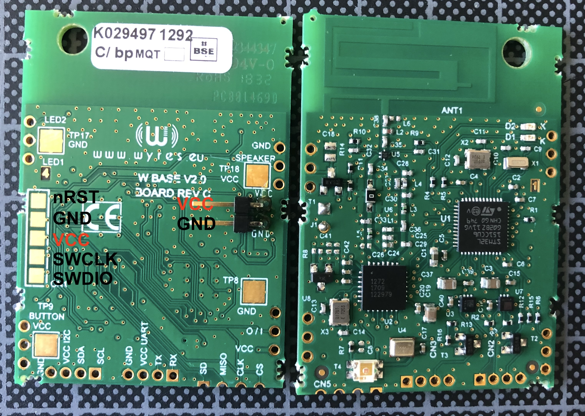
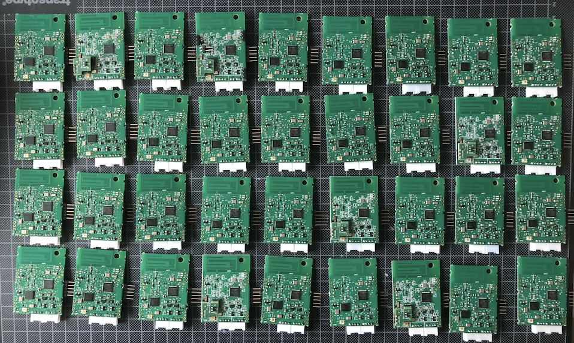
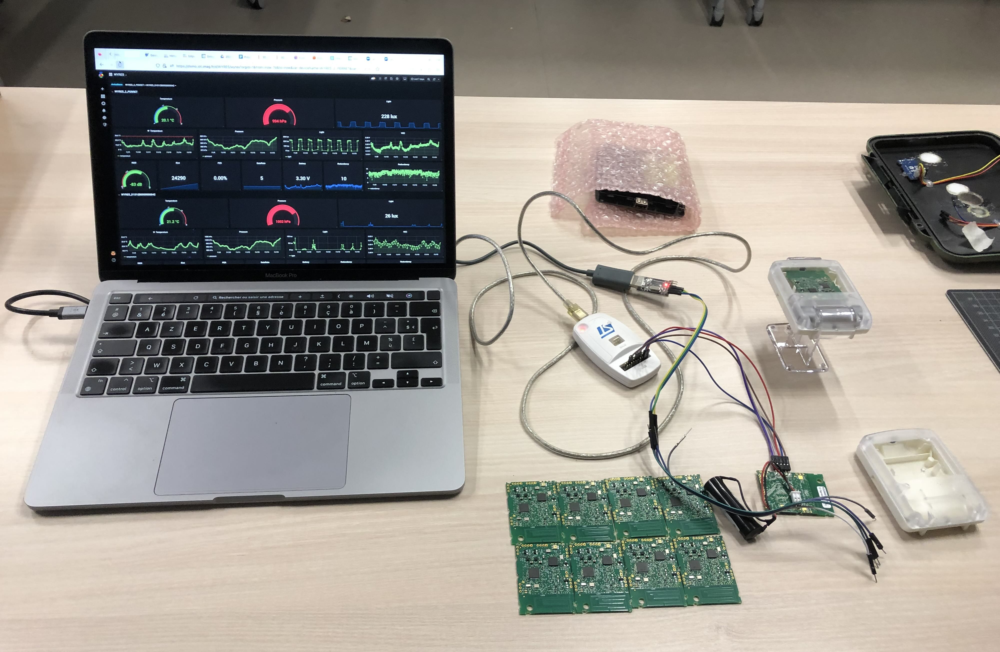

# RIOT Wyres :: RIOT OS for Wyres LoRaWAN boards

[Wyres LoRaWAN boards](https://www.tindie.com/products/wyld-things/lorawan-sensor-board/) are available on Tindies.

The [original firmware](https://github.com/wyres/mynewt_app_iocontrol) has been developed with [Apache MyNewT](https://mynewt.apache.org/) by [Brian Wyld](https://github.com/brianwyld)'s team.

This repository contains the firmware implementation with [RIOT OS](https://github.com/RIOT-OS/RIOT).









## Getting started

```bash
cd ~/github/RIOT-OS/RIOT
cd examples/hello-world
EXTERNAL_BOARD_DIRS=~/github/campusiot/RIOT-wyres/boards make BOARD=wyres-base
```

## Requirements
* STLink v2 programmer
* FTDI (USB Serial adapter)
* [PCB Probe 2.54mm Single row, 5 Pins](https://fr.aliexpress.com/item/1005001409579446.html)

## Buy
* [Wyld Things @ Tindie](https://www.tindie.com/stores/wyld-things/)
* [Parafix Porex membrane disc PMV30I](https://parafix.com/product/porex-pmv30i/)
