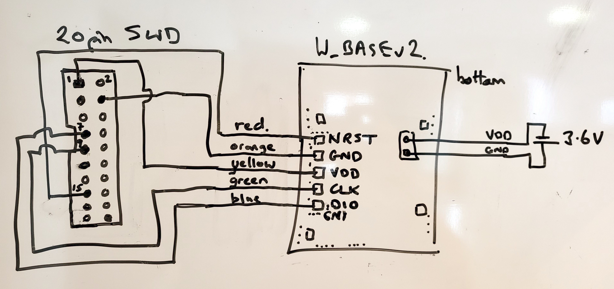
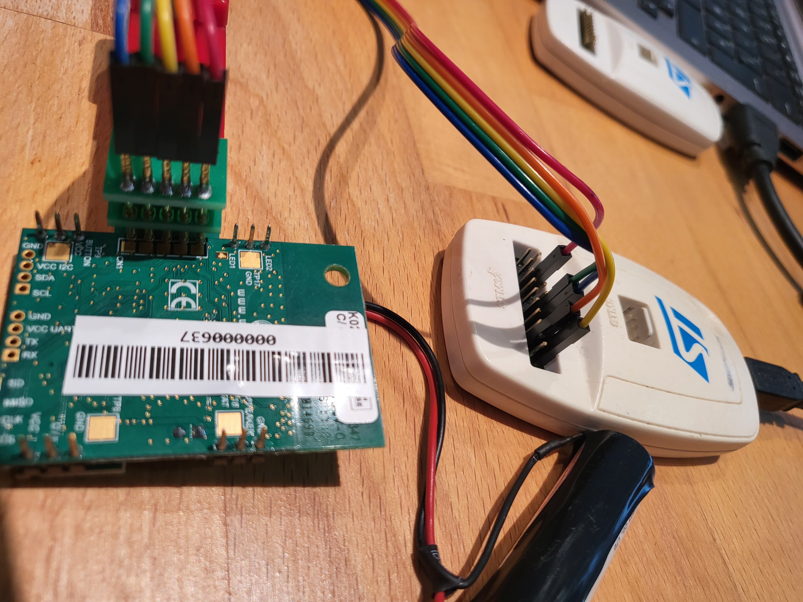

# Wyres Base

Card revisions
 - v2 revB (SX1272, RF switch old)
 - v2 revC/D (SX1272, RF switch Skynet new)) 
 - v3 revA/B (SX1261/2)

Card hardware:
 - STM32L151CC MCU
 - 256kb flash / 32kb RAM / 8kb EEPROM : MCU based 
 - UART(1) : MCU based : external grove connector
 - SPI(2) : MCU based : 1 dedicated for radio, 1 on header
 - I2C(1) : MCU based : external grove connector
 - Accelero : ST LIS2DE12 via I2C https://github.com/RIOT-OS/RIOT/tree/master/tests/driver_lis2dh12
 - Altimeter : ST LPS22HB via I2C https://github.com/RIOT-OS/RIOT/tree/master/tests/driver_lpsxxx
 - light sensitive trans. on GPIO
 - MEMS microphone on I2S bus
 - Semtech Lora radio SX1272 on SPI bus
 - 2 LEDs via GPIO on-board and via header
 - 1 'power' PWM GPIO (mosfet switched) on header
 - 1 'button' GPIO input with limiter resistance on header
 - 1 GPIO on header


## Source code

Apache MynewT implementation : https://github.com/wyres/mynewt-wbasev2-bsp


## Flashing

Connect the board's pins to the STLink flasher

| STLink Nucleo SWD                 | Color  | Wyres Base  |
|-----------------------------------|--------|-------------|
| VDD_TARGET (VDD from application) | Red    | Pin 3: VDD  |
| SWCLK (clock)                     | Yellow | Pin 4: CLK  |
| GND (ground)                      | Black  | Pin 2: GND  |
| SWDIO (SWD data input/output)     | Blue   | Pin 5: DIO  |
| NRST (RESET of target STM32)      | Green  | Pin 1: NRST |






## Pinout

https://github.com/wyres/mynewt-wbasev2-bsp/blob/master/w_base/include/bsp/bsp_defs.h

## Getting started

```bash
cd ~/github/RIOT-OS/RIOT
cd examples/hello-world
EXTERNAL_BOARD_DIRS=~/github/campusiot/RIOT-wyres/boards make BOARD=nucleo-l151cc
```

## Requirements
* STLink v2 programmer
* FTDI (USB Serial adapter)
* [Tag-Connect 10-pin no-legs probe](https://www.tag-connect.com/product/tc2050-idc-nl-10-pin-no-legs-cable-with-ribbon-connector).
* Optional : [PCB for connecting the Tag-Connect probe to the STLink v2 programmer and the USB Serial adapter](./tagconnect_adapter)


## Build


## Flash


## Console

Open the serial console of the LoRa E5 board

```bash
brew install tio
tio -L
tio -b 115200 -m INLCRNL /dev/tty.usbserial-142xxx
```

or
```bash
make term
```

or
```bash
minicom -s
```
