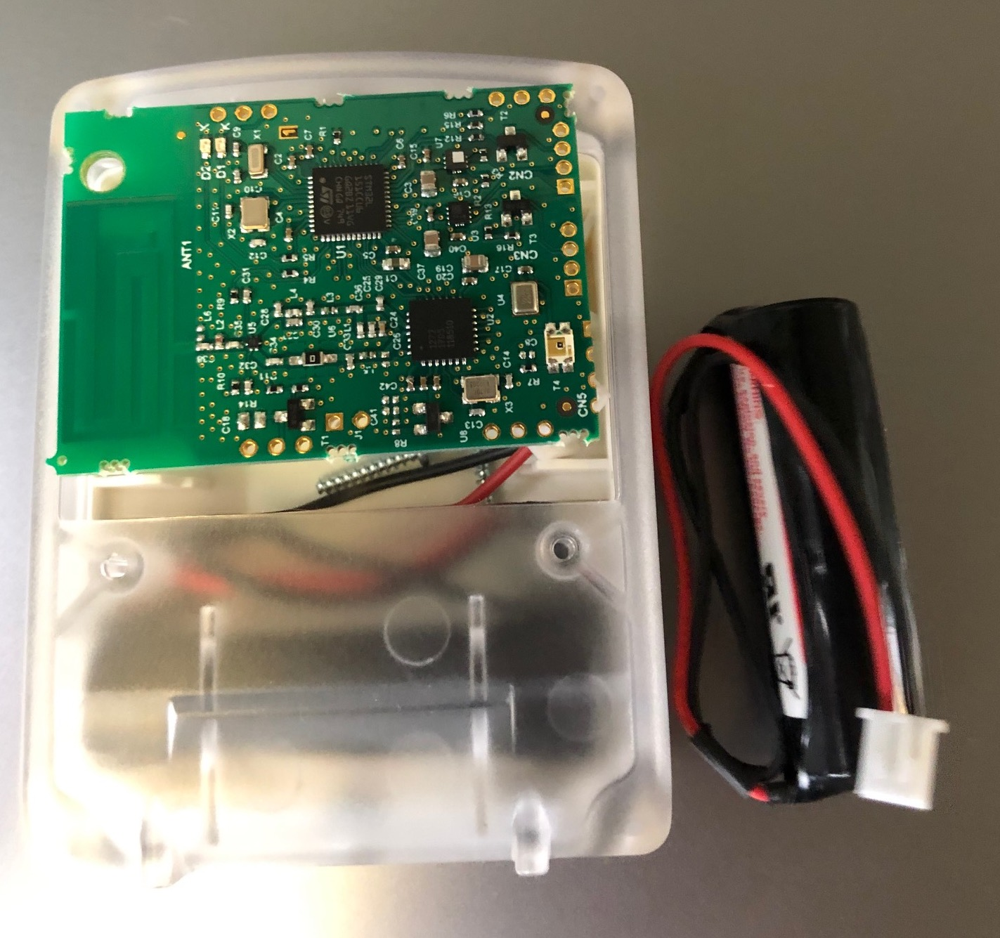
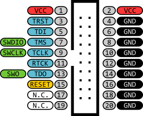
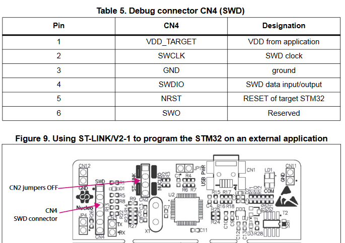
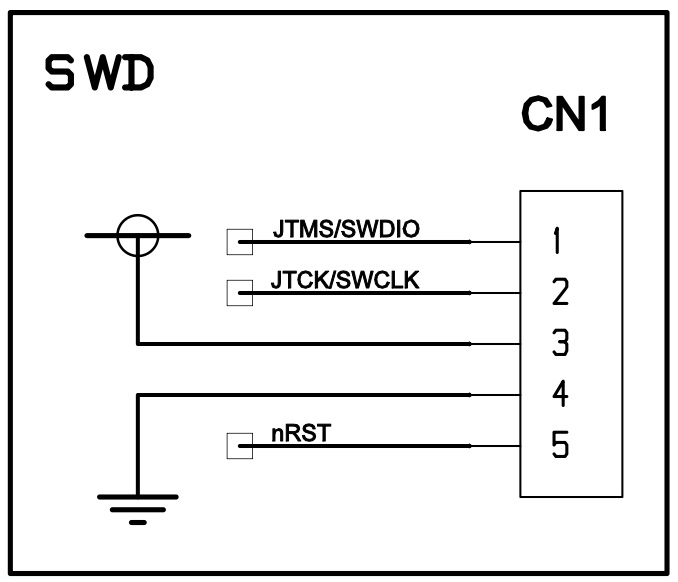
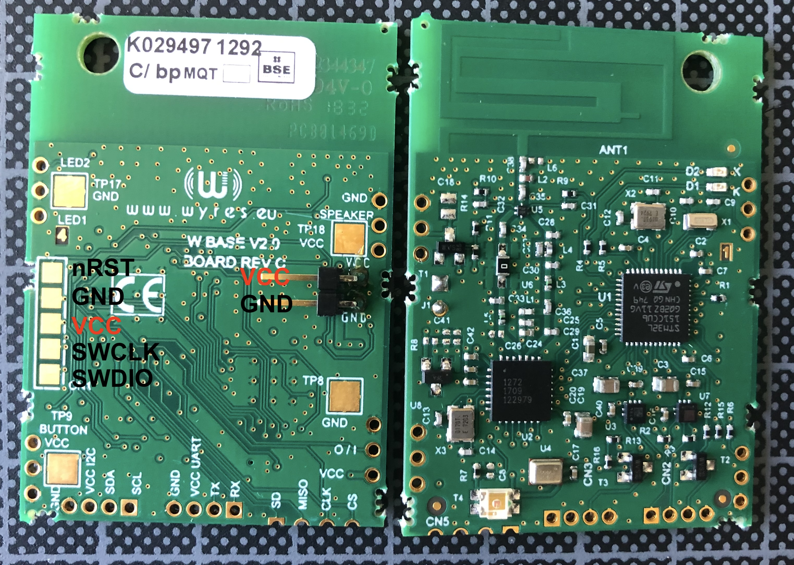
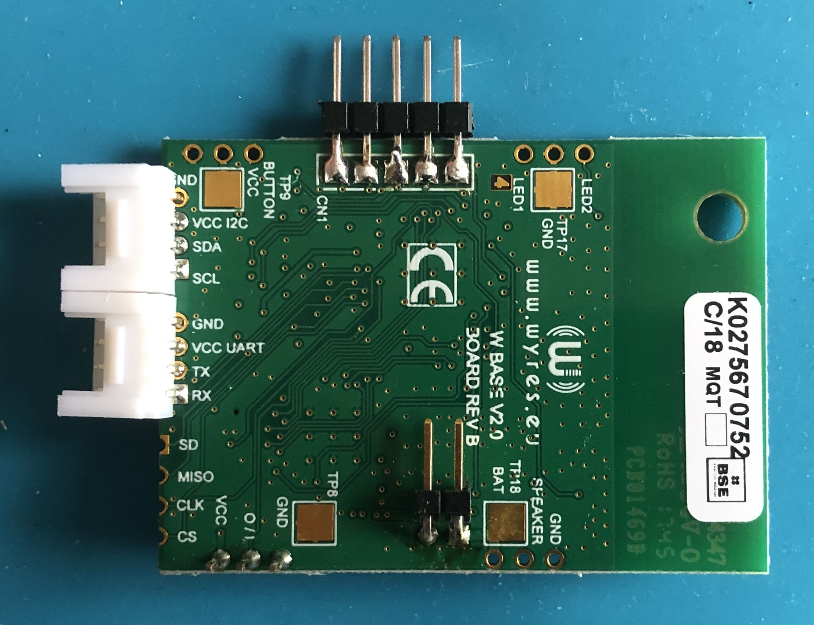
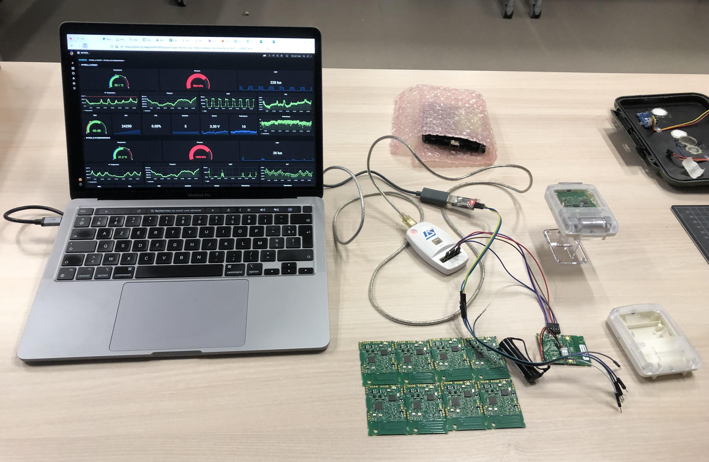
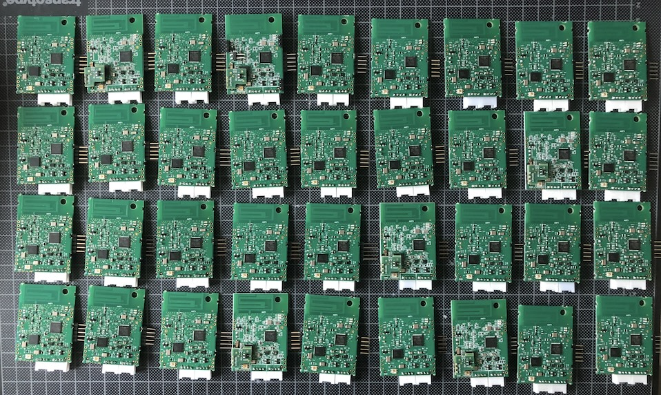
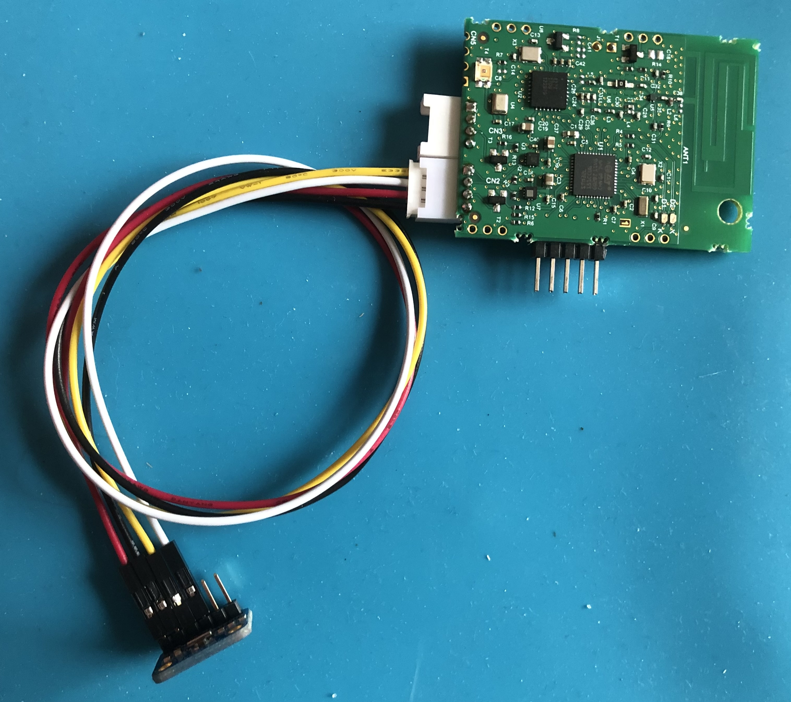

# La carte Wyres Base

[Précédent](01.md) | [Sommaire](README.md) |  [Suivant](03.md)

Dans ce chapitre, vous découvrirez les caractéristiques de la carte Wyres Base et les branchements à réaliser pour la programmer et mettre au point les programmes

## La carte Wyres Base



La carte Wyres Base est une carte électronique disposant d'un microcontroleur basse consommation d'énergie ST Microelectronic [STM32L151CC](https://www.st.com/en/microcontrollers-microprocessors/stm32l151cc.html), un composant de communication LoRa Semtech SX1272 et de plusieurs capteurs I2C.

https://github.com/CampusIoT/RIOT-wyres 

 - ST Microelectronic [STM32L151CC](https://www.st.com/en/microcontrollers-microprocessors/stm32l151cc.html) MCU
 - 256kb flash / 32kb RAM / 8kb EEPROM : MCU based 
 - [UART](https://fr.wikipedia.org/wiki/UART)(1) : MCU based : external grove connector
 - [SPI](https://fr.wikipedia.org/wiki/Serial_Peripheral_Interface)(2) : MCU based : 1 dedicated for radio, 1 on header
 - [I2C](https://fr.wikipedia.org/wiki/I2C)(1) : MCU based : external grove connector
 - Accelero : ST [LIS2DE12](https://github.com/RIOT-OS/RIOT/tree/master/tests/drivers/lis2dh12) via I2C 
 - Altimeter : ST [LPS22HB](https://github.com/RIOT-OS/RIOT/tree/master/tests/drivers/lpsxxx) via I2C
 - light sensitive trans. on GPIO : [Kingbright KPS-3227SP1C](https://www.kingbright.com/attachments/file/psearch/000/00/watermark00/KPS-3227SP1C(Ver.9).pdf)
 - [SPH0641LM4H-1](https://www.knowles.com/docs/default-source/default-document-library/sph0641lm4h-1_morello_datasheet.pdf) MEMS microphone on I2S bus
 - Semtech Lora radio SX1272 on SPI bus
 - 2 LEDs via GPIO on-board and via header
 - 1 'power' [PWM](https://fr.wikipedia.org/wiki/Modulation_de_largeur_d%27impulsion) GPIO (mosfet switched) on header
 - 1 'button' GPIO input with limiter resistance on header
 - 1 [GPIO](https://fr.wikipedia.org/wiki/General_Purpose_Input/Output) on header


La schématique de la carte est le schéma qui liste les composants, les étiquettes et les connexions électriques entre les composants de la carte. La schématique de la carte Wyres est disponible [ici](https://github.com/CampusIoT/RIOT-wyres/blob/main/boards/wyres-base/W_BASE_V2.0_REVB_Schema.pdf).
 
> Comment lire la schématique d'une carte ? [Voir](https://www.digikey.fr/fr/blog/how-to-read-a-schematic)

> Astuce: les broches 1 des connecteurs d'une carte ont en general une empreinte carré au lieu d'une empreinte ronde.

## Branchement du programmateur STLink v2

La carte Wyres Base requiert un programmateur [STLink](https://stm32-base.org/guides/connecting-your-debugger.html) pour charger le programme sur la carte et le debogger.

Le programmateur STLink peut avoir plus forme: 
* [STLink v2](https://www.st.com/en/development-tools/st-link-v2.html)
* [STLink v3](https://www.st.com/en/development-tools/stlink-v3minie.html)

| STLink ARM JTAG                          | Color  | Wyres Base  |
|------------------------------------------|--------|-------------|
| Pin 2: VDD_TARGET (VDD from application) | Red    | Pin 3: VDD  |
| Pin 9: SWCLK (clock)                     | Yellow | Pin 4: CLK  |
| Pin 4: GND (ground)                      | Black  | Pin 2: GND  |
| Pin 7: SWDIO (SWD data input/output)     | Blue   | Pin 5: DIO  |
| Pin 15: NRST (RESET of target STM32)     | Green  | Pin 1: NRST |



Le programmateur STLink disponible sur les cartes Discovery et Nucleo peuvent être utilisés pour pour charger le programme d'une autre carte.




| STLink Nucleo SWD                        | Color  | Wyres Base  |
|------------------------------------------|--------|-------------|
| Pin 1: VDD_TARGET (VDD from application) | Red    | Pin 3: VDD  |
| Pin 2: SWCLK (clock)                     | Yellow | Pin 4: CLK  |
| Pin 3: GND (ground)                      | Black  | Pin 2: GND  |
| Pin 4: SWDIO (SWD data input/output)     | Blue   | Pin 5: DIO  |
| Pin 5: NRST (RESET of target STM32)      | Green  | Pin 1: NRST |





Pour le développement, vous utiliserez des cartes équipées
* des 5 broches SWD
* d'un connecteurs Grove UART pour la console
* d'un connecteurs Grove I2C pour les capteurs I2C externes

> Il existe des modèles chinois compactes qui ne fonctionnent pas toujours très bien.







> Note: vous pouvez vérifier que le programmateur est bien reconnu par le système avec `lsusb`.

```
Bus 001 Device 005: ID 0483:3748 STMicroelectronics STM32 STLink  Serial: xxxxxxx‡
Bus 001 Device 006: ID 0483:374b STMicroelectronics STM32 STLink  Serial: xxxxxxx

```

Exercice : Recherchez sur un moteur de recherche `USB 0483:3748`

## Branchement de FTDI pour le connecteur Grove de la console UART (shell)

Le connecteur Grove UART de la carte permet de brancher un adaptateur USB-Serial (aka FTDI) pour afficher des traces sur la console de la carte.

Connectez l'adaptateur à votre machine.

Sur Linux
```bash
lsusb
ls /dev/ttyUSB*
tio -L
tio -b 115200 -m INLCRNL /dev/ttyUSB0
```

Sur MacOS
```bash
lsusb
```

```
Bus 001 Device 004: ID 067b:2303 Prolific Technology, Inc. USB-Serial Controller 
Bus 001 Device 006: ID 1a86:7523 1a86 USB2.0-Serial 
Bus 001 Device 006: ID 0403:6001 Future Technology Devices International Limited FT232R USB UART  Serial: A5058EC4
Bus 001 Device 006: ID 0483:374b STMicroelectronics STM32 STLink  Serial: 0669FF505271754867103637

```


```bash
ls /dev/tty.usb*
tio -L
tio -b 115200 -m INLCRNL /dev/tty.usbserial-XXXX
```

> Note: Parfois, le [pilote du composant CH340](https://learn.sparkfun.com/tutorials/how-to-install-ch340-drivers/linux) de certains adaptateurs USB Série n'est pas installé par défaut dans votre système.


## VirtualBox

Si vous utilisez Linux dans une machine virtuelle VirtualBox, il faut monter les 2 périphériques USBSerial et STLink dans le menu Péripériques de la machine virutelle. Utilisez `lsusb` pour savoir si les périphériques USBSerial et STLink sont montés.


## Branchement sur le connecteur Grove I2C

Le connecteur Grove I2C sert à connecter un ou plusieurs composants I2C comme ceux listés au [chapître Pilotage des capteurs MEMS](05.md).



## Autres headers

### Bouton

TODO

### External I/O

TODO

### SPI

TODO

### PWM

TODO
