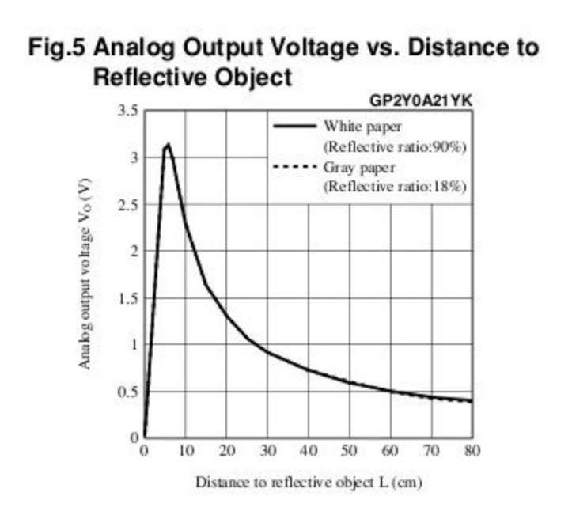
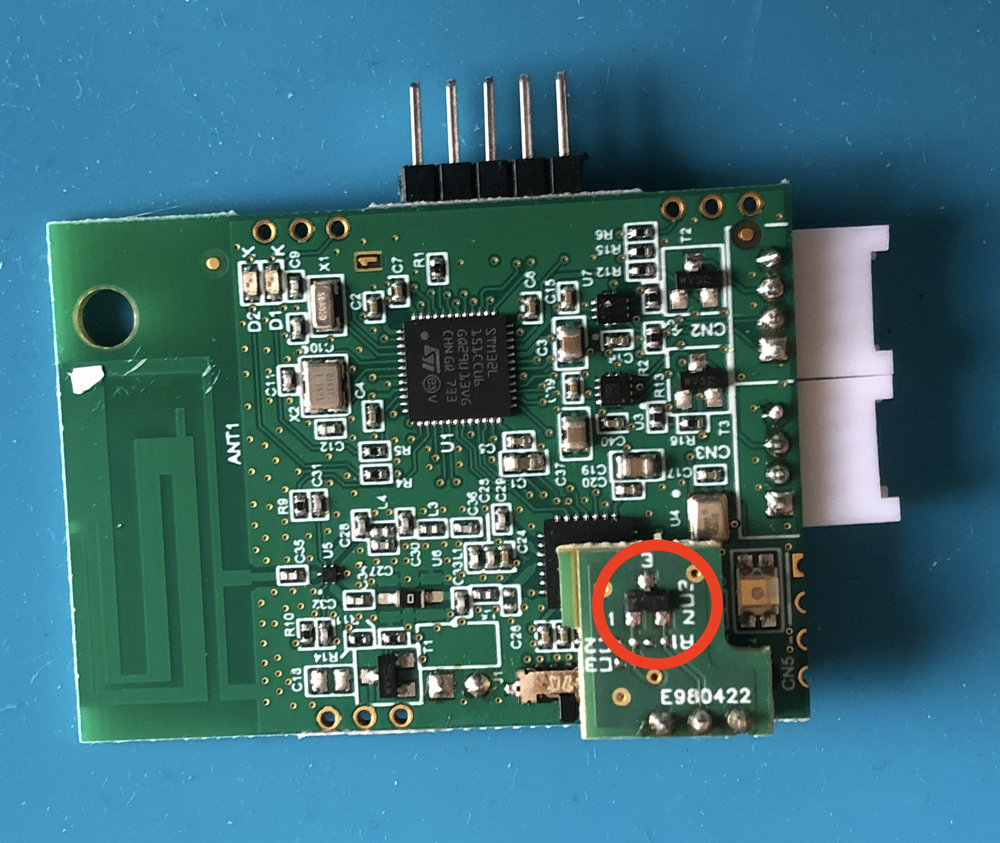

# Pilotage des entrées-sorties de la carte Wyres

[Précédent](03.md) | [Sommaire](README.md) |  [Suivant](05.md)

Dans ce chapitre, vous apprendrez à utiliser les GPIO numériques et analogiques en entrée et en sortie.


## Rappel

> Configurez la carte cible pour `make`
```bash
export BOARD=wyres-base
export EXTERNAL_BOARD_DIRS=~/github/campusiot/RIOT-wyres/boards
```

## LED / DEL

La carte Wyres Base possède 2 LED/DEL rouge et verte.

Le programme ci-dessous fait clignoter celles-ci. Relisez le fichier `main.c`.

```bash
cd ~/github/campusiot/RIOT-wyres/tests/leds
make -j 16 flash
```

<details>
<summary>Console</summary>
<pre>
main(): This is RIOT! (Version: 2023.07-devel-325-g2863d)

Toogle on board LEDs
</pre>
</details>

TODO : ajout image de la schématique

> Exercice: A quoi servent les LEDs sur une carte embarquée ?
<details>
<summary>Réponse</summary>
Les LEDs sur une carte embarquée servent d'interface homme-machine. En fonction des couleurs et des fréquences de clignotement, elles permettent d'indiquer l'état de l'exection du programme et d'être utilisé pour les diagnostiques d'erreur, de panne ...
</details>

## Bouton poussoir

Button 1 sur GPIO PB3

TODO : image de la schématique

> Exercice: quelles peuvent-être les applications (ie usages) de ce bouton ?
<details>
<summary>Réponse</summary>
  <ul>
    <li>Interface homme-machine: changement de mode en fonction du nombre d'appuis successifs (par exemple: envoi d'un message si un seul appui; ... ; reboot si 5 appuis successifs)</li>
    <li> Panic Button (pour les travailleurs isolés ou les personnes en situation de détresse ...)</li>
    <li> ... </li>
  </ul>
</details>

> Note : pour éviter le risque de rebond (rebounce), il faut ...

## Bouton poussoir en mode interruption

TODO

## Pluviomêtre

Un [pluviomêtre](https://fr.wikipedia.org/wiki/Pluviom%C3%A8tre) (rain gauge en anglais) mesure la quantité de pluie tombée sur une surface. Les pluviomètres bon marché à augets basculants sont munis d'augets qui se remplissent jusqu'au déséquilibre pour déclencher une interruption sur une GPIO (comme un bouton poussoir).


[Pour en savoir plus sur les modèles de pluviomêtre](https://www.weatherstation1.com/what-is-a-rain-gauge/)

## Capteur analogique de luminosité

La carte Wyres Base possède un capteur de luminosité raccordée en entrée à la broche XX analogique du STM32.

Le programme ci-dessous fait clignoter celles-ci. Relisez le fichier `main.c`.

```bash
cd ~/github/campusiot/RIOT-wyres/tests/light-sensor
make -j 16 flash
```

Utilisez la lumière de votre téléphone pour éblouir le capteur pendant l'exécution du programme.

<details>
<summary>Console</summary>
<pre>
main(): This is RIOT! (Version: 2023.07-devel-325-g2863d)

Test light sensor

Successfully initialized ADC_LINE(0)
ADC_LINE(0): raw value: 0016, percent: 00 %
ADC_LINE(0): raw value: 0027, percent: 00 %
ADC_LINE(0): raw value: 0304, percent: 07 %
ADC_LINE(0): raw value: 0351, percent: 08 %
ADC_LINE(0): raw value: 0431, percent: 10 %
ADC_LINE(0): raw value: 0333, percent: 08 %
ADC_LINE(0): raw value: 0123, percent: 03 %
ADC_LINE(0): raw value: 0116, percent: 02 %
ADC_LINE(0): raw value: 0172, percent: 04 %
ADC_LINE(0): raw value: 3785, percent: 92 %
ADC_LINE(0): raw value: 1679, percent: 40 %
ADC_LINE(0): raw value: 3805, percent: 92 %
ADC_LINE(0): raw value: 0296, percent: 07 %
</pre>
</details>

> Exercice: quelles peuvent-être les applications (ie usages) de ce capteur ?
<details>
<summary>Réponse</summary>
TODO
</details>

## PWM sur HP

La modulation de largeur d'impulsions (MLI ; en anglais : Pulse Width Modulation, soit PWM), est une technique couramment utilisée pour synthétiser des signaux pseudo analogiques à l'aide de circuits numériques (tout ou rien, 1 ou 0), ou plus généralement à états discrets. [Wikipedia](https://fr.wikipedia.org/wiki/Modulation_de_largeur_d%27impulsion)

La carte Wyres Base possède deux broches notées TP14 et TP15 sur lesquelles peuvent être branchés un mini haut-parleur. Le courant entre les 2 broches est piloté via la broche GPIO `PA1` en sortie [PWM](https://doc.riot-os.org/group__drivers__periph__pwm.html) 

```bash
cd ~/github/RIOT-OS/RIOT/tests/periph/pwm/
make -j 16 flash
```

> Exercice: quelles peuvent-être les applications (ie usages) de ce haut-parleur ?
<details>
<summary>Réponse</summary>
Une autre interface homme-machine (non visuelle) : En fonction de la fréquences des beeps, des périodes ..., elles permettent d'indiquer l'état de l'exection du programme et d'être utilisé pour les diagnostiques d'erreur, de panne ...
</details>


## Module GNSS

Il est possible de connecter un module GPS pour déterminer la position de l'équipement (latitude, longitude,altitude, vitesse et cap) à partir des constellations GNSS (GPS, Beidou, Glonas, Galileo). Cependant, comme la carte Wyres ne possède qu'une seule inerface UART, il est nécessaire de connecter l'interface UART du module GNSS au connecteur Grove UART utilisé normalement par la console. Il convient de désactiver la console comme dans l'exemple `apps/field_test_device` qui sera vu au [chapitre 7](07.md).

> A noter: la plupart des modules GNSS modernes disposent d'une interface I2C.

> Exercice: quelles peuvent-être les applications (ie usages) de ce GNSS ?
<details>
<summary>Réponse(s)</summary>
<ul>
<li>Suiveur (tracker en anglais) d'un véhicule pour le suivi du flotte de véhicules, le suivi/le répérage de conteneurs sur des docks, pour la lutte contre le vol, l'utilisation hors professionelle, ...</li>
<li>Suiveur (tracker en anglais) d'un animal (bétail, animaux sauvage) pour l'élevage extensif, pour la lutte contre le braconage ...)</li>
<li>Détection de déplacement de biens (geofencing en anglais)</li>
<li>...</li>
</ul>
</details>


## PIR Sensor
https://github.com/RIOT-OS/RIOT/tree/master/tests/drivers/pir
2 GPIO ?

External IO sur PA8 (noté TP3)


> Exercice: quelles peuvent-être les applications (ie usages) de ce capteur ?
<details>
<summary>Réponse</summary>
TODO
</details>

## Capteur de distance Sharp GP2Y0A21YK0F 

Ce capteur infra-rouge permet de mesurer des distances de 10  à 80 cms. Il se branche sur une broche analogique de la MCU. Il consomme environ 40 mA et son temps de réponse est de 39 ms. La tension de sortie varie de 2,3 - 0,4 Volts pour une distance variant respectivement 10 - 80 cms




## Capteur de poussière Grove

https://wiki.seeedstudio.com/Grove-Dust_Sensor/


## Capteur de gaz [MiCS-5524](https://cdn-shop.adafruit.com/product-files/3199/MiCS-5524.pdf) (CO / Alcohol / VOC)

TODO
## Reboot

GPIO PA8

> Exercice: quelles peuvent-être les applications (ie usages) de ce capteur ?
<details>
<summary>Réponse</summary>
TODO
</details>



