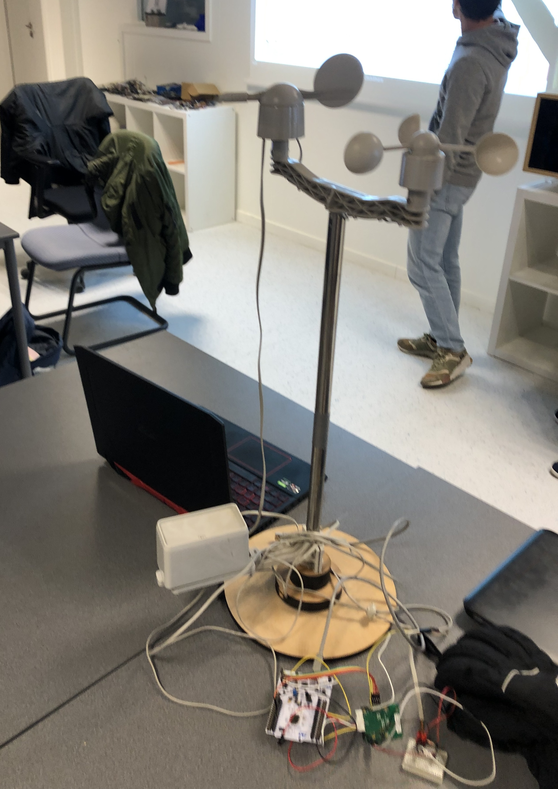

# Pilotage des entrées-sorties de la carte Wyres

[Précédent](03.md) | [Sommaire](README.md) |  [Suivant](05.md)

Dans ce chapitre, vous apprendrez à utiliser les GPIO numériques et analogiques en entrée et en sortie.

**[Schématique de la carte](https://github.com/CampusIoT/RIOT-wyres/blob/wip-tutoriel/boards/wyres-base/W_BASE_V2.0_REVB_Schema.pdf)**


## Rappel

> Configurez la carte cible pour `make`
```bash
export BOARD=wyres-base
export EXTERNAL_BOARD_DIRS=~/github/campusiot/RIOT-wyres/boards
```

Recherchez le  `tty` de la console et connectez-vous à celle-ci avec `tio`.
Sur Linux
```bash
lsusb
tio
tio -b 115200 -m INLCRNL /dev/ttyUSB0
```

Sur MacOS
```bash
lsusb
tio
tio -L
tio -b 115200 -m INLCRNL /dev/tty.usbserial-XXXX
```

> Pour mémoire, si vous utilisez Linux dans une machine virtuelle VirtualBox, il faut monter les 2 périphériques USBSerial et STLink dans le menu Péripériques de la machine virutelle.


## LED / DEL

La carte Wyres Base possède 2 LED/DEL rouge (GPIO `PA15`) et verte (GPIO `PA0`). Les broches des DEL/LED sont définies dans le fichier [`board.h`](../boards/wyres-base/include/board.h) de la carte.

Le programme ci-dessous fait clignoter celles-ci. Relisez le fichier `main.c`.

```bash
cd ~/github/campusiot/RIOT-wyres/tests/leds
make -j 4 flash
```

<details>
<summary>Console (tio)</summary>
<pre>
main(): This is RIOT! (Version: 2023.07-devel-325-g2863d)

Toogle on board LEDs
</pre>
</details>

> Exercice: A quoi servent les LEDs sur une carte embarquée ?
<details>
<summary>Réponse</summary>
Les LEDs sur une carte embarquée servent d'interface homme-machine. En fonction des couleurs et des fréquences de clignotement, elles permettent d'indiquer l'état de l'exection du programme et d'être utilisé pour les diagnostiques d'erreur, de panne ...
</details>

## Bouton poussoir

ATTENTION! Toutes les cartes Wyres Base ne sont pas équipées d'un bouton. Pour émuler un bouton, vous pouvez brancher deux fils sur les broches comme sur la photo ci-dessous et les faire toucher.


Pour les cartes équipées, le programme suivant suit l'évolution de l'état du bouton qui est sur la GPIO `PB3` du STM32:

```bash
cd ~/github/campusiot/RIOT-wyres/tests/button
make -j 4 flash
```
<details>
<summary>Console (tio)</summary>
<pre>
main(): This is RIOT! (Version: 2024.01-devel-168-g14ff95)

Read button 1 state
Button 1 has been pressed!
Button 1 has been released!
Button 1 has been pressed!
Button 1 has been released!
Button 1 has been pressed!
Button 1 has been released!
Button 1 has been pressed!
Button 1 has been released!
Button 1 has been pressed!
Button 1 has been released!
</pre>
</details>


> Exercice: quelles peuvent-être les applications (ie usages) de ce bouton ?
<details>
<summary>Réponse</summary>
  <ul>
    <li>Interface homme-machine: changement de mode en fonction du nombre d'appuis successifs (par exemple: envoi d'un message si un seul appui; ... ; reboot si 5 appuis successifs)</li>
    <li> Panic Button (pour les travailleurs isolés ou les personnes en situation de détresse ...)</li>
    <li> Boitier de satisfaction/incidents avec plusieurs boutons 'smiley' (administration, aéroport, toilettes ...). </li>
    <li> Boitier 'refill' pour signaler un événement (par exemple, plus de papiers toilettes, plus de savons ...) </li>
	<li>Interupteur micro-bascule (<i><a href="https://en.wikipedia.org/wiki/Miniature_snap-action_switch">micro-switch</a></i>) pour détecter l'ouverture d'un boitier/d'armoire contenant un équipement électrique/électronique/mécanique/optique. L'ouverture peut être normale (ie prévue) dans le cadre d'une maintenance, une installation .... L'ouverture peut être anormale (ie imprévue) dans le cadre d'une effraction. Dans ce dernier cas (<i><a href="https://en.wikipedia.org/wiki/Tamperproofing">tamper</a></i>) en anglais), l'équipement peut avoir été hacké : peut on avoir encore confiance dans les mesures collectées par cet équipement</li>
	<li>Interupteur micro-bascule (micro-switch) pour détecter la mauvaise fermeture d'un boitier/d'armoire contenant un équipement électrique/électronique/mécanique/optique devant être protégé comme l'humidité, la pluie, le ruissèlement, la poussière ...</li>
    <li> ... </li>
  </ul>
</details>

> Note : Pour éviter le risque de rebond (rebounce), il faut soit le traitement logiciellement (avec un non-prise en compte des interuptions perdant une milliseconde), soit en ajoutant un condensation dans le montage.

## Bouton poussoir en mode interruption

L'utilisation des interuptions sur les broches en entrée évite la scrutation active et permet d'économiser la batterie en mettant la MCU en sommeil profond.

```bash
cd ~/github/RIOT-OS/RIOT/tests/periph/gpio
make -j 4 flash
```

<details>
<summary>Console (tio)</summary>
<pre>
> init_int
usage: init_int <port> <pin> <flank> [pull_config]
	flank:
	0: falling
	1: rising
	2: both
	pull_config:
	0: no pull resistor (default)
	1: pull up
	2: pull down
> init_int 1 3 0
GPIO_PIN(1, 3) successfully initialized as ext int
> enable_int 1 3 1
enabling GPIO interrupt
> INT: external interrupt from pin 3
INT: external interrupt from pin 3
INT: external interrupt from pin 3
INT: external interrupt from pin 3
INT: external interrupt from pin 3
</pre>
</details>

Vous pouvez poursuivre l'exercice avec les interuptions sur le front montant `init_int 1 3 1` et pour le changement d'état `init_int 1 3 2`

## External IO

La carte Wyres Base possède une GPIO externe `PA8` à usage général (entrée numérique ou sortie numérique) qui est sur le pad `TP3`.

```bash
cd ~/github/RIOT-OS/RIOT/tests/periph/gpio
make -j 4 flash
```

<details>
<summary>Console (tio)</summary>
<pre>
> init_in_pu 0 8
> read 0 8
GPIO_PIN(0.08) is HIGH
> read 0 8
GPIO_PIN(0.08) is LOW
> read 0 8
GPIO_PIN(0.08) is HIGH
</pre>
</details>

Reliez un fil Dupont entre `GND` et `I/O` pour constater le passage à l'état bas sur la GIPO `PA8`.

> Certaines cartes sont munis d'une balance magnétique (*switch*) : placez un aimant dessus et relevez la valeur de la GPIO. Elle devient `LOW`.

> Exercice: à quoi sert cette balance (*switch*) magnétique ?
<details>
<summary>Réponse</summary>
<ol>
<li>Redémarrage de la carte avec un aimant: Cette balance magnétique (dans le cercle rouge dans la photo ci-dessous) permet d'actionner cette GPIO au travers d'un boitier étanche. Cela permet de disposer d'un bouton qui permet de réinitiaiser la carte (<i>reboot</i>) sans devoir ouvrir le boitier ou ajouter un bouton étanche coûteux. Vous pourrez écrire le traitant d'interruption qui est déclenchée au passage à l'état bas (<code>LOW</code>) de la GPIO <code>PA8</code>.</li>
<li>Contacteur de porte: la carte Wyres est fixée sur la porte et l'aimant est fixée sur le lindeau de la porte. La détection du contact peut être combinée avec l'accéléromètre [LIS2DE12](https://github.com/RIOT-OS/RIOT/tree/master/tests/driver_lis2dh12) de la carte</li>
<li>Piège à rongeur (<i>Rat trap</i>)</li>
<li>Pluviomètre: voir section suivante</li>
<ol>
</details>


Vous pouvez poursuivre l'exercice avec les interuptions comme dans le cas du bouton avec les commandes `init_int 0 8 0`, `init_int 0 8 1` et `init_int 0 8 2`

Pour tester, le *reboot* magnétique avec un aimant replacé la fonction suivante dans le code de l'exemple:

```c
#ifdef MODULE_PERIPH_GPIO_IRQ
#include "periph/pm.h"
static void cb(void *arg)
{
    printf("INT: external interrupt from pin %i\n", (int)arg);
    pm_reboot();
}
#endif
```

## Pluviomêtre

Un [pluviomêtre](https://fr.wikipedia.org/wiki/Pluviom%C3%A8tre) (rain gauge en anglais) mesure la quantité de pluie tombée sur une surface. Les pluviomètres bon marché à augets basculants sont munis d'augets qui se remplissent jusqu'au déséquilibre pour déclencher une interruption sur la GPIO `PA8` ou à la place du bouton poussoir (GPIO `PB3`). Le détection du basculement est réalisée au moyen d'un aimant fixé sur la paire d'augets et un bascule magnétique (voir section précédente). Il y a aussi un risque de rebond (*rebonce*). 


[Pour en savoir plus sur les modèles de pluviomêtre](https://www.weatherstation1.com/what-is-a-rain-gauge/)

## Weather Kit (Sparkfun SEN-15901)

Le [kit météo de Sparkfun](https://www.sparkfun.com/products/15901) comporte un pluviomètre, un anémomètre et un girouette.

L'anémomètre code la vitesse du vent en fermant simplement un interrupteur à chaque rotation.
Une vitesse du vent de 1,492 MPH produit une fermeture de l'interrupteur une fois par seconde.

Le girouette indique la direction du vent sous la forme d'une tension produite par la combinaison de résistances à l'intérieur du capteur. L'aimant de la girouette pourrait potentiellement fermer deux interrupteurs à la fois, permettant jusqu'à 16 positions différentes à indiquer.

Le guide d'utilisation est [ici](https://learn.sparkfun.com/tutorials/weather-meter-hookup-guide).

Une [bibliothèque pour Arduino](https://github.com/sparkfun/SparkFun_Weather_Meter_Kit_Arduino_Library) est disponible et peut être utiliser pour réaliser une station météo connectée avec la carte Wyres.



## Capteur analogique de luminosité

La carte Wyres Base possède un capteur de luminosité raccordée en entrée à la broche `PA3` analogique du STM32. La broche du capteur de luminosité est définie dans le fichier [`board.h`](../boards/wyres-base/include/board.h) de la carte.

Le programme ci-dessous fait clignoter celles-ci. Relisez le fichier `main.c`.

```bash
cd ~/github/campusiot/RIOT-wyres/tests/light-sensor
make -j 4 flash
```

Utilisez la lumière de votre téléphone pour éblouir le capteur pendant l'exécution du programme.

<details>
<summary>Console (tio)</summary>
<pre>
main(): This is RIOT! (Version: 2023.07-devel-325-g2863d)

Test light sensor

Successfully initialized ADC_LINE(0)
ADC_LINE(0): raw value: 0016, percent: 00 %
ADC_LINE(0): raw value: 0027, percent: 00 %
ADC_LINE(0): raw value: 0304, percent: 07 %
ADC_LINE(0): raw value: 0351, percent: 08 %
ADC_LINE(0): raw value: 0431, percent: 10 %
ADC_LINE(0): raw value: 0333, percent: 08 %
ADC_LINE(0): raw value: 0123, percent: 03 %
ADC_LINE(0): raw value: 0116, percent: 02 %
ADC_LINE(0): raw value: 0172, percent: 04 %
ADC_LINE(0): raw value: 3785, percent: 92 %
ADC_LINE(0): raw value: 1679, percent: 40 %
ADC_LINE(0): raw value: 3805, percent: 92 %
ADC_LINE(0): raw value: 0296, percent: 07 %
</pre>
</details>

> Exercice: quelles peuvent-être les applications (ie usages) de ce capteur ?
<details>
<summary>Réponse</summary>
TODO
</details>

## PWM sur HP

La modulation de largeur d'impulsions (MLI ; en anglais : Pulse Width Modulation, soit PWM), est une technique couramment utilisée pour synthétiser des signaux pseudo analogiques à l'aide de circuits numériques (tout ou rien, 1 ou 0), ou plus généralement à états discrets. [Wikipedia](https://fr.wikipedia.org/wiki/Modulation_de_largeur_d%27impulsion)

La carte Wyres Base possède deux broches notées TP14 et TP15 sur lesquelles peuvent être branchés un mini haut-parleur. Le courant entre les 2 broches est piloté via la broche GPIO `PA1` en sortie [PWM](https://doc.riot-os.org/group__drivers__periph__pwm.html) 

```bash
cd ~/github/RIOT-OS/RIOT/tests/periph/pwm/
make -j 4 flash
```

> Exercice: quelles peuvent-être les applications (ie usages) de ce haut-parleur ?
<details>
<summary>Réponse</summary>
Une autre interface homme-machine (non visuelle) : En fonction de la fréquences des beeps, des périodes ..., elles permettent d'indiquer l'état de l'exection du programme et d'être utilisé pour les diagnostiques d'erreur, de panne ...
</details>

## Module GNSS

Il est possible de connecter un module GPS pour déterminer la position de l'équipement (latitude, longitude,altitude, vitesse et cap) à partir des constellations GNSS (GPS, Beidou, Glonas, Galileo). Cependant, comme la carte Wyres ne possède qu'une seule inerface UART, il est nécessaire de connecter l'interface UART du module GNSS au connecteur Grove UART utilisé normalement par la console. Il convient de désactiver la console comme dans l'exemple `apps/field_test_device` qui sera vu au [chapitre 7](07.md).

> A noter: la plupart des modules GNSS modernes disposent d'une interface I2C.

> Exercice: quelles peuvent-être les applications (ie usages) de ce GNSS ?
<details>
<summary>Réponse(s)</summary>
<ul>
<li>Suiveur (<i>tracker</i> en anglais) d'un véhicule pour le suivi du flotte de véhicules, le suivi/le répérage de conteneurs sur des docks portuaires, pour la lutte contre le vol, l'utilisation hors professionelle, ...</li>
<li>Suiveur (<i>tracker</i> en anglais) d'un animal (bétail, animaux sauvage) pour l'élevage extensif, pour la lutte contre le braconage ...)</li>
<li>Détection de déplacement de biens en dehors d'une zone (<i>geofencing</i> en anglais)</li>
<li>...</li>
</ul>
</details>

## Pour aller plus loin

D'autres capteurs analogiques utilisant les GPIO peuvent être utilisés avec la carte Wyres Base. [Pour plus d'exemples ...](04b.md)
