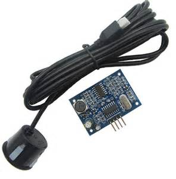
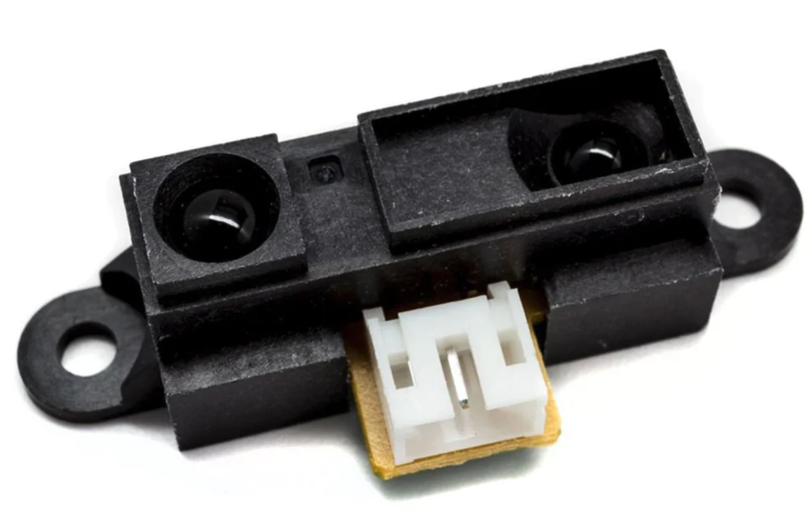
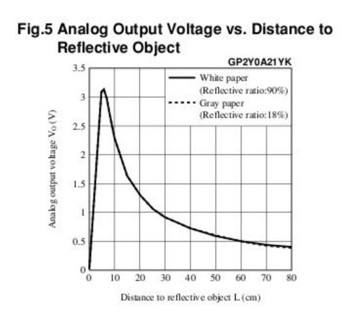
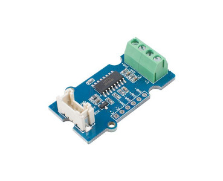
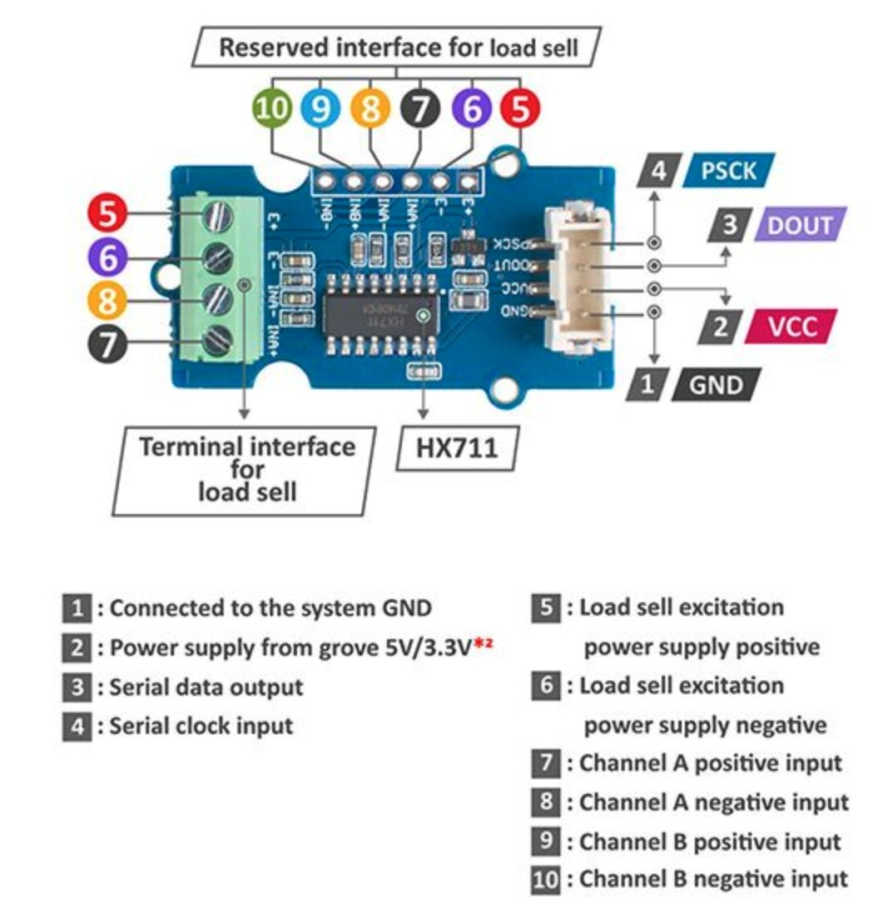
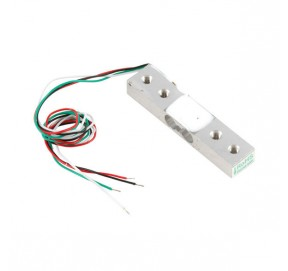

# Pilotage des entrées-sorties de la carte Wyres

[Précédent](04.md) | [Sommaire](README.md) |  [Suivant](04c.md)


## Rappel

> Configurez la carte cible pour `make`
```bash
export BOARD=wyres-base
export EXTERNAL_BOARD_DIRS=~/github/campusiot/RIOT-wyres/boards
```

Recherchez le  `tty` de la console et connectez-vous à celle-ci avec `tio`.
Sur Linux
```bash
lsusb
tio
tio -b 115200 -m INLCRNL /dev/ttyUSB0
```

Sur MacOS
```bash
lsusb
tio
tio -L
tio -b 115200 -m INLCRNL /dev/tty.usbserial-XXXX
```

> Pour mémoire, si vous utilisez Linux dans une machine virtuelle VirtualBox, il faut monter les 2 périphériques USBSerial et STLink dans le menu Péripériques de la machine virutelle.


## PIR Sensor

TODO

https://github.com/RIOT-OS/RIOT/tree/master/tests/drivers/pir

2 GPIO ?


> Exercice: quelles peuvent-être les applications (ie usages) de ce capteur ?
<details>
<summary>Réponse</summary>
Piège photo animalier (Wildcount)
</details>

## Capteur de distance à ultrason HC-SR04 

TODO

> Attention: choisissez un modèle fonctionnant en 3.3V.

> Note: en général: il est nécessaire d'effectuer plusieurs mesures pour déduire une mesure. Il faut aussi calculer la précision de la mesure.

## Capteur étanche de distance JSN-SR04T

Le JSN-SR04T est un capteur à ultrasons fonctionnant sur le même principe que le HC-SR04, mis à part que son capteur est étanche et unique (l'émetteur et le récepteur ne sont pas séparés, comme sur le HC-SR04, il est relié par 2 fils).



TODO

> Exercice: quelles peuvent-être les applications (ie usages) de ce capteur ?
<details>
<summary>Réponse</summary>
<li>detecteur de place de parking libre (en souterrain)</li>
<li>radar de recul d'un véhicule</li>
<li>niveau de liquide dans un cuve</li>
<li>niveau d'une rivière</li>
<li>niveau d'enneigement</li>
<li>...</li>
</details>


## Capteur de distance Sharp GP2Y0A21YK0F 

TODO

Ce capteur infra-rouge permet de mesurer des distances de 10  à 80 cms. Il se branche sur une broche analogique de la MCU. Il consomme environ 40 mA et son temps de réponse est de 39 ms. La tension de sortie varie de 2,3 - 0,4 Volts pour une distance variant respectivement 10 - 80 cms




```bash
cd ~/github/RIOT-OS/RIOT/tests/drivers/ir_nec/
make -j 16 flash
```

> Exercice: quelles peuvent-être les applications (ie usages) de ce capteur ?
<details>
<summary>Réponse</summary>
<li>TODO </li>
<li>...</li>
</details>

## Capteur de poussière Grove

TODO

Ce capteur mésure un taux de particules fines dans l'air. Il est muni du 
https://wiki.seeedstudio.com/Grove-Dust_Sensor/

TODO

> Exercice: quelles peuvent-être les applications (ie usages) de ce capteur ?
<details>
<summary>Réponse</summary>
<li>station de mesure de la qualité de l'air : pour mémoire, La pollution de l'air tue chaque année 7 millions de personnes dans le monde selon le dernier rapport de l'Organisation Mondiale de la Santé. </li>
<li>...</li>
</details>

## Capteur de gaz [MiCS-5524](https://cdn-shop.adafruit.com/product-files/3199/MiCS-5524.pdf) (CO / Alcohol / VOC)

TODO

## Jauge de déformation et convertisseur ADC HX711 et capteurs de force à pont de Wheatstone

TODO

[Jauge de déformation](https://fr.wikipedia.org/wiki/Jauge_de_d%C3%A9formation)





> Exercice: quelles peuvent-être les applications (ie usages) de ce capteur ?
<details>
<summary>Réponse</summary>
<li>balance connectée</li>
<li>balance industrielle connectée (rréservoir de contenus solides)</li>
<li>ruche connecté</li>
<li>nichoir connecté</li>
<li>...</li>
</details>

D'autres capteurs analogiques utilisant les GPIO peuvent être utilisés avec la carte Wyres Base. [Pour plus d'exemples ...](04c.md)

