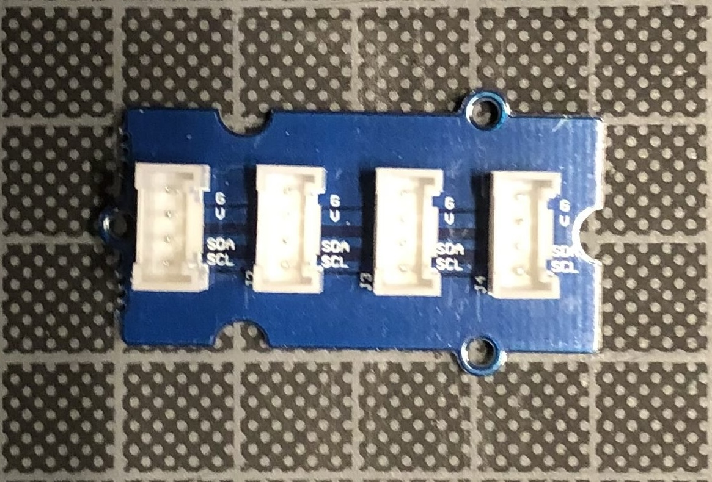
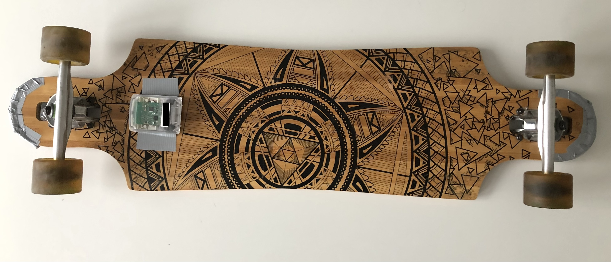
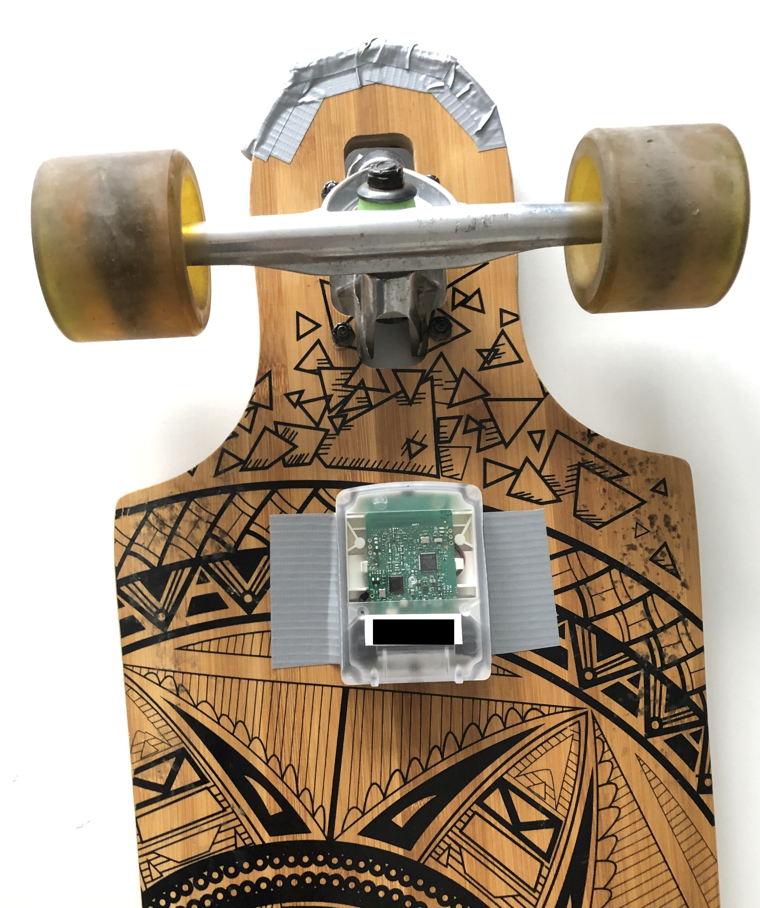
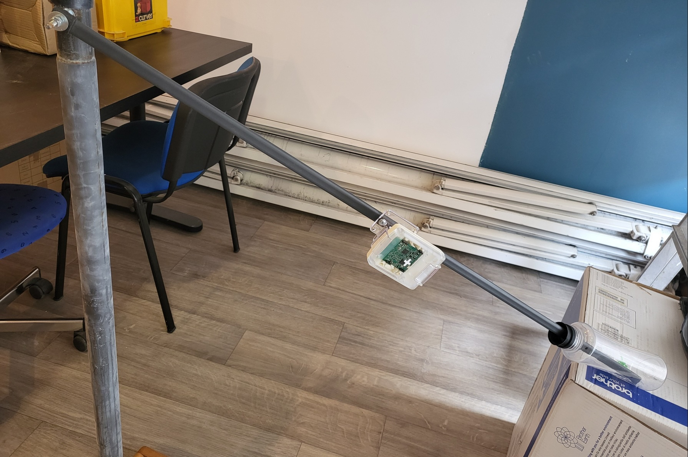

# Pilotage des capteurs MEMS I2C

[Précédent](04.md) | [Sommaire](README.md) |  [Suivant](06.md)

Dans ce chapitre, vous apprendrez à recolter les mesures
* de capteurs numériques (MEMS) de la carte Wyres Base
* ainsi que celles de capteurs connectés via le connecteur Grove I2C de la carte.


## Rappel

> Configurez la carte cible pour `make`
```bash
export BOARD=wyres-base
export EXTERNAL_BOARD_DIRS=~/github/campusiot/RIOT-wyres/boards
```

Recherchez le  `tty` de la console et connectez-vous à celle-ci avec `tio`.
Sur Linux
```bash
lsusb
tio
tio -b 115200 -m INLCRNL /dev/ttyUSB0
```

Sur MacOS
```bash
lsusb
tio
tio -L
tio -b 115200 -m INLCRNL /dev/tty.usbserial-XXXX
```

> Pour mémoire, si vous utilisez Linux dans une machine virtuelle VirtualBox, il faut monter les 2 périphériques USBSerial et STLink dans le menu Péripériques de la machine virutelle.


## Capteur pression atmosphérique ST LPS22HB

La carte comporte un capteur ST LPS22HB de mesure de la température et de la pression atmosphérique. Le pilote générique de cette gamme de capteurs `LPSxxx` est founi par RIOT OS.

```bash
cd ~/github/RIOT-OS/RIOT/tests/drivers/lpsxxx/
DRIVER=lps22hb make -j 4 flash
```

<details>
<summary>Console</summary>
<pre>
main(): This is RIOT! (Version: 2023.07-devel-325-g2863d)
Test application for lps22hb pressure sensor

Initializing lps22hb sensor
Pressure value: 995hPa - Temperature: 21.21°C
Pressure value: 995hPa - Temperature: 21.20°C
Pressure value: 995hPa - Temperature: 21.20°C
Pressure value: 995hPa - Temperature: 21.20°C
Pressure value: 995hPa - Temperature: 21.20°C
...
Pressure value: 869hPa - Temperature: 30.34°C
Pressure value: 869hPa - Temperature: 30.34°C
Pressure value: 869hPa - Temperature: 30.35°C
Pressure value: 869hPa - Temperature: 30.35°C
Pressure value: 869hPa - Temperature: 30.34°C
Pressure value: 869hPa - Temperature: 30.33°C

</pre>
</details>

> Exercice: quelles peuvent-être les applications (ie usages) de ce capteur ?
<details>
<summary>Réponse(s)</summary>
<ul>
<li>Station météo</li>
<li>Thermosat</li>
</ul>
</details>

## Accéléromêtre [LIS2DE12](https://www.st.com/en/mems-and-sensors/lis2de12.html)

La carte comporte un accélèromêtre ST [LIS2DE12](https://www.st.com/en/mems-and-sensors/lis2de12.html) pilotable via le bus I2C. RIOT fournit un driver pour un accéléromètre similaire (`lis2dh12`).

```bash
cd ~/github/RIOT-OS/RIOT/tests/drivers/lis2dh12/
DRIVER=lis2dh12_i2c make -j 4 flash
```

<details>
<summary>Console</summary>
<pre>
main(): This is RIOT! (Version: 2024.01-devel-259-ga38ab)
using I2C mode, for SPI mode select the lis2dh12_spi module
lis2dh12 [Initialized]
 Saiu do init .......................... 
Shell init .......................... 
&gt; help
Command              Description
---------------------------------------
read                 Read acceleration data
read_fifo            Read acceleration data from fifo
threshold            Configure threshold event
click                Configure click event
power                Enable / Disable the sensor
resolution           Get/Set resolution
rate                 Get/Set sampline rate
scale                Get/Set measuring range
temp                 Read temperature data
read_int             Read interruption data
pm                   interact with layered PM subsystem
reboot               Reboot the node
version              Prints current RIOT_VERSION
&gt; power
usage: power &lt;on|off&gt;
&amp; temp
-1.00 °C
&gt; scale
current range: ± 2g
usage: scale &lt;scale&gt;
where &lt;scale&gt; is:
	0: ± 2g
	1: ± 4g
	2: ± 8g
	3: ± 16g
&gt; resolution
current resolution: 8-bit
usage: resolution &lt;mode&gt;
where <mode&gt; is:
	0: off
	1: 8-bit
	2: 10-bit
	3: 12-bit
&gt; rate
Current sampling rate: 100 Hz
usage: rate &lt;rate&gt;
where &lt;rate&gt; is:
	1: 1 Hz
	2: 10 Hz
	3: 25 Hz
	4: 50 Hz
	5: 100 Hz
	6: 200 Hz
	7: 400 Hz
	8: 1620 Hz
	9: 5376 Hz
&gt; temp
0.00 °C
&gt; click
usage: click &lt;mg&gt; [µs] [dead time µs] [double click µs]
&gt; power
usage: power &lt;on|off&gt;
&gt; click
usage: click &lt;mg&gt; [µs] [dead time µs] [double click µs]
&gt; threshold
usage: threshold &lt;slot&gt; &lt;mg&gt; [µs]
&gt; read_fifo
[ 0] X:  0.160  Y: -0.144  Z:  0.976
[ 1] X:  0.176  Y: -0.144  Z:  0.976
[ 2] X:  0.160  Y: -0.144  Z:  0.960
[ 3] X:  0.160  Y: -0.144  Z:  0.960
[ 4] X:  0.160  Y: -0.160  Z:  0.960
[ 5] X:  0.160  Y: -0.160  Z:  0.976
[ 6] X:  0.176  Y: -0.144  Z:  0.976
[ 7] X:  0.176  Y: -0.160  Z:  0.944
[ 8] X:  0.160  Y: -0.160  Z:  0.960
[ 9] X:  0.160  Y: -0.144  Z:  0.976
[10] X:  0.160  Y: -0.144  Z:  0.960
[11] X:  0.160  Y: -0.160  Z:  0.960
[12] X:  0.160  Y: -0.176  Z:  0.960
[13] X:  0.160  Y: -0.160  Z:  0.976
[14] X:  0.160  Y: -0.160  Z:  0.976
[15] X:  0.176  Y: -0.160  Z:  0.960
[16] X:  0.160  Y: -0.144  Z:  0.976
[17] X:  0.160  Y: -0.144  Z:  0.960
[18] X:  0.176  Y: -0.160  Z:  0.976
[19] X:  0.160  Y: -0.144  Z:  0.960
[20] X:  0.176  Y: -0.176  Z:  0.960
[21] X:  0.160  Y: -0.160  Z:  0.960
[22] X:  0.160  Y: -0.176  Z:  0.976
[23] X:  0.160  Y: -0.160  Z:  0.976
[24] X:  0.176  Y: -0.144  Z:  0.960
[25] X:  0.176  Y: -0.160  Z:  0.992
[26] X:  0.192  Y: -0.160  Z:  0.960
[27] X:  0.176  Y: -0.144  Z:  0.960
[28] X:  0.160  Y: -0.160  Z:  0.960
[29] X:  0.176  Y: -0.176  Z:  0.976
[30] X:  0.176  Y: -0.160  Z:  0.976
&gt; read
X:  0.160  Y: -0.176  Z:  0.960
&gt; read
X:  0.320  Y: -0.112  Z:  0.928
&gt; read
X:  0.336  Y: -0.112  Z:  0.944
&gt; read
X:  0.912  Y: -0.080  Z:  0.288
&gt; read
X:  1.040  Y: -0.032  Z:  0.000
</pre>
</details>

Changez la position de la carte entre chaque commande `read`.


> Exercice: quelles peuvent-être les applications (ie usages) de ce capteur ?
<details>
<summary>Réponse(s)</summary>
<ul>
<li>Compteur de pas</li>
<li>Antivol</li>
<li>Ouverture de barrières</li>
<li>...</li>     
</ul>
</details>

## Capteurs I2C externes

La carte peut être étendue en raccordant un ou plusieurs capteurs I2C via le connecteur Grove I2C de la carte.

Repérez le modèle de capteur que vous avez en votre possession et branchez le au connecteur Grove I2C de la carte.

Respectez la couleur des fils et des broches si vous ne souhaitez pas endommager les composants et la carte

| Broche Platine | Fil Groove |
| ---- | ---- |
| `VCC` | Rouge |
| `GND` | Noir |
| `SDA` | Blanc | 
| `SDL` | Jaune |

Plusieurs capteurs I2C externes peuvent être raccordés à la carte Wyres grace à la [platine I2C Hub](https://wiki.seeedstudio.com/Grove-I2C_Hub/) (voir ci-dessous):




### [BME280](https://www.bosch-sensortec.com/products/environmental-sensors/humidity-sensors-bme280/)

Le composant Bosch Sensortec BME280 mesure la température ambiente, la pression atmosphérique et l'humidité relative. Le pilote générique de cette gamme de capteurs `bmx280` est founi par RIOT OS.

```bash
cd ~/github/RIOT-OS/RIOT/tests/drivers/bmx280/
make -j 4 flash
```

<details>
<summary>Console (tio)</summary>
<pre>
TODO
</pre>
</details>

> Exercice: quelles peuvent-être les applications (ie usages) de ce capteur ?
<details>
<summary>Réponse(s)</summary>
<ul>
<li>Station météo</li>
<li>Thermosat</li>
<li>...</li>
</ul>
</details>

### [BMP180](https://www.mouser.fr/datasheet/2/783/BST-BMP180-DS000-1509579.pdf) sur platine GY-68

Le composant Bosch Sensortec BMP180 mesure la température ambiente et la pression atmosphérique. Le pilote générique de cette gamme de capteurs `bmp180` est founi par RIOT OS.

> Note: Ce capteur est indiqué obsolète par son fabricant.

```bash
cd ~/github/RIOT-OS/RIOT/tests/drivers/bmp180/
make -j 4 flash
```

<details>
<summary>Console (tio)</summary>
<pre>
main(): This is RIOT! (Version: 2023.07-devel-325-g2863d)
BMP180 test application

+------------Initializing------------+
Initialization successful

+------------Calibration------------+
AC1: 9532
AC2: -1106
AC3: -14393
AC4: 33991
AC5: 25365
AC6: 21501
B1: 6515
B2: 40
MB: -32768
MC: -11786
MD: 2598

+--------Starting Measurements--------+
Temperature [°C]: 26.6
Pressure [hPa]: 866.36
Pressure at see level [hPa]: 882.79
Altitude [m]: 157

+-------------------------------------+
Temperature [°C]: 26.6
Pressure [hPa]: 866.39
Pressure at see level [hPa]: 882.85
Altitude [m]: 158
</pre>
</details>

> Exercice: quelles peuvent-être les applications (ie usages) de ce capteur ?
<details>
<summary>Réponse(s)</summary>
<ul>
<li>Station météo</li>
<li>Thermosat</li>
<li>...</li>
</ul>
</details>


### [BME680](https://www.bosch-sensortec.com/products/environmental-sensors/gas-sensors/bme680/)

Le composant Bosch Sensortec BME280 mesure la température ambiente, la pression atmosphérique et l'humidité relative. Il mesure aussi la concentration en Composants Organiques Volatiles COV (VOC en anglais). Le pilote de ce capteur `bme680` est founi par RIOT OS.

```bash
cd ~/github/RIOT-OS/RIOT/tests/drivers/bme680/
USEMODULE='bme680_fp bme680_i2c printf_float' make -j 4 flash
```

<details>
<summary>Console (tio)</summary>
<pre>
Help: Press s to start test, r to print it is ready
START
main(): This is RIOT! (Version: 2023.07-devel-325-g2863d)
Initialize BME680 sensor 0 ... OK
[bme680]: dev=0 T = 27.04 degC, P = 86734.91 Pa, H 63.732 %, G = 31305 ohms
+-----------------------------------------+
[bme680]: dev=0 T = 27.05 degC, P = 86735.34 Pa, H 63.672 %, G = 29744 ohms
+-----------------------------------------+
[bme680]: dev=0 T = 27.05 degC, P = 86735.66 Pa, H 63.593 %, G = 28781 ohms
+-----------------------------------------+
[bme680]: dev=0 T = 27.06 degC, P = 86736.39 Pa, H 63.647 %, G = 28122 ohms
+-----------------------------------------+
[bme680]: dev=0 T = 27.06 degC, P = 86735.59 Pa, H 63.681 %, G = 27510 ohms
+-----------------------------------------+
[bme680]: dev=0 T = 27.07 degC, P = 86735.38 Pa, H 63.748 %, G = 27082 ohms
+-----------------------------------------+
[bme680]: dev=0 T = 27.07 degC, P = 86735.33 Pa, H 63.835 %, G = 26447 ohms
</pre>
</details>

L'adresse I2C est `0x77`.

> Exercice: quelles peuvent-être les applications (ie usages) de ce capteur ?
<details>
<summary>Réponse(s)</summary>
<ul>
<li>Station météo</li>
<li>Station de mesure de la qualité de l'air intérieur</li>
<li>...</li>
</ul>
</details>


### MPL3115A2

Le composant NXP [MPL3115A2](https://www.nxp.com/docs/en/data-sheet/MPL3115A2.pdf) mesure la température ambiente, l'altitude (via la pression atmosphérique) et l'humidité relative. Il mesure aussi la concentration en Composants Organiques Volatiles COV (VOC en anglais). Le pilote de ce capteur `mpl3115a2` est founi par RIOT OS.

Les plages de mesure et les précisions sont:
- Pressure: 20 à 110 kPa sur 20 bits
– Altitude: –698 à 11,775 m sur 20 bits
– Temperature: –40 °C à 85 °C sur 12 bits

```bash
cd ~/github/RIOT-OS/RIOT/tests/drivers/mpl3115a2/
make -j 4 flash
```

<details>
<summary>Console (tio)</summary>
<pre>
TODO
</pre>
</details>


> Exercice: quelles peuvent-être les applications (ie usages) de ce capteur ?
<details>
<summary>Réponse(s)</summary>
<ul>
<li>Station météo</li>
<li>Sonde météo pour ballon</li>
</ul>
</details>

### [MAG3110](https://www.nxp.com/docs/en/data-sheet/MAG3110.pdf)

Mesures: digital 3-axis magnetometer

```bash
cd ~/github/RIOT-OS/RIOT/tests/drivers/mag3110/
make -j 4 flash
```

<details>
<summary>Console (tio)</summary>
<pre>
main(): This is RIOT! (Version: 2023.07-devel-325-g2863d)
MAG3110 magnetometer driver test application

Initializing MAG3110 magnetometer at I2C_0... [SUCCESS]
Field strength: X: -1745 Y: 1645 Z: 2350
Die Temperature T: 0
Field strength: X: -1750 Y: 1646 Z: 2265
Die Temperature T: 0
Field strength: X: -1749 Y: 1647 Z: 2222
Die Temperature T: 0
Field strength: X: -1799 Y: 1944 Z: 2028
Die Temperature T: -1
Field strength: X: -1699 Y: 1591 Z: 1969
Die Temperature T: 0
Field strength: X: -1705 Y: 1562 Z: 1968
Die Temperature T: 1
Field strength: X: -1762 Y: 1512 Z: 1781
Die Temperature T: 2
Field strength: X: -1764 Y: 1510 Z: 1761
Die Temperature T: 3
Field strength: X: -1761 Y: 1509 Z: 1664
Die Temperature T: 3
Field strength: X: -1760 Y: 1507 Z: 1819
</pre>
</details>

> L'adresse I2C est `0x0e`.

<details>
<summary>Console (tio)</summary>
<pre>
<li>Electronic Compass (e-compass)</li>
</li>Location-Based Services</li>
</li>Détection d'une masse de métal (détecteur pour place de parking)</li>
</pre>
</details>

> Exercice: quelles peuvent-être les applications (ie usages) de ce capteur ?
<details>
<summary>Réponse(s)</summary>
<ul>
<li>Sonde météo pour ballon</li>
</ul>
</details>

### Capteur de distance Time-of-Flight

STMicroelectronics fabrique une gamme de capteurs I2C (miniature et basse consommation) de distance basés sur la technologie Time-of-Flight (ToF). La gamme varie sur la portée (distance maximale dans l'obscurité et en lumière ambiante), sur le nombre de zones mesurées (8x8 pour le capteur [VL53L7CH](https://www.st.com/en/imaging-and-photonics-solutions/vl53l7ch.html)) et sur l'angle d'ouverture des zones.

RIOT supporte seulement les capteurs de la sous-gamme []`vl6180x`](https://github.com/RIOT-OS/RIOT/tree/master/drivers/vl6180x).

```bash
cd ~/github/RIOT-OS/RIOT/tests/drivers/vl6180x/
make -j 4 flash
```

```bash
cd ~/github/RIOT-OS/RIOT/tests/drivers/vl6180x/
CFLAGS="-DVL6180X_PARAM_INT_PIN=\(GPIO_PIN\(0,5\)\)" \
USEMODULE=vl6180x_irq \
make -j 4 flash
```

> Exercice: quelles peuvent-être les applications (ie usages) de ce capteur ?
<details>
<summary>Réponse(s)</summary>
<ul>
<li>[niveau de papier](https://www.milesight.com/iot/product/lorawan-sensor/ws201) dans un distributeur de feuille de papier toilette</li>
<li>niveau de liquide dans un cuve</li>
<li>[niveau de remplissage d'un conteneur de déchets](https://www.milesight.com/iot/product/lorawan-sensor/em400-tld)</li>
<li>niveau d'une rivière</li>
<li>niveau d'enneigement</li>
<li>présence d'un objet/d'un colis dans une boite à lettre/un caissier de livraison</li>
<li>...</li>
</ul>
</details>

> Note: vous pouvez implémenter les drivers des capteurs ToF des autres gammes et les contribuer à RIOT OS.

### Capteurs de gaz
La mesure de la qualité de l'air interieur et exterieur est une application de l'Internet des Objets.

Les gaz mesurables sont nombreux : Monoxyde de carbone (CO), Dioxyde de carbone (CO2), Ammoniac (NH₃), Sulfure d'hydrogène (H₂S), Dioxyde d'azote (NO2), Alcool éthylique (C2H5CH), Composés organiques volatils (COV), Particules en suspension (PM). ...

SeeedStudio fabrique plusieurs platines Groove avec les principaux composants du marché :
[GM-102B; GM-302B; GM-502B; GM-702B](https://www.seeedstudio.com/Grove-Multichannel-Gas-Sensor-v2-p-4569.html)
[SGP40](https://www.seeedstudio.com/Grove-Air-Quality-Sensor-SGP40-p-5700.html)
[SGP41](https://www.seeedstudio.com/Grove-Air-Quality-Sensor-SGP41-p-5687.html)
[SCD30](https://www.seeedstudio.com/Grove-CO2-Temperature-Humidity-Sensor-SCD30-p-2911.html)
[BME688](https://www.seeedstudio.com/Grove-Gas-Sensor-BME688-p-5478.html)
[ME2](https://www.seeedstudio.com/Grove-Oxygen-Sensor-ME2-O2-f20.html)


> Exercice: quelles peuvent-être les applications (ie usages) de ces capteurs ?
<details>
<summary>Réponse(s)</summary>
<ul>
<li>Confort et sécurité</li>
<li>Alkolock (Antidémarreur éthylométrique)</li>
<li><a href="https://www.milesight.com/iot/product/lorawan-sensor/gs301">Bathroom Odor Detector</a></li>
<li><a href="https://blog.benjamin-cabe.com/2021/08/03/how-i-built-a-connected-artificial-nose">Nez artificiel</a></li>
<li>...</li>
</ul>
</details>


### Convertisseur analogique numérique multi-canaux multi-résolutions I2C 

La carte Wyres Base n'a qu'un seul convertisseur analogique numérique (ADS) qui est affecté au capteur de luminosité. 

Si votre projet requiert plusieurs ADC, il existe des composants I2C qui permettent d'ajouter plusieurs canaux d'ADS (2 à 8), avec une meilleure résolution (12 à 16 bits), avec des taux de conversion plus ou moins élevés (jusqu'à MSPS pour l'[ADC120 de ST](https://www.st.com/resource/en/datasheet/adc120.pdf)) sur des plages de tensions variables (±0.256 à ±6.144 V par exemple).

On peut citer les composants [ADS101x](https://www.ti.com/lit/ds/symlink/ads1114.pdf) et [ADS111x](https://www.ti.com/lit/ds/symlink/ads1114.pdf) supportés par RIOT.


```bash
cd ~/github/RIOT-OS/RIOT/tests/drivers/ads101x/
make -j 4 flash
```

<details>
<summary>Console (tio)</summary>
<pre>
main(): This is RIOT! (Version: 2023.07-devel-325-g2863d)
ADS101X analog to digital driver test application

Initializing ADS101x analog to digital at I2C_DEV(0)... [OK]
Initializing ADS101x alert at I2C_DEV(0)... [OK]
Enabling alert interrupt: [OK]
Raw analog read. CH0: 5664 CH1: 5584 CH2: 5728 CH3: 5472
Raw analog read. CH0: 5504 CH1: 5440 CH2: 5712 CH3: 5648
Raw analog read. CH0: 5456 CH1: 5616 CH2: 5600 CH3: 5616
Raw analog read. CH0: 5568 CH1: 5456 CH2: 5600 CH3: 5504
...
Raw analog read. CH0: 5424 CH1: 5440 CH2: 5504 CH3: 5632
Raw analog read. CH0: 9744 CH1: 9024 CH2: 9344 CH3: 11024
Raw analog read. CH0: 13904 CH1: 12544 CH2: 12432 CH3: 14720
Raw analog read. CH0: 21312 CH1: 14592 CH2: 17184 CH3: 15040
</pre>
</details>


Vous pourrez brancher sur un des canaux des capteurs analogiques tels que
* le capteur de luminosité [TEMT6000]([TEMT6000X01 ambient light sensor](https://www.vishay.com/docs/81579/temt6000.pdf))
* une sonde de température PT100/PT1000 (-200°C à 600°C)
* une sonde de pression de l'eau (niveau de cuve, canalisation ...)
* un [capteur de flexion](https://fr.wikipedia.org/wiki/Capteur_de_flexion)
* ...

## SAUL

[SAUL ([S]ensor [A]ctuator [U]ber [L]ayer)](https://doc.riot-os.org/group__drivers__saul.html) est une interface d'abstraction des capteurs pour les applications. Les pilotes de capteurs compatibles SAUL sont listés dans un registre. La collecte des mesures ne dépend plus d'une interface spécifique à un modèle de capteurs.

```bash
cd ~/github/campusiot/RIOT-wyres/tests/saul
make -j 4 flash
```

<details>
<summary>Console (tio)</summary>
<pre>
main(): This is RIOT! (Version: 2023.07-devel-325-g2863d)
SAUL test application

Dev: lps22hb    Type: SENSE_PRESS
Data:            	995 hPa

Dev: lps22hb    Type: SENSE_TEMP
Data:          	20.97 °C

##########################

Dev: lps22hb    Type: SENSE_PRESS
Data:            	995 hPa

Dev: lps22hb    Type: SENSE_TEMP
Data:          	20.97 °C
</pre>
</details>

## Exploration des capteurs I2C

Ce [programme](https://github.com/RIOT-OS/RIOT/tree/master/tests/periph/i2c#readme) vous permet de tester toutes les fonctions I2C de bas niveau disponibles à l'aide du Shell sur les capteurs I2C présents sur la carte. Il offre la possibilité de débbuger les pilotes I2C de nouveaux capteurs via le Shell

```bash
cd ~/github/RIOT-OS/RIOT/tests/periph/i2c
make -j 4 flash
```

<details>
<summary>Console (tio)</summary>
<pre>
Scanning I2C device 0...
addr not ack'ed = "-", addr ack'ed = "X", addr reserved = "R", error = "E"
     0 1 2 3 4 5 6 7 8 9 a b c d e f
0x00 R R R R R R R R R R R R R R - -
0x10 - - - - - - - - - X - - - - - -
0x20 - - - - - - - - - - - - - - - -
0x30 - - - - - - - - - - - - - - - -
0x40 - - - - - - - - - - - - - - - -
0x50 - - - - - - - - - - - - - X - -
0x60 - - - - - - - - - - - - - - - -
0x70 - - - - - - - - R R R R R R R R
</pre>
</details>

> Exercice: 2 composants I2C sont découverts aux adresses `0x19` et `0x5d`. Quels sont ces composants ?

## Contributions à RIOT

RIOT OS ne supporte pas tous les capteurs de la carte et les capteurs externes dont vous disposez.

Vous pouvez entreprendre l'écriture du pilote et du test idoine et le contribuer à RIOT via une pull-request.

Voici quelques capteurs pour les pilotes sont à écrire.

### [MMA7361](https://www.nxp.com/docs/en/data-sheet/MMA7361L.pdf)

Mesures:
- ±1.5g, ±6g Three Axis Low-g Accelerometer

```bash
cd ~/github/RIOT-OS/RIOT/tests/drivers/mma7660/
make -j 4
```

###  MPU-6050 sur la platine GY-521

Mesures: Gyroscope 3 axes et accéléromètre

> Note: il existe un pilote RIOT mpu9x50 pour un capteur MEMS d'une gamme silmilaire   

### [MPL115A2](https://www.nxp.com/docs/en/data-sheet/MPL115A2.pdf)

TODO

### BMP085 sur platine GY-65

TODO

### [SPH0641LM4H-1](https://www.knowles.com/docs/default-source/default-document-library/sph0641lm4h-1_morello_datasheet.pdf)

Ce microphone MEMS est présent sur la carte Wyres Base. Il est accessible via le [bus I2S (également appelé Inter-IC Sound)](https://fr.wikipedia.org/wiki/I2S).

Quelques pistes pour l'exploiter dans vos projets:
* https://github.com/baztastic/knowles_mic_shield
* https://github.com/baztastic/knowles_mic_shield/blob/master/Datasheets/AP_Understanding_PDM_Digital_Audio.pdf


## Idées de projet

### Coatch pour skaters

Mesurer les mouvements (et les chocs) d'un skateur au moyen de l'accéléromètre `lis2de12` de la carte Wyres Base.




### Mesure le niveau d'eau d'une rivière ou d'un lac

Mesurer le niveau d'eau d'une rivière ou d'un lac en mesurant l'inclinaison de l'accéléromètre `lis2de12` de la carte Wyres Base. https://hackaday.io/project/186862-water-level-lora-sensor


