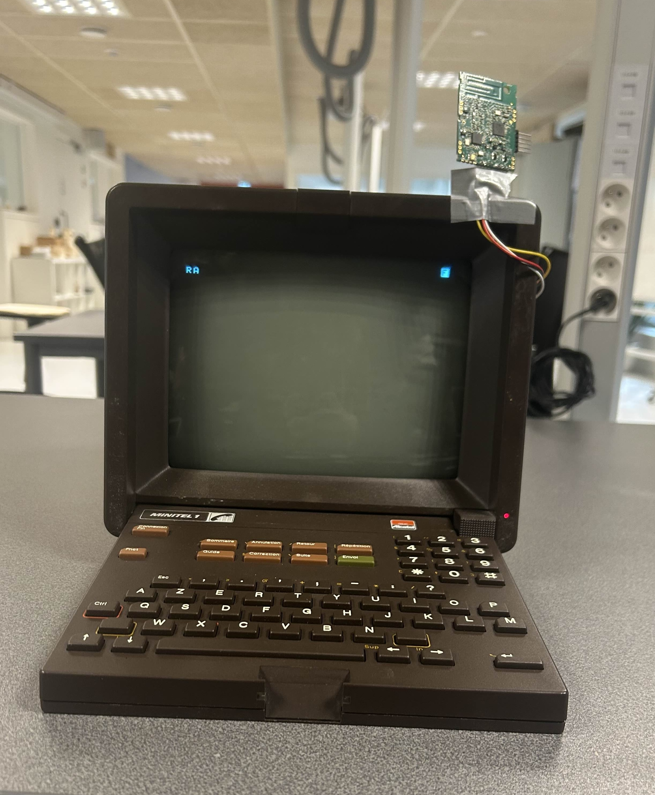

# Communications LoRa

[Précédent](05.md) | [Sommaire](README.md) |  [Suivant](07.md)

Dans ce chapitre, vous apprendrez à transmettre et recevoir des informations en utilisant directement le pilote des transceivers LoRa SX1272 de 2 (ou plus) cartes Wyres Base (la votre et celles de vos voisins).

## Rappel

> Configurez la carte cible pour `make`
```bash
export BOARD=wyres-base
export EXTERNAL_BOARD_DIRS=~/github/campusiot/RIOT-wyres/boards
```

Recherchez le  `tty` de la console et connectez-vous à celle-ci avec `tio`.
Sur Linux
```bash
lsusb
tio
tio -b 115200 -m INLCRNL /dev/ttyUSB0
```

Sur MacOS
```bash
lsusb
tio
tio -L
tio -b 115200 -m INLCRNL /dev/tty.usbserial-XXXX
```

> Pour mémoire, si vous utilisez Linux dans une machine virtuelle VirtualBox, il faut monter les 2 périphériques USBSerial et STLink dans le menu Péripériques de la machine virutelle.


## La modulation de communication LoRa

La modulation de communication LoRa utilise une technique brevetée de modulation par étalement de spectre (de type [Chirp](https://fr.wikipedia.org/wiki/Chirp) Spread Spectrum).

La modulation de communication LoRa cible principalement les communications nécessitant de faire transiter un volume de données faible avec un débit réduit, ce qui permet de limiter la consommation énergétique des équipements connectés et de proposer des [autonomies de plusieurs années sur piles](https://www.elsys.se/en/battery-life-calculator/).

La modulation de communication LoRa s'utilise sur des bandes de fréquences libres (utilisables sans déclaration et sans redevance) permet de réduire les coûts de fonctionnement du réseau. Elle offre ainsi la possibilité de créer de réseaux dits privés (indépendants des opérateurs) pouvant couvrir un immeuble, un champ ou une ville sans frais d'abonnement. 

Quelques liens pour approfondir:
* [Wikipedia](https://fr.wikipedia.org/wiki/LoRaWAN)
* [LoRa Alliance](https://lora-alliance.org/about-lorawan/)

## Communication point-à-point (P2P) avec LoRa

RIOT autorise l'utilisation direct des pilotes des périphériques de communication (Ethernet, 802.15.4 ...) sans passer par des couches d'abstraction réseau (IP, LoRaMAC ...). Dans le cas de la carte Wyres Base, le périphérique de communication radio est le composant [Semtech SX1272](https://www.semtech.fr/products/wireless-rf/lora-connect/sx1272) qui permet d'écouter des messages transmis en modulation LoRa ou GFSK et de transmettre des messages avec modulation LoRa ou GFSK en consommant peu d'énergie (GMSK, LR-FHSS, Mioty, FLRC pour les nouvelles génération de transceivers : SX126x, LR11XX, LR20xx). Les communications sont dites helf-duplex : l'écoute est exclusive de la transmission (c.a.d que le transceiver est "sourd" pendant l'émission).

Le programme suivant démontre la configuration des paramêtres de communication, la transmission de messages et la réception de messages.

Pour les tests, accordez vous avec votre voisin sur des paramêtres de communication pour échanger avec lui des messages LoRa. Il conviendra d'utiliser des canaux de fréquence qui sont autorisés par la réglementation locale (entre 863 et 870 MHz en Europe par exemple).

```bash
cd ~/github/campusiot/RIOT-wyres/tests/driver_sx127x
make -j 4 flash
```

<details>
<summary>Console (tio) #1</summary>
<pre>
> help
main(): This is RIOT! (Version: 2026.01-devel-61-gb1256f)
Initialization successful - starting the shell now
> init
[sx127x] SPI_0 initialized with success
[sx127x] initializing radio settings
Unexpected netdev event received: 8
5
> random
random: number from sx127x: 1263573764
[sx127x] initializing radio settings
> random
random: number from sx127x: 912026691
[sx127x] initializing radio settings
> channel get
Channel: 868299987
> setup 125 7 5
setup: setting 125KHz bandwidth
[Info] setup: configuration set with success
> syncword set 34
Syncword set to 34
> crc set 1
Successfully enabled CRC check
> implicit set 0 
Successfully disabled implicit header
> send HELLO
sending "HELLO" payload (6 bytes)
> Transmission completed
> send ₍ᐢ֎ﻌ֍ᐢ₎ʃ
sending "₍ᐢ֎ﻌ֍ᐢ₎ʃ" payload (22 bytes)
> Transmission completed
> setup 125 8 5
setup: setting 125KHz bandwidth
[Info] setup: configuration set with success
> send fffffffff
sending "fffffffff" payload (10 bytes)
> send ffffffffffffffffffff
sending "ffffffffffffffffffff" payload (21 bytes)
> Transmission completed
</pre>
</details>

<details>
<summary>Console (tio) #2</summary>
<pre>
> init
[sx127x] SPI_0 initialized with success
[sx127x] initializing radio settings
Unexpected netdev event received: 8
5
> channel get
Channel: 868299987
> setup 125 7 5
setup: setting 125KHz bandwidth
[Info] setup: configuration set with success
> syncword set 34
Syncword set to 34
> crc set 1
Successfully enabled CRC check
> implicit set 0 
Successfully disabled implicit header
> listen
Listen mode set
> Data reception started
{Payload: "HELLO" (6 bytes), RSSI: -90, SNR: 7, TOA: 42}
Data reception started
{Payload: "?/??-?TI5??̾o" (17 bytes), RSSI: -134, SNR: -12, TOA: 57}
Data reception started
{Payload: "₍ᐢ֎ﻌ֍ᐢ₎ʃ" (22 bytes), RSSI: -86, SNR: 7, TOA: 62}
> setup 125 8 5
setup: setting 125KHz bandwidth
[Info] setup: configuration set with success
> Data reception started
{Payload: "ffffffffffffffffffff" (21 bytes), RSSI: -90, SNR: 7, TOA: 114}
</pre>
</details>

> Exercice: que constatez-vous ?


## Interception des messages LoRaWAN, Meshtastic, Meshcore

Le programme `driver_sx127x` échange des messages affichables au format UTF-8. Les protocoles comme LoRaWAN, Meshtastic, Meshcore qui s'appuient sur la modulation LoRa CSS utilisent des messages formattés selon des structures binaires fixes ou variables (protobuf)

Exercice: Etendez le programme `driver_sx127x` afin d'ajouter des commandes pour envoyer des messages formattés en hexadécimal et pour afficher les messages reçus au format hexadécimal. Vous pouvez réutiliser les fonctions `_loramac_txhex_handler` et `convert_hex` utilisées dans [`tests/pkg_semtech-loramac/main.c`](../tests/pkg_semtech-loramac/main.c).

> Ces nouvelles commandes vous permettront d'écouter et d'envoyer les messages LoRaWAN, Meshtastic, Meshcore ...

## LoRa₍ᐢ֎ﻌ֍ᐢ₎ʃ (LoRaChat)

Utilisez le programme précédent pour élaborer un chat ₍ᐢ֎ﻌ֍ᐢ₎ʃ en LoRa.

Il suffit pour cela d'établir une convention de rédaction des messages.

Par exemple:
* `123@*:11:Qui est la?` : signifie de la part de `123` pour tout le monde (`*`) (message #`11`), Qui est la ? --> doit entrainer une réponse des récepteurs.
* `123@*:12:Salut à tous` : signifie de la part de `123` pour tout le monde (`*`) (message #12)
* `123#frblabla:13:Salut !` : signifie de la part de `123` pour les abonnés du salon `frblabla` (message #`13`)
* `123@456:14:RDV 868100000 SF7BW125` : signifie de la part de `123` à l'utiliteur `456` (message #`14`), RdV sur le canal `868.1` MHz en `SF7` et `BW125`)
* `123@*:15:sos3.86292,11.50003` : signifie de la part de `123` pour tout le monde (`*`), SOS, je suis à la position [3.86292,11.50003](https://www.openstreetmap.org/search?query=3.86292%2C11.50003#map=20/3.86300/11.50000)
* `123@*:16:lpp03670110056700ff067104d2fb2e0000018806765ff2960a0003e8` : signifie de la part de `123` pour tout le monde (`*`), Telemetry au format [LPP Cayenne](https://github.com/RIOT-OS/RIOT/tree/master/tests/pkg/cayenne-lpp) pour `[{"temperature_3":27.2},{"temperature_5":25.5},{"accelerometer_6":{"x":1.234,"y":-1.234,"z":0}},{"gps_1":{"latitude":42.3519,"longitude":-87.9094,"altitude":10}}]`
* `123@*:17:lpp` : signifie de la part de `123` pour tout le monde (`*`), Telemetry au format [LPP Cayenne](https://github.com/RIOT-OS/RIOT/tree/master/tests/pkg/cayenne-lpp) à partir des capteurs SAUL de la carte

Ajoutez des commandes Shell
* pour lister les noeuds/utilisateurs connus (qui ont envoyé au moins un message) avec le dernier numéro de message reçu.
* pour s'abonner à un salon
* pour se retirer d'un salon
* pour construire automatiquement un message de télémétrie LPP à partir des [capteurs SAUL](https://github.com/RIOT-OS/RIOT/tree/master/tests/drivers/saul) de la carte.
* pour lister les derniers messages reçus en gérant une file FIFO.

> Observez-vous des pertes de messages à partir des numéros de messages ?

> Quels sont les risques de sécurité d'un tel protocole de chat ?

> Note: il existe une réprésentation très compacte des positions : le [GeoHash](https://fr.wikipedia.org/wiki/Geohash). Ainsi `3.86292,11.50003` est représenté par `s28jvxnp7`.

> Vous pouvez vous inspirer des [abrévations](https://www.ref68.com/les-abreviations-dans-le-trafic-radio/) utilisées par les [radioamateurs](https://fr.wikipedia.org/wiki/Radioamateur) également.

> Remarque: ce type de chat est un début de solution pour opérer un réseau d'urgence en cas de catastrophe (aka [disaster network](https://air.imag.fr/index.php/Disaster_Networking_with_LoRa))
 
> Regardez la [version LoRaWAN](https://github.com/CampusIoT/RIOT-wyres/blob/main/tutoriel/07.md#id%C3%A9e-de-mini-projet--minitel--lorawan-class-c) de LoRaChat.



## LoRaMesh₍ᐢ֎ﻌ֍ᐢ₎ʃ  (LoRaMeshChat)

Etendez le programme précédent pour élaborer un chat ₍ᐢ֎ﻌ֍ᐢ₎ʃ en LoRa maillé multi-sauts par innodation controlée.

Pour cela, vous ajouterez un champs supplémentaire `ttl` (*Time to Live*) qui donne le nombre de sauts restants à relayer par le noeud récepteur.

`123@*:18,3:Salut à tous en multi-sauts (3 restants)`: signifie de la part de 123 pour tout le monde (*) (message #18 émis par 123 avec un `ttl` de 3)

A la réception, un noeud attends `RelayDelay` millisecondes avant de répeter un message. La valeur de `RelayDelay` depends du SF, de la BW, du Preamble et du SNR de la réception. Le principe est le suivant : plus le SNR est haut, moins le noeud est prioritaire pour répéter un message. Notez que le `SF`, la `BW` et le `Preamble` définissent le débit de `DataRate` choisi par les noeuds.

Le `ttl` du message est décrémenté avant d'être relayé.

Les messages sans `ttl` ne sont pas relayés pour rester compatible avec LoRa₍ᐢ֎ﻌ֍ᐢ₎ʃ sans multi-saut.

Un noeud décide de ne pas répeter le message recu si le SNR de la première réception et des répétitions recues depasse le seuil `SNRThreshold`.

Ajoutez des commandes Shell
* pour ajuster le seuil `SNRThreshold`.
* pour lister les derniers messages reçus (relayés, non rélayés, en cours de relai (aka *pending*))en gérant une file FIFO.

## Observation depuis les stations

Ouvrez la console Web d'une des stations de l'organisation pour observer les échanges sur les canaux 868.1 MHz, 868.3 MHz, 868.5 MHz, 867.1 MHz, 867.3 MHz, 867.5 MHz, 867.7 MHz, 867.9 MHz  (SF7 à SF12 et BW125).

Observez-vous dans la console Web des gateways, les échanges sur les canaux 868.0 MHz, 868.2 MHz, 868.4 MHz, 867.0 MHz, 867.2 MHz ...  (SF7 à SF12 et BW125, BW250 et BW500) ?
