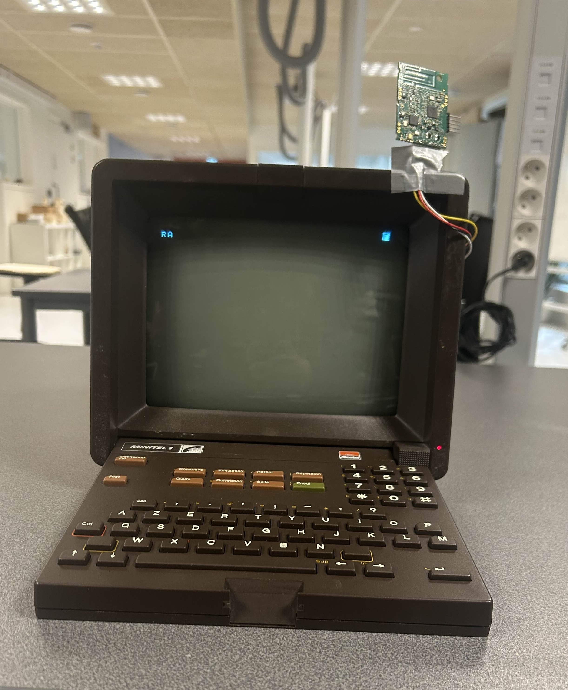

# Communications LoRa

[Précédent](05.md) | [Sommaire](README.md) |  [Suivant](07.md)

Dans ce chapitre, vous apprendrez à transmettre et recevoir des informations en utilisant directement le pilote des transceivers LoRa SX1272 de 2 (ou plus) cartes Wyres Base (la votre et celles de vos voisins).

## Rappel

> Configurez la carte cible pour `make`
```bash
export BOARD=wyres-base
export EXTERNAL_BOARD_DIRS=~/github/campusiot/RIOT-wyres/boards
```

Recherchez le  `tty` de la console et connectez-vous à celle-ci avec `tio`.
Sur Linux
```bash
lsusb
tio
tio -b 115200 -m INLCRNL /dev/ttyUSB0
```

Sur MacOS
```bash
lsusb
tio
tio -L
tio -b 115200 -m INLCRNL /dev/tty.usbserial-XXXX
```

> Pour mémoire, si vous utilisez Linux dans une machine virtuelle VirtualBox, il faut monter les 2 périphériques USBSerial et STLink dans le menu Péripériques de la machine virutelle.


## La modulation de communication LoRa

La modulation de communication LoRa utilise une technique brevetée de modulation par étalement de spectre (de type [Chirp](https://fr.wikipedia.org/wiki/Chirp) Spread Spectrum).

La modulation de communication LoRa cible principalement les communications nécessitant de faire transiter un volume de données faible avec un débit réduit, ce qui permet de limiter la consommation énergétique des équipements connectés et de proposer des [autonomies de plusieurs années sur piles](https://www.elsys.se/en/battery-life-calculator/).

La modulation de communication LoRa s'utilise sur des bandes de fréquences libres (utilisables sans déclaration et sans redevance) permet de réduire les coûts de fonctionnement du réseau. Elle offre ainsi la possibilité de créer de réseaux dits privés (indépendants des opérateurs) pouvant couvrir un immeuble, un champ ou une ville sans frais d'abonnement. 

Quelques liens pour approfondir:
* [Wikipedia](https://fr.wikipedia.org/wiki/LoRaWAN)
* [LoRa Alliance](https://lora-alliance.org/about-lorawan/)

## Communication point-à-point (P2P) avec LoRa

RIOT autorise l'utilisation direct des pilotes des périphériques de communication (Ethernet, 802.15.4 ...) sans passer par des couches d'abstraction réseau (IP, LoRaMAC ...). Dans le cas de la carte Wyres Base, le périphérique de communication radio est le composant [Semtech SX1272](https://www.semtech.fr/products/wireless-rf/lora-connect/sx1272) qui permet d'écouter des messages transmis en modulation LoRa ou GFSK et de transmettre des messages avec modulation LoRa ou GFSK en consommant peu d'énergie. L'écoute est exclusive de la transmission.

Le programme suivant démontre la configuration des paramêtres de communication, la transmission de messages et la réception de messages.

Pour les tests, accordez vous avec votre voisin sur des paramêtres de communication pour échanger avec lui des messages LoRa. Il conviendra d'utiliser des canaux de fréquence qui sont autorisés par la réglementation locale (entre 863 et 870 MHz en Europe par exemple).

```bash
cd ~/github/campusiot/RIOT-wyres/tests/driver_sx127x
make -j 4 flash
```

<details>
<summary>Console (tio)</summary>
<pre>
> help
> init
1
 8006988
 8003295
*** RIOT kernel panic:
HARD FAULT HANDLER

*** rebooting...

main(): This is RIOT! (Version: 2023.07-devel-325-g2863d)
Initialization successful - starting the shell now
</pre>
</details>

> Exercice: que constatez-vous ?

## LoRaChat

Utilisez le programme précédent pour élaborer un chat en LoRa.

Il suffit pour cela d'établir une convention de rédaction des messages.

Par exemple:
* `123@*:11:Qui est la?` : signifie de la part de `123` pour tout le monde (`*`) (message #`11`), Qui est la ? --> doit entrainer une réponse des récepteurs.
* `123@*:12:Salut à tous` : signifie de la part de `123` pour tout le monde (`*`) (message #12)
* `123@456:13:Salut au groupe 456` : signifie de la part de `123` pour `456` (message #`13`)
* `123@12*:14:RDV 868100000 SF7BW125` : signifie de la part de `123` pour les groupes dont le numéro commence par  `12*` (message #`14`), RdV sur le canal `868.1` MHz en `SF7` et `BW125`)
* `123@*:15:SOS 3.86292,11.50003` : signifie de la part de `123` pour tout le monde (`*`), SOS, je suis à la position [3.86292,11.50003](https://www.openstreetmap.org/search?query=3.86292%2C11.50003#map=20/3.86300/11.50000)

> Observez-vous des pertes de messages à partir des numéros de messages ?

> Quels sont les risques de sécurité d'un tel protocole de chat ?

> Note: il existe une réprésentation très compacte des positions : le [GeoHash](https://fr.wikipedia.org/wiki/Geohash). Ainsi `3.86292,11.50003` est représenté par `s28jvxnp7`.

> Vous pouvez vous inspirer des [abrévations](https://www.ref68.com/les-abreviations-dans-le-trafic-radio/) utilisées par les [radioamateurs](https://fr.wikipedia.org/wiki/Radioamateur) également.

> Regardez la [version LoRaWAN](https://github.com/CampusIoT/RIOT-wyres/blob/main/tutoriel/07.md#id%C3%A9e-de-mini-projet--minitel--lorawan-class-c) de LoRaChat.



## Observation depuis les stations

Ouvrez la console Web d'une des stations de l'organisation pour observer les échanges sur les canaux 868.1 MHz, 868.3 MHz, 868.5 MHz, 867.1 MHz, 867.3 MHz, 867.5 MHz, 867.7 MHz, 867.9 MHz  (SF7 à SF12 et BW125).

Observez-vous dans la console Web des gateways, les échanges sur les canaux 868.0 MHz, 868.2 MHz, 868.4 MHz, 867.0 MHz, 867.2 MHz ...  (SF7 à SF12 et BW125, BW250 et BW500) ?
