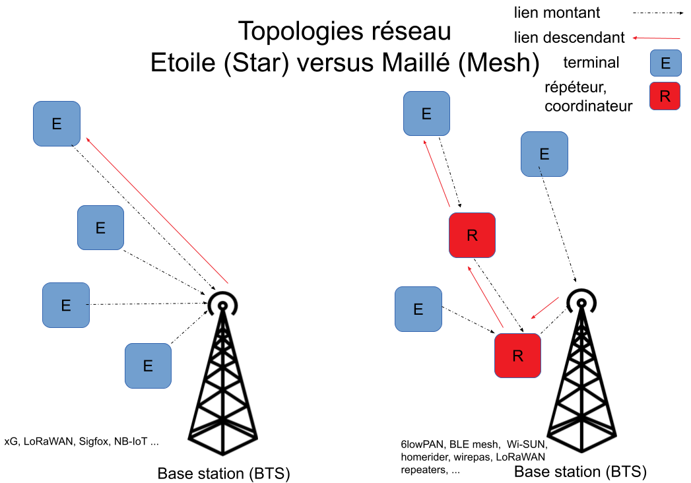
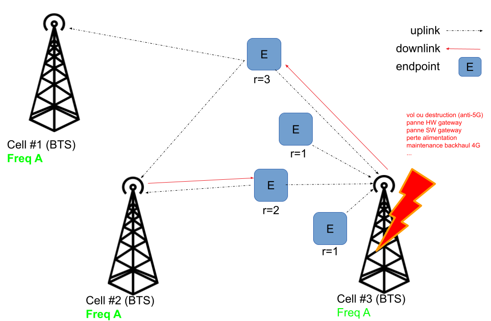
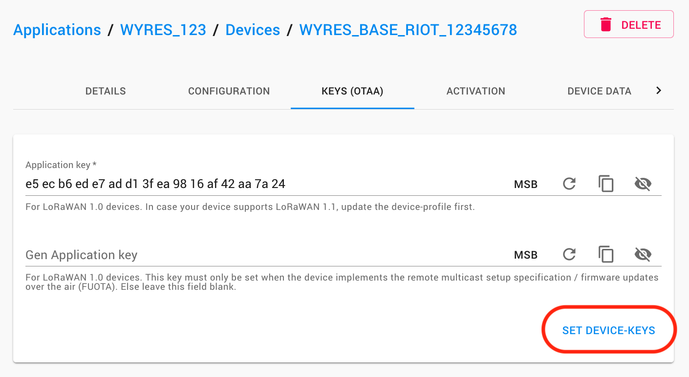
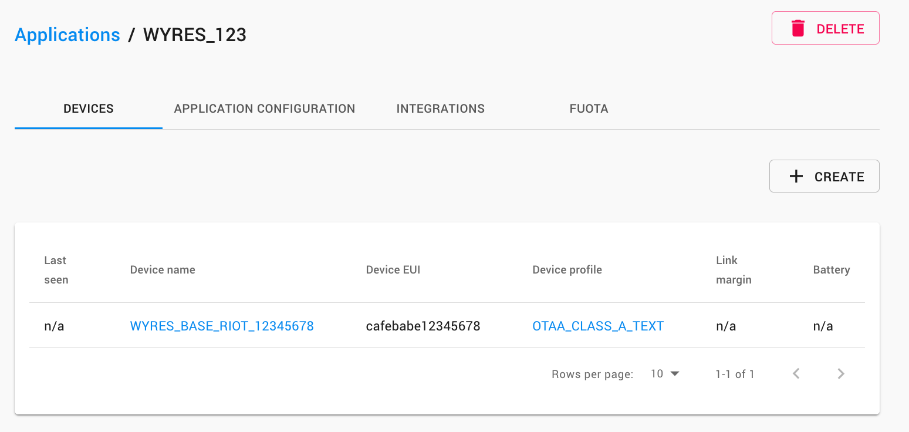
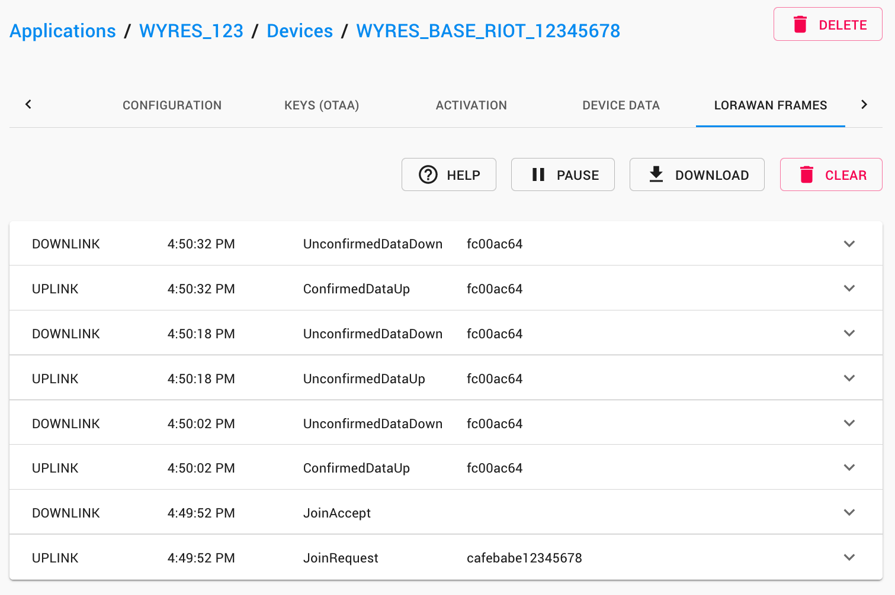
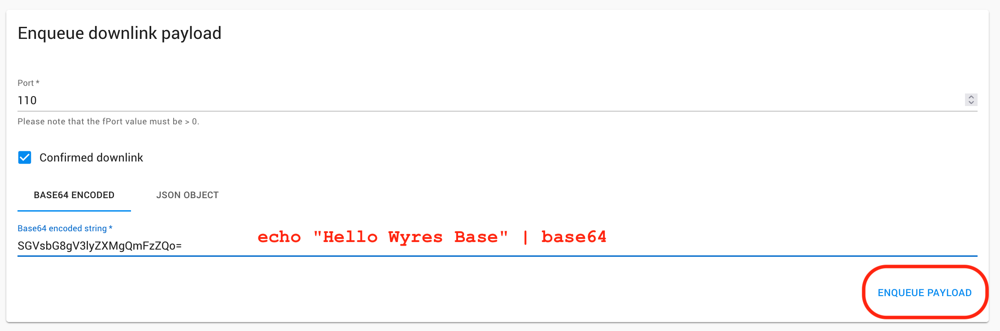
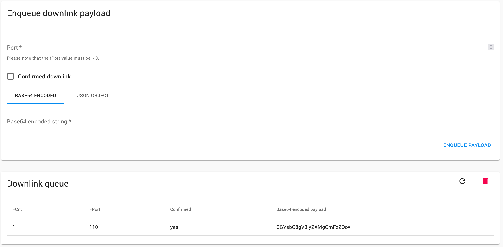
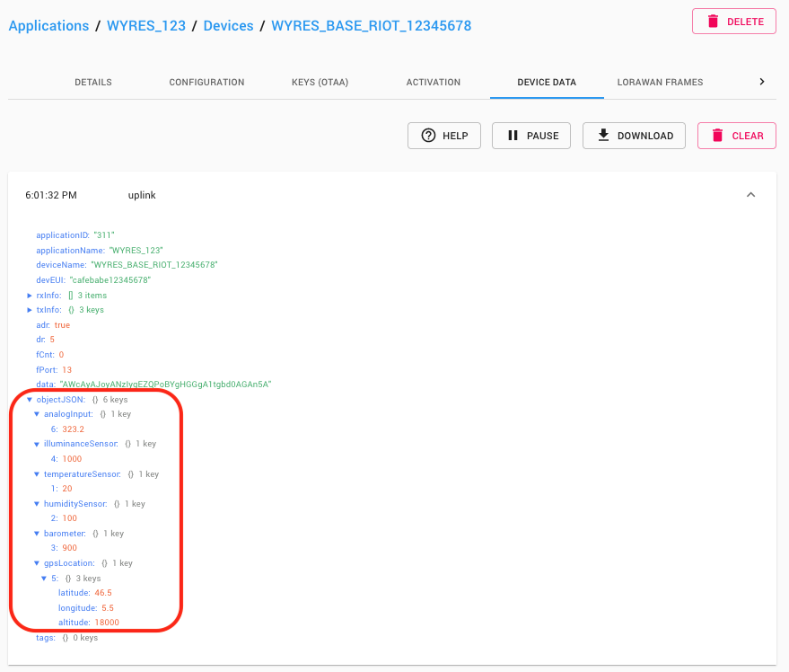
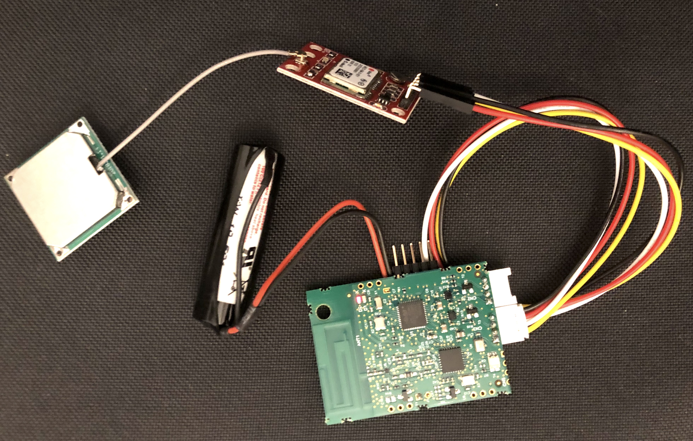
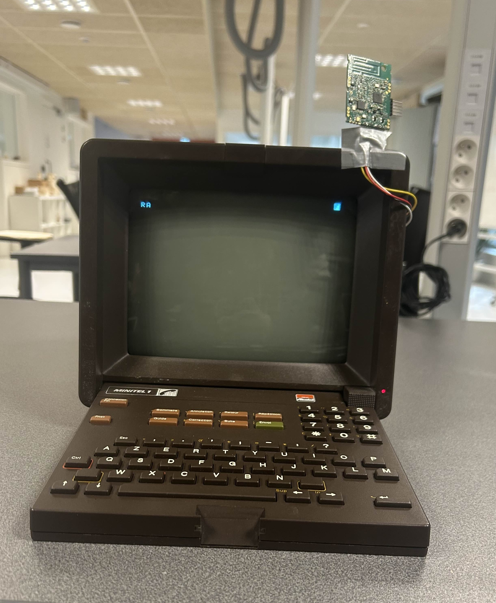

# Communications dans un réseau des capteurs LoRaWAN

[Précédent](06.md) | [Sommaire](README.md) |  [Suivant](07b.md)

Dans ce chapitre, vous apprendrez à transmettre et recevoir des informations vers des applications sur des serveurs en utilisant les services d'une infrastructure LoRaWAN.

## Rappel

> Configurez la carte cible pour `make`
```bash
export BOARD=wyres-base
export EXTERNAL_BOARD_DIRS=~/github/campusiot/RIOT-wyres/boards
```

Recherchez le  `tty` de la console et connectez-vous à celle-ci avec `tio`.

Sur Linux
```bash
lsusb
tio
tio -b 115200 -m INLCRNL /dev/ttyUSB0
```

Sur MacOS
```bash
lsusb
tio
tio -L
tio -b 115200 -m INLCRNL /dev/tty.usbserial-XXXX
```

> Pour mémoire, si vous utilisez Linux dans une machine virtuelle VirtualBox, il faut monter les 2 périphériques USBSerial et STLink dans le menu Péripériques de la machine virutelle.


## L'infrastructure LoRaWAN

Les réseaux LoRaWAN ont une topologie dite en étoile. Les équipemnts ne dialoguent qu'avec les stations de base (cf. figure de gauche). Les équipements ne dialoguent pas entre-eux comme dans les réseaux maillés (cf. figure à droite).



Dans un réseau LoRaWAN, toutes les stations de base écoutent (et transmettent) sur les mêmes canaux d'une bande de fréquence. De ce fait, un message émis par un équipement peut être reçu par une à plusieurs stations. Le serveur du réseau est en charge de dédupliquer les duplicats d'un même message. Dans le cas où un équipement est entendu par plusieurs stations, la panne d'une d'entre elles ne crée par d'interuption de la collecte des mesures (cf. le schéma suivant).



### Les éléments

Les équipements d'un réseau LoRaWAN sont: 
* Terminal (Endpoint ou Device en anglais)
* Point d’accès ou Station de Base ou Passerelle (Gateway en anglais)
* Join Server
* Network Server
* App Server


Les équipements utilisent les [chirps](https://fr.wikipedia.org/wiki/Chirp) montants (polarité normale) pour transmettre et les équipements utilisent les chirps descendants (polarité inversée) pour transmettre. Cela évite que les équipements s'entendent entre eux et Cela évite que les stations s'entendent entre elles.

> Pour mémoire, dans le chapitre précédent, les équipements LoRaChat s'entendaient entre eux !


### Les identifiants et les clés

L'activation (OTAA) utilise les informations suivantes pour authentifier un équipement auprès d'un réseau d'opérateur:
* L'identifiant unique d'équipement `DevEUI` dont le préfixe est norlmalement l'identifiant unique de fabricant([`OUI`](https://fr.wikipedia.org/wiki/Organizationally_Unique_Identifier))
* `AppEUI` / `JoinEUI` qui sert aux équipements vagabonds (roaming en anglais)
* `AppKey` la clé dite applicative qui sert à authentifier l'équipement auprès du serveur du réseau et qui sert à authentifier le serveur du réseau dans lequel l'équipement est censé être enregisté par son propriétaire.

A l'issue de la procédure d'activation, l'équipement recoit un identifiant dans le réseau, le `DevAddr`. Cet identifant est normalement pris dans une plage d'adresse affectée à un opérateur LoRaWAN par la LoRa Alliance. Cette plage se calcule à partir du [`NetId`](https://www.thethingsnetwork.org/docs/lorawan/prefix-assignments/). Deux `NetId` sont réservés aux réseaux expérimentaux (`00`,`01`).

Note: Sur Grenoble, les `NetId`s que vous pourrez observer les plus fréquemment dans la console des stations sont
* `000007` pour Objenious rachété par NetMore (`DevAddr compris entre `0E000000` et `0FFFFFFF`).
* `00000F` pour LiveObject (Orange) (`DevAddr compris entre `1E000000` et `1FFFFFFF`).
* `000013` pour The Things Network (`DevAddr compris entre `26000000` et `27FFFFFF`).
* `C0002B` pour l'Université Grenoble Alpes (`DevAddr compris entre `FC00AC00` et `FC00AFFF`).

La suite des échanges est sécurisée au moyen de deux clés : la clé de session réseau `NwkSKey` qui sert à signer (et donc autentifier) les messages et la clé de session applicative `AppSKey` qui sert à chiffrer (donc rendre confidentiel) la charge utile (ou applicative) du message.

### Les classes d'objet

* La classe A pour un terminal autonome en énergie (batteries). Réception du message descendant (downlink) 1 seconde exactement après la fin de la transmission d’un message montant
* La classe B pour un terminal autonome en énergie (batteries). Ecoute périodique (8 fois / 128 secondes) d’un canal pour la réception du message descendant (downlink). Synchronisation régulière de l’oscillateur du terminal avec un “beacon” pour corriger sa dérive
* La classe C pour un terminal autonome en énergie (batteries). Ecoute permanente d’un canal pour la réception du message descendant (downlink)
* La classe C Multicast : pour procéder notamment à la mise à jour d'un parc d'équipement

## Envoi d'information vers l'infrastructure LoRaWAN

Pour que votre carte puisse transmettre des informations, il faut enregistrer un équipement dans une application sur le serveur de l'infrastructure LoRaWAN de CampusIoT (via la console Web).


Générez premièrement un identifiant unique (`DevEUI`) et une clé secrete AES128 (`AppKey`).

```bash
DevEUI=`echo "CAFEBABE$(openssl rand -hex 4)"`
AppKey=`openssl rand -hex 16`
echo $DevEUI
echo $AppKey
```
> Note: La probabilité de collisions des DevEUI entre vous est de 1 sur 2^32.

Connectez-vous à la [console web du serveur LoRaWAN](https://lns.campusiot.imag.fr) avec vos identifiants donnés en cours.

Cherchez l'application qui correspond à votre numéro de groupe.

Enregistrez un nouvel équipement dans l'application créée pour votre équipe depuis votre console Web en utilisant l'identifiant unique (`DevEUI`) et la clé secrete AES128 (`AppKey`) générés. Il faut choisir  `OTAA_CLASS_A_TEXT` pour le Device Profile qui utilise la fonction de décodage suivante:

```javascript
// Decode decodes an array of bytes into an object.
//  - fPort contains the LoRaWAN fPort number
//  - bytes is an array of bytes, e.g. [225, 230, 255, 0]
//  - variables contains the device variables e.g. {"calibration": "3.5"} (both the key / value are of type string)
// The function must return an object, e.g. {"temperature": 22.5}
function Decode(fPort, bytes, variables) {
  	var result = "";
	for(var i = 0; i < bytes.length; ++i){
		result+= (String.fromCharCode(bytes[i]));
	}
	var decoded = { text: result };
  	return decoded;
}
```

> Si le Device Profile `OTAA_CLASS_A_TEXT` n'apparait pas dans la liste, créez un profil pour votre organisation en utilisant la fonction de décodage ci-dessus.

Créez un nouvel équipement depuis l'application qui vous a été affectée en renseignant le `DevEUI` généré


Renseignez l'`AppKey` générée



L'équipement est crée dans l'application



Flashez la carte avec le programme suivant

```bash
cd ~/github/campusiot/RIOT-wyres/tests/pkg_semtech-loramac
make -j 4 flash
```

Si je vous ai fourni une carte déjà flashé avec le firmware `pkg_semtech-loramac.bin`, exécutez les commandes suivantes:
```bash
cd ~/github/campusiot/RIOT-wyres/tests/pkg_semtech-loramac
ls -l /dev/ttyUSB0
sudo chmod 666 /dev/ttyUSB0
make term
```

Lancez les commandes depuis le console `tio` qui est connectée à votre carte via son interface UART (console):

```console
help
loramac
loramac set
# echo "CAFEBABE$(openssl rand -hex 4)"
loramac set deveui CAFEBABE123456xx
loramac set appeui CAFEBABE00000000
# openssl rand -hex 16
loramac set appkey e5ecb6ede7add13fea9816af42aaxxxx
loramac save
loramac set dr 5
loramac set adr on
loramac join otaa
loramac tx HELLO\ YAOUNDE cnf 10
loramac link_check
# Link check request scheduled
loramac tx HELLO\ YAOUNDE uncnf 10
loramac tx HELLO\ YAOUNDE cnf 10
loramac link_check
# Link check request scheduled
loramac tx HELLO\ YAOUNDE uncnf 10
```

En parallèle, vous observez les messages recus et envoyés par le serveur depuis l'onglet `LORAWAN FRAMES`  de la console Web



Vous observerez le `DevAddr`, les 2 clés de session `AppSKey`  et `NwkSKey`utilisées désormais par la carte et le serevur pour sécuriser les échanges (uplink et downlink) ainsi que la valeur des 2 compteurs (**uplink** et **downlink**)

Vérifiez que ce sont bien les mêmes du côté de la carte

```console
loramac get devaddr
loramac get nwkskey
loramac get appskey
loramac get ul_cnt
```


Vous observez la charge utile décodée dans le messages recu depuis l'onglet `DEVICE DATA`  de la console Web

```console
loramac tx HELLO\ YAOUNDE uncnf 10
```


## Réception d'information depuis l'infrastructure LoRaWAN CampusIoT

Les applications qui consomment les mesures des capteurs des équipements, peuvent être envoyés des messages (downlink) vers les équipements. Ces messages peuvent être des paramêtres de reconfiguration du capteur, ou bien des commandes vers une des actionneurs de la carte. Dans le cas de la carte Wyres Base, les deux actionneurs sont la paire de LED et le PWM qui commande le haut parleur.

Depuis un Shell, encodez en Base64 un message de texte:

```bash
echo "Hello Wyres Base" | base64
SGVsbG8gV3lyZXMgQmFzZQo=
```

Ouvrez l'onglet Detail de votre équipement et ajoutez le texte encodé dans la boite `Enqueue downlink payload` comme ci-dessous.



Le message destiné à l'équipement est mis en file d'attente. Le serveur repondra à l'équipement 1 seconde après la prochaine émission de la carte.



Depuis la console de la carte, envoyez un message sans confirmation. Le serveur répond avec le message en attente. La carte affiche le message recu `Hello Wyres Base`.

```console
> loramac tx HELLO\ WORLD uncnf 14
Data received: Hello Wyres Base
, port: 110
Message sent with success
```


> Exercice (optionel) : modifiez le code de l'exemple `pkg_semtech-loramac` pour que la carte joue une petite partition de musique quand elle reçoit un message sur le port `33`, la partition est une chaine de caractères passée dans la charge utile. `A`, `B`, `C`, `D`, `E`, `F`, `G`, pour les notes `la` `si`, `do`, `ré`, `mi`, `fa`, `sol` et en suffixe de chaque note, la durée avec : 0 pour une demi croche (1/4 de temps); 1 pour une croche (1/2 de temps); 2 pour une noire (1 temps); 3 pour une blanche (2 temps); 4 pour une ronde (4 temps).

## Réception d'information depuis l'infrastructure LoRaWAN CampusIoT quand l'équipement est en classe C

Ré-enregistrez l'équipement avec le Device Profile `OTAA_CLASS_C_NOCODEC`.

```console
> reboot
> loramac set dr 5
> loramac set adr on
> loramac join otaa
> loramac get class
> loramac set class C
```

Depuis un Shell, encodez en Base64 un nouveau message de texte:

```bash
echo "Hello Wyres Base (Class C)" | base64
SGVsbG8gV3lyZXMgQmFzZSAoQ2xhc3MgQykK
```

Ouvrez l'onglet Detail de votre équipement et ajoutez le texte encodé `SGVsbG8gV3lyZXMgQmFzZSAoQ2xhc3MgQykK` dans la boite `Enqueue downlink payload` comme précédenment.

Refraichissez l'état de la file de message `Downlink queue` : le message a été envoyé par le serveur

Mais la console n'affiche pas le message ! Que s'est il passé ?

Reconfigurez les paramêtres suivants:

```console
> loramac get rx2_freq
RX2 freq: 869525000
> loramac get rx2_dr
RX2 dr: 0
> loramac set rx2_dr 3
> loramac get rx2_dr
RX2 dr: 3
```

A quoi correspond les paramêtres `rx2_freq` et `rx2_dr` ?

Ouvrez de nouveau l'onglet Detail de votre équipement et ajoutez le texte encodé `SGVsbG8gV3lyZXMgQmFzZSAoQ2xhc3MgQykK` dans la boite `Enqueue downlink payload` comme précédenment.

Que se passe t'il ?


## Cayenne LPP

Cayenne LPP (Low Power Payload) est un format d'encodage des mesures de capteurs dans la charge utile d'un message LoRaWAN. Chaque mesure est attachée à un canal (0..255) et elle est typée (temperature en °C, humidité relative en %RH, position GPS ...). Ce format qui est auto-descriptif a l'avantage d'être directement utilisable par un décodeur générique (`OTAA_CLASS_A_LPP` de votre organisation et par des plateformes de stockage et de visualisation comme myDevices que nous verrons dans le chapitre suivant.

> Note: les fabricants d'équipements lui préfèrent des formats plus compacts mais propriétaires pour alléger au maximum la charge utile des messages (donc la durée de la transmission et la durée de vie des batteries des équipements). Un catalogue des decodeurs d'équipements commerciaux est disponible [ici](https://github.com/TheThingsNetwork/lorawan-devices).

Le programme suivant génère quels points de mesure similant la trajectoire d'un ballon stratosphérique.

```bash
cd ~/github/campusiot/RIOT-wyres/tests/cayenne-lpp
make -j 4
```

```console
main(): This is RIOT! (Version: 2023.07-devel-325-g2863d)

==== Point #1 ====
temperature=20.00
humidity=100.0
pressure=900
luninosity=1000.0
latitude=46.50000 longitude=5.50000 altitude=18000
battery_voltage=3600.0
LPP: : 016700C80268C803732328046503E8058807186800D6D81B774006027E40

==== Point #2 ====
temperature=20.00
humidity=100.0
pressure=900
luninosity=1000.0
latitude=46.50000 longitude=5.50349 altitude=18000
battery_voltage=3600.0
LPP: : 016700C70268C703732327043C03E7058807186800D6FA1B773E06027E3F

```

Reflashez l'exemple `pkg_semtech-loramac` (le firmware est inchangé)

```bash
cd ~/github/campusiot/RIOT-wyres/tests/pkg_semtech-loramac
make -j 4 flash-only
```

Changez cependant le Device Profile par `OTAA_CLASS_A_LPP` dans la console Web

Utilisez les chaînes hexadécimales LPP générées pour simuler un ballon stratosphérique.

```
> reboot
> loramac set dr 5
> loramac set adr on
> loramac join otaa
...
> loramac_txhex 016700C80268C803732328046503E8058807186800D6D81B774006027E40 uncnf 10
> loramac_txhex 016700C70268C703732327043C03E7058807186800D6FA1B773E06027E3F uncnf 10
...
```

> Note: Les `DevEUI`, `AppEUI` et `AppKey` ont été conservés en EEPROM grace à la commande `loramac save`.

Vous observez la charge utile décodée dans le messages recu depuis l'onglet `DEVICE DATA`  de la console Web




## Un exemple assez complet : un Field Test Device utilisé à bord de ballons sondes

Les Field Test Device ou testeur de couverture de terrain sont des équipements utilisés par les installateurs de réseaux LoRaWAN (capteurs et stations) peuvent mesurer et cartographier la couverture radio et la qualité des liens entre les équipements à installer et les stations existantes.

### Field Test Device (sans module GNSS)

Le programme ci-dessous a été utilisé pour effectuer des [tests de couverture à très haute altitude (jusqu'à 30 kms) au bord de ballons sonde](https://gricad-gitlab.univ-grenoble-alpes.fr/thingsat/public/-/blob/master/balloons/README.md) à pour déterminer la portée potentiele des communications LoRa.

Générez premièrement un nouvel identifiant unique (`DevEUI`) et une clé secrete AES128 (`AppKey`).

```bash
DevEUI=`echo "CAFEBABE$(openssl rand -hex 4)"``
AppKey=`openssl rand -hex 16`
echo $DevEUI
echo $AppKey
```

Créez un nouvel équipement `WYRES_123_12345679_BALLOON` avec l'dentifiant `DevEUI` et la clé AES128 (`AppKey`) générés et avec le Device Profile `OTAA_CLASS_A_BALLOON` ([codec](https://github.com/CampusIoT/RIOT-wyres/blob/main/apps/field_test_device/codec/decoder_lns.js))

```bash
cd ~/github/campusiot/RIOT-wyres/apps/field_test_device
AppEUI=CAFEBABE00000000
make DEVEUI=$DevEUI APPEUI=$AppEUI APPKEY=$AppKey OPERATOR=CampusIoT TXPERIOD=60 flash
```

<details>
<summary>Console (tio)</summary>
main(): This is RIOT! (Version: 2b19330--dirty)
Application: field-test-device
Version: 	2b19330--dirty
Commit SHA1: 2b1933015ce40a7c9f9592e2292d6073ab68441a
Commit date: 2023-11-08T22:16:19+01:00
Build date:  2023-11-10T09:26:06Z
WDT started
[clock] Current RTC time :   2020-01-01 00:07:23
[clock] Last correction  : never
[info] CpuId:33374701303738370067a06a
[info] Operator: Undefined
[mac] Region: EU868
[mac] DutyCycle: disabled
[otaa] DevEUI:cafebabe12345679
[otaa] AppEUI:cafebabe00000000
[otaa] AppKey:af42aa7bedbed13efea9816cb6ede7ad
[otaa] Starting join procedure: dr=5
[otaa] Join procedure succeeded
[otaa] DevAddr: fc00aed5
[otaa] NwkSKey:3c1c8772e97ec553244dafc336e08b3a
[otaa] AppSKey:88447cc8363cb775be075f3cc507a794
[otaa] Network: Unknown
[clock] Current RTC time :   2020-01-01 00:07:28
[clock] Last correction  : never
[clock] app_clock_send_app_time_req
[clock] Current time:   2020-01-01 00:07:58
[clock] app_clock_process_downlink
[clock] APP_CLOCK_CID_AppTimeAns
[clock] Current time	:   2020-01-01 00:07:59
[clock] Time Correction : 121771160
[clock] RTC time fixed  :   2023-11-10 09:27:19
[clock] sent_buffer:
[clock] app_clock_send_buffer
[clock] Current RTC time :   2023-11-10 09:27:19
[clock] Last correction  :   2023-11-10 09:27:19
[ftd] Start benchmark
[ftd] New benchmark sequence: port=2
[ftd] Send @ devaddr=d5ae00fc port=2 dr=0 txpower=14 size=8
[ftd] Tx Done ret=6 fcnt=2
[ftd] Send @ devaddr=d5ae00fc port=2 dr=0 txpower=14 size=32
[ftd] Tx Done ret=6 fcnt=3
[ftd] Send @ devaddr=d5ae00fc port=2 dr=0 txpower=14 size=16
[ftd] Tx Done ret=6 fcnt=4
[ftd] Send @ devaddr=d5ae00fc port=2 dr=1 txpower=14 size=16
[ftd] Tx Done ret=6 fcnt=5
[ftd] Send @ devaddr=d5ae00fc port=2 dr=2 txpower=14 size=16
[ftd] Tx Done ret=6 fcnt=6
[ftd] Send @ devaddr=d5ae00fc port=2 dr=3 txpower=14 size=16
[ftd] Tx Done ret=6 fcnt=7
[ftd] Send @ devaddr=d5ae00fc port=2 dr=4 txpower=14 size=16
[ftd] Tx Done ret=6 fcnt=8
[ftd] Send @ devaddr=d5ae00fc port=2 dr=5 txpower=14 size=16
[ftd] Tx Done ret=6 fcnt=9
[dn] Link check information:
  - Demodulation margin: 10
  - Number of gateways: 3
[ftd] Send @ devaddr=d5ae00fc port=2 dr=5 txpower=1 size=16
[ftd] Tx Done ret=6 fcnt=10
[ftd] Send @ devaddr=d5ae00fc port=2 dr=5 txpower=8 size=16
[ftd] Tx Done ret=6 fcnt=11
[ftd] Send @ devaddr=d5ae00fc port=2 dr=5 txpower=5 size=16
[ftd] Tx Done ret=6 fcnt=12
[ftd] Send @ devaddr=d5ae00fc port=2 dr=5 txpower=2 size=16
[ftd] Tx Done ret=6 fcnt=13
[ftd] New benchmark sequence: port=3
[ftd] Send @ devaddr=d5ae00fc port=3 dr=0 txpower=14 size=8
[ftd] Tx Done ret=6 fcnt=14
[ftd] Send @ devaddr=d5ae00fc port=3 dr=0 txpower=14 size=32
[ftd] Tx Done ret=6 fcnt=15
[ftd] Send @ devaddr=d5ae00fc port=3 dr=0 txpower=14 size=16
[ftd] Tx Done ret=6 fcnt=16
[ftd] Send @ devaddr=d5ae00fc port=3 dr=1 txpower=14 size=16
[ftd] Tx Done ret=6 fcnt=17
[ftd] Send @ devaddr=d5ae00fc port=3 dr=2 txpower=14 size=16
[ftd] Tx Done ret=6 fcnt=18
[ftd] Send @ devaddr=d5ae00fc port=3 dr=3 txpower=14 size=16
[ftd] Tx Done ret=6 fcnt=19
[ftd] Send @ devaddr=d5ae00fc port=3 dr=4 txpower=14 size=16
[ftd] Tx Done ret=6 fcnt=20
[ftd] Send @ devaddr=d5ae00fc port=3 dr=5 txpower=14 size=16
[ftd] Tx Done ret=6 fcnt=21
[ftd] Send @ devaddr=d5ae00fc port=3 dr=5 txpower=1 size=16
[ftd] Tx Done ret=6 fcnt=22
[ftd] Send @ devaddr=d5ae00fc port=3 dr=5 txpower=8 size=16
[ftd] Tx Done ret=6 fcnt=23
[ftd] Send @ devaddr=d5ae00fc port=3 dr=5 txpower=5 size=16
[ftd] Tx Done ret=6 fcnt=24
[ftd] Send @ devaddr=d5ae00fc port=3 dr=5 txpower=2 size=16
[ftd] Tx Done ret=6 fcnt=25
[clock] app_clock_send_app_time_req
[clock] Current time:   2023-11-10 09:41:47
[clock] app_clock_process_downlink
[clock] APP_CLOCK_CID_AppTimeAns
[clock] Current time	:   2023-11-10 09:41:48
[clock] Time Correction : 1
[clock] RTC time fixed  :   2023-11-10 09:41:49
[clock] sent_buffer:
[clock] app_clock_send_buffer
[clock] Current RTC time :   2023-11-10 09:41:49
[clock] Last correction  :   2023-11-10 09:41:49
</details>

> Note : dans l'exemple précédent, le firmware demande périodiquement au serveur LoRaWAN de recaler son horloge temps réel (RTC)

### Field Test Device (avec module GNSS)

Pour inclure dans la charge utile du message la position de l'objet lors de l'émission, il convient de connecter l'interface UART du module GNSS au connecteur Grove UART utilisé normalement par la console et de refabriquer le firmware en modifiant le fichier `Makefile.device` de la manière suivante.

```makefile
GPS = 1

ifeq ($(GPS),1)
STD_BAUDRATE = 9600
endif
```

Il n'est alors plus possible d'utiliser la console.

> Note: le débit (baudrate) par défaut des modules GNSS varie d'un modèle à l'autre. Vous trouverez la configuration des modèles courants dans cette [liste](https://github.com/CampusIoT/orbimote/blob/master/gnss_modules.md).



## Idée de mini-projet 

En repartant du code de l'exemple Field Test Device, utilisez SAUL pour collecter les mesures de capteurs branchés et utilisez Cayenne LPP pour encoder le message à envoyer vers l'infrastructure LoRaWAN.

Changez le Device Profile par `OTAA_CLASS_A_LPP` pour votre équipement.

## Idée de mini-projet : [Minitel](https://fr.wikipedia.org/wiki/Minitel) 📺 LoRaWAN Class C

L'idée de ce mini-projet est de recycler un minitel (chiné dans une brocante ou sur le Bon Coin) pour chatter via un réseau LoRaWAN.

A partir des exemples précédents, interfacez la carte Wyres par le port UART au port du Minitel 📺 via la carte d'adaptation des niveau de tension 12V0 -> 3V3 pour envoyer des messages dans des paquets LoRaWAN et pour afficher les messsages texte recus.

La carte reliée au minitel doit être enregistrée en classe C avec ce Device Profile `OTAA_CLASS_A_TEXT`. 

En complément, vous pouvez aussi compléter le texte du message à envoyer avec:
* la température (en `°C`) relevée par la carte quand `%c` se trouve dans le message texte à envoyer
* la température (en `°F`) relevée par la carte quand `%f` se trouve dans le message texte à envoyer
* la pression relevée par la carte quand `%p` se trouve dans le message texte à envoyer
* l'orientation relevée par l'accéleromètre de la carte quand `%o` se trouve dans le message texte à envoyer
* la tension de l'alimentation (VBat) relevée par la carte quand `%v` se trouve dans le message texte à envoyer
* le date  de la RTC de la carte au format `YYYY-MM-DD` quand `%D` se trouve dans le message texte à envoyer.
* l'heure de la RTC de la carte au format `HH:MM:SS` quand `%H` se trouve dans le message texte à envoyer. 
* ...
* l'ensemble des mesures quand `%a` se trouve dans le message texte à envoyer

La carte synchronise sa RTC au moyen de la spécification `App Clock Sync`.

`help` affiche la bannière et l'aide


Crédit photo: Nicolas Picaud

Testez les messages suivant:
```
Nous sommes le %D et il est %H.
La température est de %c °C et la pression atmospherique est de %p hPa.
La tension d'alimentation est %v mV.
```

En complément, développez un flot Nodered qui envoie en donwlink un message recu à chaque minitel identifié dans le message recu par des sous-chaine préfixée par `@`. 

> Remarque: ce type de chat est un début de solution pour opérer un réseau d'urgence en cas de catastrophe (aka [disaster network](https://air.imag.fr/index.php/Disaster_Networking_with_LoRa))

## Que faire si nous n'avez pas de stations CampusIoT à proximité de vos équipements ?

L'infrastructure LoRaWAN CampusIoT est opéré par le Laboratoire d'Informatique de Grenoble (LIG UMR CNRS 5217) de l'Université Grenoble Alpes.

Si vous n'êtes pas à proximité d'une station LoRa communiquant avec CampusIoT, vous pouvez tenter d'enregistrer votre équipement soit auprès du réseau collaboratif [TheThingsNetwork](https://eu1.cloud.thethings.network/console/) (gratuit mais pas d'utilisation commerciale) soit auprès du réseau crowd-sourcé [Helium](https://console.helium.com) (gratuit jusqu'à 10 équipements et ~10000 messages).
