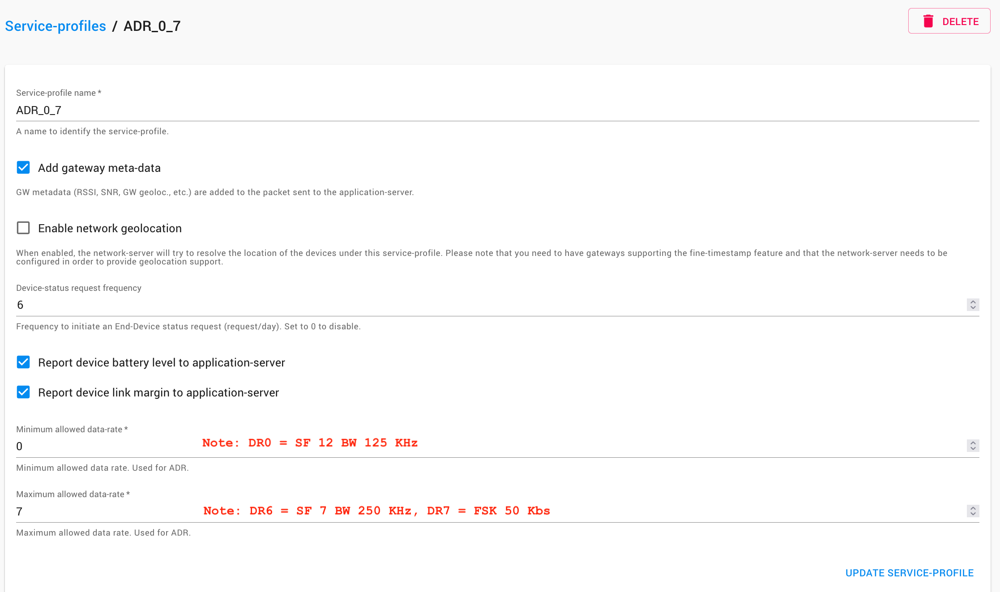

# Communications dans un réseau des capteurs LoRaWAN (partie avancée)

[Précédent](07.md) | [Sommaire](README.md) | [Suivant](08.md)

Dans ce chapitre, vous approfondirez quelques notions avanacées dans les infrastructures LoRaWAN.

## Rappel

> Configurez la carte cible pour `make`
```bash
export BOARD=wyres-base
export EXTERNAL_BOARD_DIRS=~/github/campusiot/RIOT-wyres/boards
```

Recherchez le  `tty` de la console et connectez-vous à celle-ci avec `tio`.
Sur Linux
```bash
lsusb
tio
tio -b 115200 -m INLCRNL /dev/ttyUSB0
```

Sur MacOS
```bash
lsusb
tio
tio -L
tio -b 115200 -m INLCRNL /dev/tty.usbserial-XXXX
```

> Pour mémoire, si vous utilisez Linux dans une machine virtuelle VirtualBox, il faut monter les 2 périphériques USBSerial et STLink dans le menu Péripériques de la machine virutelle.


## Rejoin

Renouveller les clés de session est parfois nécessaire pour augmenter la sécurité de la liaison. Le terminal peut soit refaire la procédure d'activation, soit envoyer un message `Rejoin` au serveur.

Au moyen de l'exemple `pkg_semtech-loramac`, émulez le fonctionnement du rejoin avec les commandes suivantes :

```
> reboot
> loramac join
> loramac get devaddr
> loramac get nwkskey
> loramac get appskey
> loramac get ul_cnt
...
```

Vous pourrez constater le changement des valeurs coté équipement et coté serveur (console Web, onglet `ACTIVATION`).

### L'adaptation du débit (ADR : Adaptative DataRate)

La modularation LoRa possède plusieurs paramêtres : Spreading factor, Bandwith, TxPower) qui agissent sur la durée d'une transmission (time on air), la sensibilité du récepteur ... qui influent sur le débit et la portée des messages (et donc le taux de perte (aka PER : Packet Error Ratio)).

Le tableau ci-dessous donne les différents débits (DataRate) définit par la spécification LoraWAN pour les [régions `EU868`](https://resources.lora-alliance.org/technical-specifications/rp002-1-0-4-regional-parameters).

| DataRate | Modulation | SF (Spreading Factor)    | Bandwith | Sensibilité (en dBm) | [SNR](https://fr.wikipedia.org/wiki/Rapport_signal_sur_bruit) | Débit (en bit/s) | Taille max. charge utile (en octet) |
| -------- | ---------- | ----- | -------- | ----------- | --- | ----- | ----------------------------------- |
| 0 | LoRa | 12 | 125 | -20 | -137 | 250 | 51 |
| 1 | LoRa | 11 | 125 | -17.5 | -135 | 440 | 51 |
| 2 | LoRa | 10 | 125 | -15 | -133 | 980 | 51 |
| 3 | LoRa | 9  | 125 | -12.5 | -130 | 1760 | 115 |
| 4 | LoRa | 8  | 125 | -10 | -127 | 3125 | 222 |
| 5 | LoRa | 7  | 125 | -7.5 | -124 | 3125 | 222 |
| 6 | LoRa | 7  | 125 | -7.5 | -124 | 5470 | 222 |
| 7 | FSK 50 Kbs |   |  |  |  | 50000 | 222 |

> Les valeurs de sensibilité dans le tableau sont calculées pour les composants Semtech SX127x.

Le tableau ci-dessous donne les différents temps de vol (Time On Air ou Airtime) pour différents tailles de charge utile (13, 51, 115, 222) et plus des 13 octets pour l'entête, le FPort et le MIC.

| DataRate | ToA pour 13+13 octets | ToA pour 13+51 octets | ToA pour 13+115 octets | ToA pour 13+222 octets |
| -------- | --------| --------| --------| --------|
| 0 | 1,646.6 ​ms | 2,793.5​ ms |  |  |
| 1 | 823.3​ ms | 1,560.6​ ms |  |  |
| 2 | 411.6​ ms | 698.4​ ms |  |  |
| 3 | 205.8​ ms | 390.1​ ms | 676.9​ ms |  |
| 4 | 113.2 ​ms | 215.6​ ms | 379.4​ ms | 655.9​ ms |
| 5 | 61.7 ​ms | 118.0​ ms | 215.3​ ms | 368.9​ ms |
| 6 | 30.8 ​ms | 59.0​ ms | 107.6​ ms | 184.4​ ms |

> Note: La deuxieme colonne correspond à la charge utile minimale d'un message d'une sonde pour [ballon météorologique](https://fr.wikipedia.org/wiki/Ballon_stratosph%C3%A9rique) : 3 octets pour la latitude; 3 octets pour la longitude; 2 octets pour l'altitude en mètre; 2 octets pour la pression atmosphérique; 2 octets pour la température; 1 octet pour l'humidité relative. D'autres données peuvent être ajoutées : vitesse ascensionnelle, vitesse horizontale, cap, qualité GPS, niveau de batterie, luminosité, température interne, taux de particules ionisantes ...

> Note: [Ce calculateur en ligne](https://avbentem.github.io/airtime-calculator/ttn/eu868/13,13) permet de connaître le temps de vol (time on air) d'un message LoRaWAN en fonction de sa taille et du datarate utilisé par l'équipement.

L'adaptation du débit (ADR pour Adaptative DataRate) permet d'agir sur ces paramêtres afin :
* d'accroître la durée de vie de la batterie en réduisant la durée des transmissions.
* de maximiser l’usage du canal (dans le respect de la réglementation régionale (ESTI pour l'Europe, FCC pour les USA ...))
* et d'augmenter le volume de données échangées par un terminal

Le serveur LoRaWAN est en charge d'adapter les paramêtres pour chacun des équipements engistrés dans le réseau qu'il gère.

Le fonctionnement simplifié de l'ADR est celui-ci : A la réception des duplicats d’un message, le coeur de réseau calcule la marge entre le le meilleur SNR (des duplicats) et le SNR du DR utilisé par le terminal. Le LNS calcule un nouveau DR et l’envoie au terminal via le prochain message descendant (`LinkADRRequest`)

Remarque (dans les régions `EU868`): Le LNS peut agir sur
* le `DR` (0..5-7),
* le `TxPower` (14dBm … 2 dBm)
* le `NbTrans`, nombre de retransmission du message (1 ... 15)

Il y a cependant un risque de perte du lien quand le terminal est nomade ou bien quand une station est arrêtée (panne, maintenance ...).

Pour limiter cela:
* Le terminal envoie regulièrement un message contenant un FOpt LinkCheck
* si le LNS ne réponds pas, le terminal abaisse progressivement son DR (jusqu'à DR0)

> Remarque: le terminal peut empécher le procédure d’ADR par le LNS au moyen du drapeau ADR dans le champs FCtrl. C'est cepndant interdit (contractuellement) par certains opérateurs publics.

Pour en savoir plus sur l'[ADR](https://lora-developers.semtech.com/library/tech-papers-and-guides/understanding-adr/).

> Note: Ce [calculateur](https://www.elsys.se/en/battery-life-calculator/) perment d'estimer la durée de vie des batteries des équipements LoRaWAN d'un équipementier en fonction du datarate et de nombre de messages envoyés par jour.

Regardez comment le serveur met en oeuvre l'ADR pour votre équipement en fonction de la qualité du lien radio avec les stations environnantes au moyen des commandes suivantes

```
loramac get adr
# l'ADR doit être on
loramac get dr
loramac get txpower
loramac get nbtrans
...
loramac tx HELLO\ YAOUNDE uncnf 10
loramac get dr
loramac get txpower
loramac get nbtrans
...
loramac tx HELLO\ YAOUNDE uncnf 10
...

```

En pratique, les opérateurs publics LoRaWAN déactivent les DataRate `DR6` et `DR7` dans les politiques d'ADR qui proposent.

Dans Chirpstack, l'ADR se configure au moyen avec le Service Profile au niveau de l'application : il concerne donc tous les équipements créés dans l'application.

Les deux service profiles ci-dessous configurent l'ADR en `DR0` jusqu'à `DR5` pour premier et de `DR0` à (seulement) `DR1` pour le second, et de `DR0` à `DR7` pour le dernier




> Exercice: A quoi peuvent servir plusieurs configurations d'ADR ?
<details>
<summary>Réponse(s)</summary>
<ul>
<li>Forcer des équipements à se mettre dans une configuration proche de ce qu'il y aura quand ils seront déployés sur le terrain</li>
</ul>
</details>

> Note: La [dernière spécification (1.0.4) des paramètres régionaux](https://resources.lora-alliance.org/technical-specifications/rp002-1-0-4-regional-parameters) de la LoRa Alliance a ajouté de nouveaux datarates (`DR8` à `DR11` pour `EU868`) liés à l'utilisation de la [modulation LR-FHSS](https://arxiv.org/pdf/2010.00491.pdf) qui est disponible dans les composants Semtech SX126x, LLCC68 et LR11xx. Le démodulation des messages LR-FHSS par les stations n'est cependant pas généralisée dans les stations LoRa commercialisées et installées.

### ADR et équipements mobiles

En se déplacant, un équipement peut perdre la liaison avec les stations du réseau. Ceci peut être causer par l'éloignement, le masquage par des édifices (tunnels, parkings souterrains ...) ou relief (collines, montagnes ...).

Pour éviter cela, il convient d'utiliser des stratégies spécifiques aux équipements mobiles et nomades. Un équipement nomade se déplace de temps à autre pour rester un certain temps à un emplacement donné.

#### Stratégie 1: détection du mouvement 
* le terminal détecte son déplacement grâce à un accéléromètre, un module GNSS …
* le terminal demande au serveur son [link margin](https://fr.wikipedia.org/wiki/Bilan_de_liaison)
* le terminal abaisse progressivement son DR jusqu’à la réception d’une trame descendante du serveur

#### Stratégie 2: Blind ADR 

https://lora-developers.semtech.com/library/tech-papers-and-guides/blind-adr/


Au moyen de l'exemple `pkg_semtech-loramac`, émulez le fonctionnement du Blind ADR avec les commandes suivantes

```
loramac set adr off
loramac set dr 0
loramac tx HELLO\ WORLD uncnf 14
loramac set dr 5
loramac tx HELLO\ WORLD uncnf 14
loramac set dr 2
loramac tx HELLO\ WORLD uncnf 14
loramac set dr 5
loramac tx HELLO\ WORLD uncnf 14
loramac set dr 2
loramac tx HELLO\ WORLD uncnf 14
loramac set dr 5
loramac tx HELLO\ WORLD uncnf 14
loramac set dr 0
loramac tx HELLO\ WORLD uncnf 14
...
```

### Device Status

Le LNS peut demander à un équipement de lui remonter le status de sa batterie et de la marge de liaison à la réception du dernier message descendant (downlink).

Dans Chirpstack, ce mécanisme est configurable dans le Service Profile de l'application.


> Exercice: Quelle est l'utilité du Device Status pour l'opérateur du réseau ?
<details>
<summary>Réponse(s)</summary>
<ul>
<li>Agir sur les stations pour limiter le taux de perte des messages descendants (downlink)</li>
</ul>
</details>

> Exercice: Quelle est l'utilité du Device Status pour le propriétaire de l'équipement ?
<details>
<summary>Réponse(s)</summary>
<ul>
<li>Connaître l'état de la batterie afin de planifier la maintenance de l'équipement (remplacement de la batterie, changement préventif de l'équipement) et éviter ainsi une interuption dans l'historique des mesures.</li>
</ul>
</details>


### Synchronisation de l'horloge RTC d'un équipement LoRaWAN

TODO

### Géolocalisation des équipements par le réseau (aka TDOA)

Un réseau LoRaWAN peut offrir la géolocalisation des équipements au moyen du technique appelé TDOA ([Time Difference On Arrival](https://en.wikipedia.org/wiki/Time_of_arrival)).

Un message d'un équipement est récu par plusieurs stations à des instants différents (TOA : Time On Arrival). Le solveur TDOA détermine la position (x,y,z) de l'équipement à partir des TOA et des positions de stations réceptrices. Pour que cette position soit précise à quelques dizaines de mètres, il est nécessaire que les stations puissent estampiller l'arrivée du message LoRa avec une précision de l'ordre de quelques nano-secondes et qu'elles soient suffisantes nombreuses et bien répartis autour de l'équipement.


Les phénomèmes de propagation du signal en multi-chemins (multipath en anglais) complique la résolution de la position.


Dans Chirpstack, la géolocalisation par TDOA est activable via la Service Profile de l'application (comme ci-dessous). Il faut cependant qu'il y ait suffissament de stations ayant l'estampillage fin (de l'ordre de quelques nano-secondes de précision) et un solveur de position TDOA (local ou en service Cloud comme celui de [LoRaCloud](https://www.loracloud.com/documentation/modem_services?url=gls.html#apigeoloclora) de Semtech).


### DevEUI et OUI

Exercice: Trouvez les fabricants de terminaux dont les `JoinRequest` s'affichent dans la console Web des gateways au moyen de https://www.wireshark.org/tools/oui-lookup.html

Quelques exemples récoltés :
| DevEUI | OUI | Manufacturer/Organization |
| ------ | --- | ------------ |
| `a840413f6100fe77` | `A8:40:41` | [Dragino Technology Co., Limited](https://www.dragino.com/products/lora-lorawan-end-node.html) |
| `0018b2000012170c` | `00:18:B2` | [Adeunis Rf](https://www.adeunis.com/) |
| `a81758fffe09b1bc` | `A8:17:58` | [Elektronik System i Umeå AB (Elsys)](https://www.elsys.se/en/) |
| `fcd6bd000010682d` | `FC:D6:BD` | [Robert Bosch GmbH](https://lora-alliance.org/marketplace/search/?mp_search=Bosch&mp_certified=1) |
| `0008000000169272` | `00:08:00` | [Multitech Systems, Inc.](https://multitech.com/all-products/wireless-sensors/) |
| `7076ff0000257076` | `70:76:FF` | [Kerlink](https://www.kerlink.fr/) |
| `ac1f090017600112`  | `AC:1F:09` | [shenzhen RAKwireless technology Co.,Ltd](https://www.rakwireless.com/en-us/products) |
| `2cf7F10000373197`  | `2C:F7:F1` | Seeed Technology Inc. |
| `90dffb8190146763`  | `90:DF:FB` | [Homerider Systems](https://www.birdz.com/birdz/) |
| `e019d83202224a15`  | `E0:19:D8` | [Bh Technologies](https://bh-technologies.com/) |
| `102cef010110059c`  | `10:2C:EF` | EMU Electronic AG |
| `000295b841676500`  | `00:02:95` | IP.Access Limited |
| `24e124710b874284`  | `24:E1:24` | [Xiamen Milesight IoT Co., Ltd.](https://www.milesight.com/) |
| `0000015200000103`  | `00:00:01` | Xerox Corporation |
| `20635f01340002ff`  | `20:63:5F` | [Abeeway](https://www.abeeway.com/) |
| `70b3d52dd4004bdd`  | `70:B3:D5:2D:D0:00/36` | [Melissa Climate Jsc01](https://mclimate.eu/products/melissa-smart-wi-fi-a-c-controller) |
| `70b3d5e75e0023dd`  | `70:B3:D5:E7:50:00/36` | [Watteco](https://www.watteco.fr/) |
| `70b3d54fd00022ff`  | `70:B3:D5:4F:D0:00/36` | [Enless Wireless](https://enless-wireless.com) |
| `70b3d59ba0004eff`  | `70:B3:D5:9B:A0:00/36` | [ATIM Radiocommunication](https://www.atim.com/) |
 
Quelques OUI de fabricants de terminaux LoRaWAN

| Size | `OUI` | Organization | 
| ---- | -------- | ---------------- |
| MA-L | `0016C0` | Semtech Corporation 200 Flynn Rd Camarillo California US 93012  |
| MA-L | `0018B2` | ADEUNIS RF 283 Rue NEEL CROLLES ISERE FR 38920 |
| MA-L | `FCD6BD` | Robert Bosch GmbH AE-BE/EKE Leonberg BW DE 71206 |
| MA-L | `E019D8` | BH TECHNOLOGIES 12 RUE AMPERE GRENOBLE  FR 38000   |
| MA-L | `A81758` | Elektronik System i Umeå AB Box 7978 Umeå Västerbotten SE 907 19  (Elsys.se) |
| MA-L | `089758` | "Shenzhen Strong Rising Electronics Co. Ltd DongGuan Subsidiary" "QingPing Road 2 Qinghutou  village DongGuan GuangDong CN 523711 "  |
| MA-L | `7076FF` | KERLINK 1 rue Jacqueline AURIOL THORIGNE FOUILLARD  FR 35235  |
| MA-L | `000800` | "MULTITECH SYSTEMS  INC." 2205 WOODALE DRIVE MOUNDS VIEW MN US 55112  |
| MA-L | `647FDA` | TEKTELIC Communications Inc. 7657 10th Street NE Calgary Alberta CA T2E 8X2 |
| MA-L | `10E77A` | STMicrolectronics International NV "39  Chemin du Champ-des-Filles  Geneva  Plan-les-Quates   |CH 1228 "
| MA-L | `7894E8` | Radio Bridge "8601 73rd Ave N, Suite 38 Brooklyn Park MN US 55428  |
| MA-M | `904E915` | mcf88 SRL "Via Roma  3 Sozzago Novara IT 28060 "  |
| MA-M | `244E7B0` | Tekelek Europe Ltd Unit 118 Shannon Free zone Shannon Co. Clare IE   |
| MA-S | `70B3D59BA` | ATIM Radiocommunication Chemin des Guillets Villard de Lans  FR 38250  |
| MA-S | `70B3D531C` | FINANCIERE DE L'OMBREE (eolane) La Fresnay Le Fresne sur Loire  FR 49123  |
| MA-S | `70B3D5770` | STREGA  Dreve de la Meute 31 Waterloo  BE 1410 |
| MA-S | `70B3D5637` | INEO-SENSE "125 rue de l'Hostellerie  Immeuble Ellipsis - Niv 4-12 NIMES  FR 30900 " |
| MA-S | `70B3D5475` | EWATTCH "13  rue Maurice Jeandon Saint Die des Vosges Lorraine FR 88100 " |
| MA-S | `70B3D58FF` | IMST GmbH Carl-Friedrich-Gauss-Str. 2-4 Kamp-Lintfort Northrhine-Westfalia DE 47475 |
| MA-S | `70B3D58F8` | Wi6labs,1137 A - Avenue des Champs Blancs Cesson Sevigné  FR 35510 |
| MA-S | `70B3D5326` | NEMEUS-SAS,1 rue de la Chalotais Bat A Cesson-Sévigné  FR 35510 |
| MA-S | `70B3D580A` | SENSING LABS,CAP OMÉGA - Rond Point Benjamin Franklin MONTPELLIER  FR 34960 |

Il y a aussi Laird, Tektelic Kona, Talkpool, Netvox ... Voir les [produits certifiés](https://lora-alliance.org/marketplace/search/?mp_cats%5B%5D=4408) par la LoRa Alliance.

## Catalogue d'équipements et décodeurs

La [spécification Payload Codec API](https://resources.lora-alliance.org/technical-specifications/ts013-1-0-0-payload-codec-api) définie par la LoRa Alliance spécifie désormais les fonctions standards Javascript pour décoder ou encoder la charge utile des messages au niveau du LNS. Chirpstack v4 et TTN v3 supportent cette spécification. Les décodeurs/encoders peuvent être publiés par les fabricants ou des tiers.

Dépots généraux:
* [Device Repository for LoRaWAN®](https://github.com/TheThingsNetwork/lorawan-devices)
* [Alliot-decoders](https://github.com/ProVuUK/Alliot-decoders)
* [SensationalSystems](https://github.com/SensationalSystems)

Dépots des fabricants:
* [Milesight](https://github.com/Milesight-IoT/SensorDecoders/tree/main)
* [Watteco](https://github.com/Watteco/Codec-API-LoRaWAN/tree/main/distrib)
* [Dragino](https://www.dragino.com/downloads/index.php?dir=)
* [Adeunis](https://codec-adeunis.com/download)
* [RAK Wireless](https://github.com/RAKWireless/RAKwireless_Standardized_Payload)
* [Elsys](https://www.elsys.se/en/elsys-payload/)
* [Decentlab](https://github.com/decentlab/decentlab-decoders)
* [Seeed Technology Co., Ltd](https://wiki.seeedstudio.com/SenseCAP_Decoder/)

Sur demande ou en ligne:
* [ATIM](https://www.atim.com/codecs/)
* [Nexelec](https://nexelec-support.fr/n/decoder/)
* [Sensing Labs](https://documenter.getpostman.com/view/3384740/api-slcodec/7Lkh4RB)


## Capacité d'un réseau LoRa

Pour assurer la qualité du service de son réseau, l'opérateur doit déterminer la capacité de son réseau et déterminer le nombre et l'emplacement des stations à déployer en fonction des équipements installés ou à installer.

https://lora-developers.semtech.com/documentation/tech-papers-and-guides/predicting-lorawan-capacity/


## Glossaire

* [Bilan de liaison](https://fr.wikipedia.org/wiki/Bilan_de_liaison)
* [SNR (Signal Noise Ratio)](https://fr.wikipedia.org/wiki/Rapport_signal_sur_bruit)
* PER (Packet Error Ratio)
* [Paramètres régionaux définis par la LoRa Alliance](https://resources.lora-alliance.org/technical-specifications/rp002-1-0-4-regional-parameters)
* [Time Difference On Arrival](https://en.wikipedia.org/wiki/Time_of_arrival)
