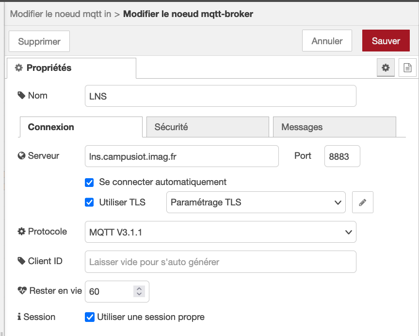
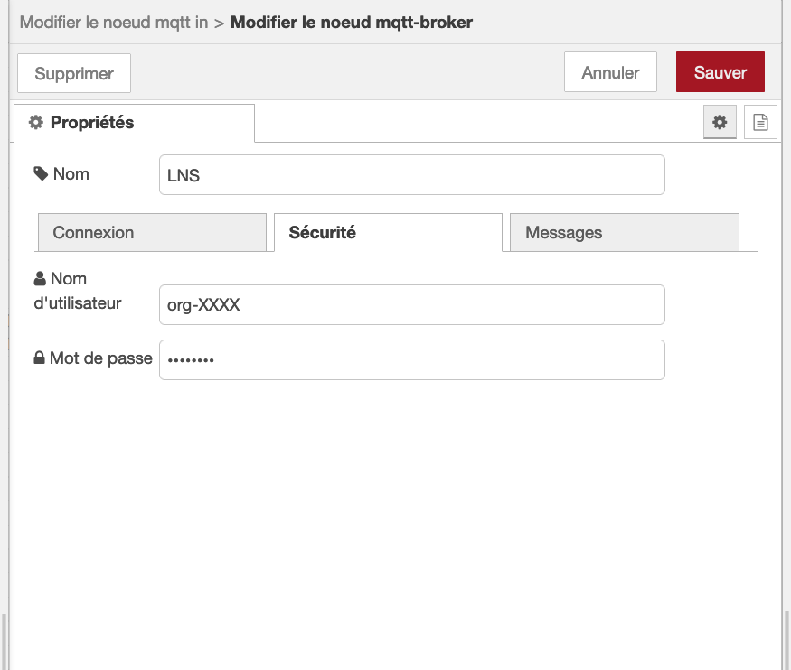
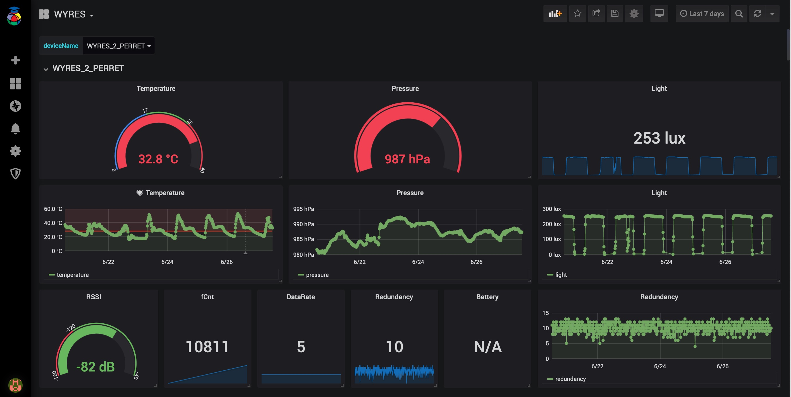

# Collecte, stockage et affichage des mesures de capteurs LoRaWAN :: Tutoriel sur RIOT et LoRa/LoRaWAN avec la carte Wyres Base

[Précédent](07.md) | [Top](README.md) |  [Suivant](09.md)

Dans ce chapitre, vous apprendrez à
* intégrer les mesures de capteurs LoRaWAN dans des applications IoT Cloud
* collecter, stocker et afficher les mesures de capteurs LoRaWAN dans des applications on-premise


## Rappel

> Configurez la carte cible pour `make`
```bash
export BOARD=wyres-base
export EXTERNAL_BOARD_DIRS=~/github/campusiot/RIOT-wyres/boards
```

## MyDevice (cloud)

MyDevice est une plateforme cloud pour la création rapide de tableau de bord liés à des équipements IoT.

Ouvrez un compte sur [MyDevice](https://mydevices.com). C'est gratuit jusqu'à 5 équipements.

Dans l'onglet `INTEGRATIONS` de votre application, créez une nouvelle intégration du type `myDevices.com`

TODO

## Influx Cloud (cloud)

TODO


## Nodered - Influxdb - Grafana (on premise)

Dans cet exemple, la chaîne de traitement des mesures


```bash
cd ~/github/campusiot/RIOT-wyres/backend
docker-compose up -d
docker-compose ps
docker-compose logs -f
```

Ouvrez la [console Web](http://localhost:1880) du service NodeRed (`admin` `MY_SUPER_ADMIN_SECRET`)

Configurez dans le noeud MQTT le broker MQTT LNS (`lns.campusiot.imag.fr`) en ajoutant l'identifiant et le mot de passe pour se connecter au broker MQTT (l'identifiant et le mot de passe vous seront communiqué en séance).





Ouvrez la [console Web](http://localhost:3000) du service Grafana (`admin` `CHANGE_THIS_UNSECURE_PASSWORD`).

Vous pouvez transformer les tableaux de bord existant à votre guise.

> Le mot de passe Grafana se change dans le fichier `grafana.yml`.



## Utilisation des mesures dans des Notebooks Jupyter pour le Machine Learning

Vous trouvez sur ce dépôt [CampusIoT/datasets](https://github.com/CampusIoT/datasets) un certain nombre des datasets contenant les mesures recueillies su(r des [capteurs Wyres Base installés à Grenoble](https://github.com/CampusIoT/datasets/tree/main/SaintEynard/logs), France. La collecte a dure plusieurs mois.

Ces datasets peuvent servir à élaborer des notebooks Jupyter comme [ces ébauches](https://github.com/CampusIoT/datasets/blob/main/SaintEynard/notebooks/campusiot.ipynb).


## Thingsboard (cloud)

TODO

## Thingsboard (on premise)

TODO
