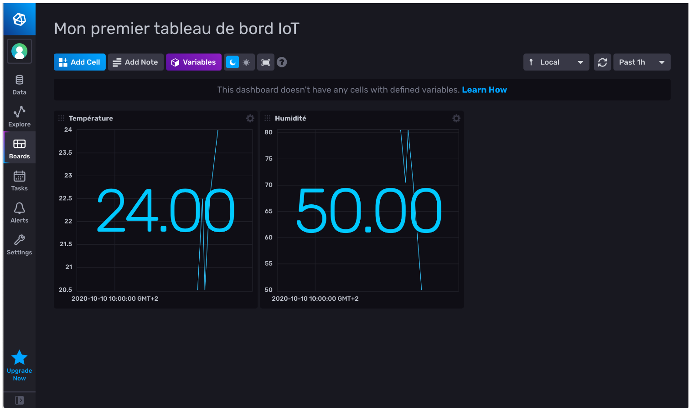
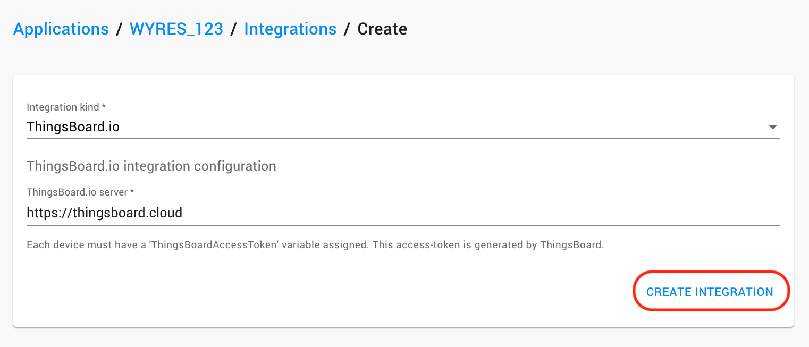
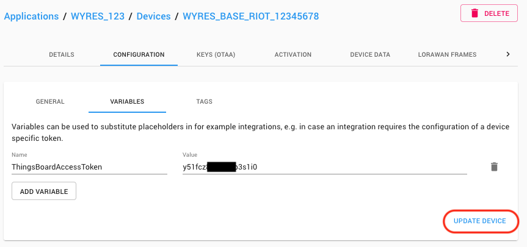
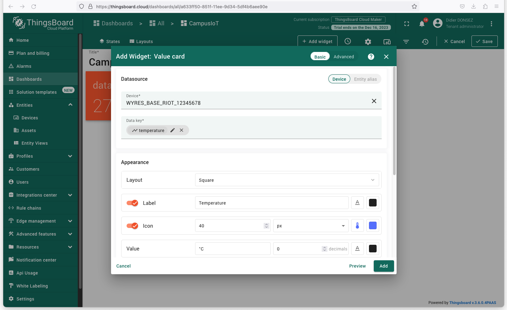

# Collecte, stockage et affichage des mesures de capteurs LoRaWAN :: Tutoriel sur RIOT et LoRa/LoRaWAN avec la carte Wyres Base

[Précédent](07.md) | [Top](README.md) |  [Suivant](09.md)

Dans ce chapitre, vous apprendrez à
* intégrer les mesures de capteurs LoRaWAN dans des applications IoT Cloud
* collecter, stocker et afficher les mesures de capteurs LoRaWAN dans des applications on-premise


## Rappel

> Configurez la carte cible pour `make`
```bash
export BOARD=wyres-base
export EXTERNAL_BOARD_DIRS=~/github/campusiot/RIOT-wyres/boards
```

## Nodered - Influxdb - Grafana (on premise)

Dans cet exemple, la chaîne de traitement des mesures est constituée des services Dockerisés suivants:
* `nodered` pour la récupération des messages en souscrivant au broker MQTT
* `influxdb` pour stocker les mesures dans des séries temporelles
* `grafana` pour afficher dans des tableaux de bord les séries temporelles stockées par le service `influxdb`

Lancez les commandes suivantes:

```bash
cd ~/github/campusiot/RIOT-wyres/backend
docker-compose up -d
docker-compose ps
docker-compose logs -f
```

Ouvrez la [console Web](http://localhost:1880) du service NodeRed (`admin` `MY_SUPER_ADMIN_SECRET`)

Configurez dans le noeud MQTT le broker MQTT LNS (`lns.campusiot.imag.fr`) en ajoutant l'identifiant et le mot de passe pour se connecter au broker MQTT (l'identifiant et le mot de passe vous seront communiqué en séance).


Ouvrez la [console Web](http://localhost:3000) du service Grafana (`admin` `CHANGE_THIS_UNSECURE_PASSWORD`).

Vous pouvez transformer les tableaux de bord existant à votre guise.

> Le mot de passe Grafana se change dans le fichier `grafana.yml`. Le mot de passe Nodered se change dans le fichier `settings.js` après hachage.


## Influx Cloud (cloud)

InfluxDB est une base des données temporelle spécialisée dans le stockage de mesures IoT. Elle peut être opérée soi-même sur ses propres serveurs (on-premise). Plusieurs fournisseurs cloud offrent un service de stockage InfluxDB sur leur cloud. InfluxData est l’un d’entre eux.

Chirpstack permet une intégration avec un serveur InfluxDB: https://www.chirpstack.io/application-server/integrations/influxdb/ 

Créez vous un compte gratuit sur le service de stockage en nuage d’InfluxData (une carte de crédit n’est pas nécessaire) https://cloud.influxdata.com/ . Lors de la création du compte, choisissez plutôt un fournisseur en Europe (par exemple, Azure Amsterdam). La retention des données du compte gratuit est limitée à 30 jours. La documentation de InfluxDB cloud est ici https://docs.influxdata.com/influxdb/v2.0/get-started/#start-with-influxdb-cloud-2-0

Créez vous un compte gratuit sur le service de stockage en nuage d’InfluxData (une carte de crédit n’est pas nécessaire) https://cloud.influxdata.com/ . Lors de la création du compte, choisissez plutôt un fournisseur en Europe (par exemple, Azure Amsterdam). La retention des données du compte gratuit est limitée à 30 jours. La documentation de InfluxDB cloud est ici https://docs.influxdata.com/influxdb/v2.0/get-started/#start-with-influxdb-cloud-2-0


Générez un token depuis le menu `Data` > onglet `Tokens`


Ajoutez quelques mesures factices au bucket `lorawan` avec ces commandes shell (il faut configurer les variables `DBHOST` et `TOKEN`)

```bash
# DBHOST dépend du choix du provider Cloud (Azure) et du DataCenter (westeurope-1)
DBHOST=https://westeurope-1.azure.cloud2.influxdata.com
# L’adresse utilisée pour créer le compte InfluxData
DBUSERNAME='prenom.nom@gmail.com'
# Le token généré depuis la console InfluxData
DBTOKEN='ov8MaASWoEXXXXXXXXXXXXXXMHTgmUvKjXXXXXXXXXXXXXXXXXXXXX-kHrD6p4MD-RoWhLc-2AXXX5G4_ajqQ=='

curl -i -XPOST -u "$DBUSERNAME:$DBTOKEN" "$DBHOST/write?db=lorawan" \
--data-binary 'data,deveui=1234567890abdcef,application=WYRES_123 temperature_1=24,humidity_1=50'

sleep 10

curl -i -XPOST -u "$DBUSERNAME:$DBTOKEN" "$DBHOST/write?db=lorawan" \
--data-binary 'data,deveui=1234567890abdcef,application=WYRES_123 temperature_1=20,humidity_1=70.5'

sleep 10

curl -i -XPOST -u "$DBUSERNAME:$DBTOKEN" "$DBHOST/write?db=lorawan" \
--data-binary 'data,deveui=1234567890abdcef,application=WYRES_123 temperature_1=30,pressure_1=990'

sleep 10

curl -i -XPOST -u "$DBUSERNAME:$DBTOKEN" "$DBHOST/write?db=lorawan" \
--data-binary 'data,deveui=1234567890abdcef,application=WYRES_123 temperature_1=37,humidity_1=30.0'
```

Explorez les mesures enregistrées au moyen de l’explorateur de données. Cliquez sur Submit pour visualiser le graphe.


Créez un tableau de bord en ajoutant 2 cellules (cell). La cellule Humidité peut être rapidement obtenue en clone la première cellule créée.



Créez une intégration de votre application WYRES_123 depuis l’onglet Integrations de celle-ci. Utilisez les informations données (Token dans Password) dans la console InfluxData.

`https://westeurope-1.azure.cloud2.influxdata.com/write?db=lorawan`


Un nouveau bucket (lorawan?db=lorawan) est créé dans InfluxData. Attention, il faut prévoir de supprimer des buckets dans la console InfluxData car leur nombre est limité avec le compte gratuit. Vous pouvez changer la rétention du bucket (30 days maximun avec les comptes gratuits). Vous pouvez explorer les données de vos endpoints et construire des tableaux de bord comme vu précédemment.

## Thingsboard (cloud)

Créez vous un compte sur [Thingsboard](https://thingsboard.cloud/signup). ThingsBoard.cloud crée une instance qui vous est dédié. Ca peut prendre quelques minutes. Cette instance d'avaluation est gratuite pendant un mois.

Connectez-vous à votre [instance ThingsBoard](http://thingsboard.cloud)

Pour ajouter votre équipemnent à Thingsboard, accédez à la section "Entités". Ensuite, allez à la page "Dispositifs".

Cliquez sur l'icône "+" en haut à droite du tableau, puis sélectionnez "Ajouter un nouvel dispositif".

Entrez le nom de l'équipement. Par exemple, "WYRES_BASE_RIOT_12345678" et un label (par exemple, le texte imprimé sur l'étiquette du boitier de l'équipement).


Notez l'`Access Token` du dispositif et terminez la création en cliquant sur "Ajouter" ("Add").


Dans la console du LNS, ajoutez une nouvelle intégration `Thingsboard` depuis l'onglet `INTEGRATIONS` votre application.



L'adresse du serveur a spécifié est `https://thingsboard.cloud`.
 
Dans l'onglet `VARIABLES` de l'onglet `CONFIGURATION` de votre équipement, ajoutez une nouvelle variable `ThingsBoardAccessToken` avec la valeur de l'`Access Token` donnée par Thingsboard précédenment.



Désormais que le LNS reçoit un message de l'équipement, il envoit vers Thingsboard une réquête HTTPS contenant les nouvelles mesures contenues dans la charge utile (décodée)ndu message.

Vous pouvez désormais [ajouter un nouveau tableau de bord](https://thingsboard.cloud/dashboards/all) à votre instance Thingsboard en cliquant sur l'icône "+".

Entrez dans le mode Edition pour ajouter un nouveau Widget (que vous choissirez parmi la liste proposée en fonction de vos goûts) et sélectionnez le dispositif (parmi les dispositifs déjà créés) et la mesure (parmi les mesures (aka Data Keys) déjà reçues). N'oubliez pas de sauvegarder le tableau de tableau.



Plus de détail sur l'[intégration Thingsboard de Chirpstack](https://www.chirpstack.io/docs/guides/thingsboard.html).

## Thingsboard (on premise)

Thingsboard est également disponible sous la forme de conteneur Docker.

Dans la composition `backend` qui contient déjà Nodered-InfluxDB-Grafana, décommentez le service `thingsboard` dans le fichier `docker-compose.yml`.

Relancez la composition avec les commandes suivantes (Normalement, seul le nouveau service  `thingsboard` est créé).

```bash
cd ~/github/campusiot/RIOT-wyres/backend
docker-compose up -d
docker-compose ps
docker-compose logs -f
```

Ouvrez [la console web](http://localhost:9090) du service Thingsboard.

Vous pouvez utiliser les 3 comptes par défaut
* Systen Administrator: `sysadmin@thingsboard.org` / `sysadmin`
* Tenant Administrator: `tenant@thingsboard.org` / `tenant`
* Customer User: `customer@thingsboard.org` / `customer`

> Vous pouvez toujours changer les mots de passe pour chaque compte dans la page de profil du compte.

Connectez vous avec le compte Tenant : `tenant@thingsboard.org` / `tenant`

Comme dans le cas de l'instance cloud de Thingsboard, ajoutez le dispositif et recupérez l'`Access Token`.

Renseignez l'`Access Token` dans la variable `ThingsBoardAccessToken` dans l'onglet `VARIABLES` de l'onglet `CONFIGURATION` de votre équipement.

Modifiez le flot Nodered pour que les message de l'équipement reçus vers MQTT soit transformé en requête HTTP vers le service docker `thingsboard`.

La réquête est équivalent à une commande `cURL` suivante:

```bash
OBJECT_JSON="{temperature:25}"
ACCESS_TOKEN=yzXXXXXXXX151fci0
curl -v -X POST http://http://thingsboard:9090/api/v1/$ACCESS_TOKEN/telemetry --header Content-Type:application/json --data "{$OBJECT_JSON}"
```

Continuez en créant un tableau de bord à votre goût.

## MyDevice (cloud)

MyDevice est une plateforme cloud pour la création rapide de tableau de bord liés à des équipements IoT.

Ouvrez un compte sur [MyDevice](https://mydevices.com). C'est gratuit jusqu'à 5 équipements.

Dans l'onglet `INTEGRATIONS` de votre application, créez une nouvelle intégration du type `myDevices.com`

TODO

## Utilisation des mesures dans des Notebooks Jupyter pour le Machine Learning

Vous trouvez sur ce dépôt [CampusIoT/datasets](https://github.com/CampusIoT/datasets) un certain nombre des datasets contenant les mesures recueillies su(r des [capteurs Wyres Base installés à Grenoble](https://github.com/CampusIoT/datasets/tree/main/SaintEynard/logs), France. La collecte a dure plusieurs mois.

Ces datasets peuvent servir à élaborer des notebooks Jupyter comme [ces ébauches](https://github.com/CampusIoT/datasets/blob/main/SaintEynard/notebooks/campusiot.ipynb).
