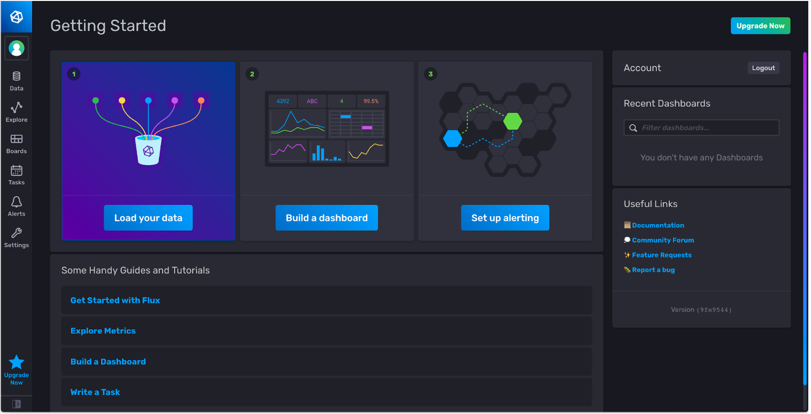
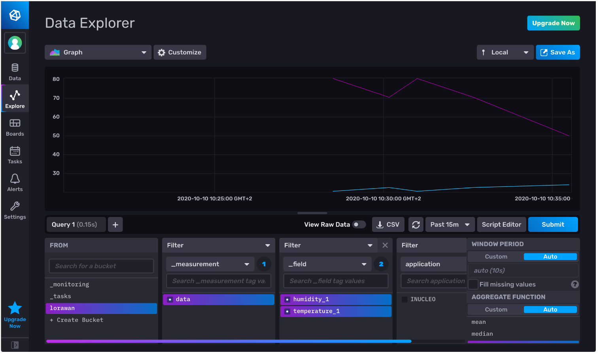
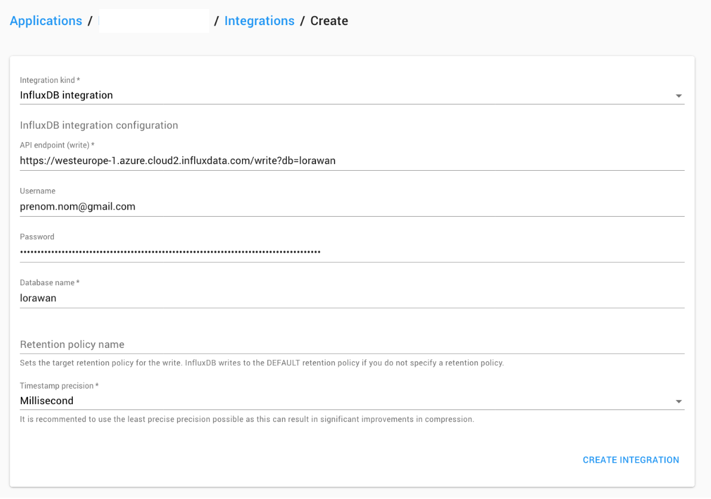

# Collecte, stockage et affichage des mesures de capteurs LoRaWAN :: Tutoriel sur RIOT et LoRa/LoRaWAN avec la carte Wyres Base

[Précédent](07.md) | [Top](README.md) |  [Suivant](09.md)

Dans ce chapitre, vous apprendrez à
* intégrer les mesures de capteurs LoRaWAN dans des applications IoT Cloud
* collecter, stocker et afficher les mesures de capteurs LoRaWAN dans des applications on-premise


## Rappel

> Configurez la carte cible pour `make`
```bash
export BOARD=wyres-base
export EXTERNAL_BOARD_DIRS=~/github/campusiot/RIOT-wyres/boards
```

## Nodered - Influxdb - Grafana (on premise)

Dans cet exemple, la chaîne de traitement des mesures est constituée des services Dockerisés suivants:
* `nodered` pour la récupération des messages en souscrivant au broker MQTT
* `influxdb` pour stocker les mesures dans des séries temporelles
* `grafana` pour afficher dans des tableaux de bord les séries temporelles stockées par le service `influxdb`

Lancez les commandes suivantes:

```bash
cd ~/github/campusiot/RIOT-wyres/backend
docker-compose up -d
docker-compose ps
docker-compose logs -f
```

Ouvrez la [console Web](http://localhost:1880) du service NodeRed (`admin` `MY_SUPER_ADMIN_SECRET`)

Configurez dans le noeud MQTT le broker MQTT LNS (`lns.campusiot.imag.fr`) en ajoutant l'identifiant et le mot de passe pour se connecter au broker MQTT (l'identifiant et le mot de passe vous seront communiqué en séance).


Ouvrez la [console Web](http://localhost:3000) du service Grafana (`admin` `CHANGE_THIS_UNSECURE_PASSWORD`).

Vous pouvez transformer les tableaux de bord existant à votre guise.

> Le mot de passe Grafana se change dans le fichier `grafana.yml`. Le mot de passe Nodered se change dans le fichier `settings.js` après hachage.


## Utilisation des mesures dans des Notebooks Jupyter pour le Machine Learning

Vous trouvez sur ce dépôt [CampusIoT/datasets](https://github.com/CampusIoT/datasets) un certain nombre des datasets contenant les mesures recueillies su(r des [capteurs Wyres Base installés à Grenoble](https://github.com/CampusIoT/datasets/tree/main/SaintEynard/logs), France. La collecte a dure plusieurs mois.

Ces datasets peuvent servir à élaborer des notebooks Jupyter comme [ces ébauches](https://github.com/CampusIoT/datasets/blob/main/SaintEynard/notebooks/campusiot.ipynb).

## Influx Cloud (cloud)

InfluxDB est une base des données temporelle spécialisée dans le stockage de mesures IoT. Elle peut être opérée soi-même sur ses propres serveurs (on-premise). Plusieurs fournisseurs cloud offrent un service de stockage InfluxDB sur leur cloud. InfluxData est l’un d’entre eux.

Chirpstack permet une intégration avec un serveur InfluxDB: https://www.chirpstack.io/application-server/integrations/influxdb/ 

Créez vous un compte gratuit sur le service de stockage en nuage d’InfluxData (une carte de crédit n’est pas nécessaire) https://cloud.influxdata.com/ . Lors de la création du compte, choisissez plutôt un fournisseur en Europe (par exemple, Azure Amsterdam). La retention des données du compte gratuit est limitée à 30 jours. La documentation de InfluxDB cloud est ici https://docs.influxdata.com/influxdb/v2.0/get-started/#start-with-influxdb-cloud-2-0

Créez vous un compte gratuit sur le service de stockage en nuage d’InfluxData (une carte de crédit n’est pas nécessaire) https://cloud.influxdata.com/ . Lors de la création du compte, choisissez plutôt un fournisseur en Europe (par exemple, Azure Amsterdam). La retention des données du compte gratuit est limitée à 30 jours. La documentation de InfluxDB cloud est ici https://docs.influxdata.com/influxdb/v2.0/get-started/#start-with-influxdb-cloud-2-0



Générez un token depuis le menu `Data` > onglet `Tokens`


Ajoutez quelques mesures factices au bucket `lorawan` avec ces commandes shell (il faut configurer les variables `DBHOST` et `TOKEN`)

```bash
# DBHOST dépend du choix du provider Cloud (Azure) et du DataCenter (westeurope-1)
DBHOST=https://westeurope-1.azure.cloud2.influxdata.com
# L’adresse utilisée pour créer le compte InfluxData
DBUSERNAME='prenom.nom@gmail.com'
# Le token généré depuis la console InfluxData
DBTOKEN='ov8MaASWoEXXXXXXXXXXXXXXMHTgmUvKjXXXXXXXXXXXXXXXXXXXXX-kHrD6p4MD-RoWhLc-2AXXX5G4_ajqQ=='

curl -i -XPOST -u "$DBUSERNAME:$DBTOKEN" "$DBHOST/write?db=lorawan" \
--data-binary 'data,deveui=1234567890abdcef,application=WYRES_123 temperature_1=24,humidity_1=50'

sleep 10

curl -i -XPOST -u "$DBUSERNAME:$DBTOKEN" "$DBHOST/write?db=lorawan" \
--data-binary 'data,deveui=1234567890abdcef,application=WYRES_123 temperature_1=20,humidity_1=70.5'

sleep 10

curl -i -XPOST -u "$DBUSERNAME:$DBTOKEN" "$DBHOST/write?db=lorawan" \
--data-binary 'data,deveui=1234567890abdcef,application=WYRES_123 temperature_1=30,pressure_1=990'

sleep 10

curl -i -XPOST -u "$DBUSERNAME:$DBTOKEN" "$DBHOST/write?db=lorawan" \
--data-binary 'data,deveui=1234567890abdcef,application=WYRES_123 temperature_1=37,humidity_1=30.0'
```

Explorez les mesures enregistrées au moyen de l’explorateur de données. Cliquez sur Submit pour visualiser le graphe.



Créez un tableau de bord en ajoutant 2 cellules (cell). La cellule Humidité peut être rapidement obtenue en clone la première cellule créée.


Créez une intégration de votre application WYRES_123 depuis l’onglet Integrations de celle-ci. Utilisez les informations données (Token dans Password) dans la console InfluxData.

`https://westeurope-1.azure.cloud2.influxdata.com/write?db=lorawan`



Un nouveau bucket (lorawan?db=lorawan) est créé dans InfluxData. Attention, il faut prévoir de supprimer des buckets dans la console InfluxData car leur nombre est limité avec le compte gratuit. Vous pouvez changer la rétention du bucket (30 days maximun avec les comptes gratuits). Vous pouvez explorer les données de vos endpoints et construire des tableaux de bord comme vu précédemment.

## Thingsboard (cloud)

Créez vous un compte sur [Thingsboard](https://thingsboard.cloud/signup).

https://thingsboard.io/docs/getting-started-guides/helloworld/
TODO

Pour ajouter un nouvel appareil, suivez ces étapes :
* Connectez-vous à votre instance ThingsBoard et accédez à la section "Entités". Ensuite, allez à la page "Appareils";
* Cliquez sur l'icône "+" en haut à droite du tableau, puis sélectionnez "Ajouter un nouvel appareil";
* Entrez le nom de l'appareil. Par exemple, "Mon nouvel appareil". Aucune autre modification n'est nécessaire pour le moment. Cliquez sur "Ajouter" pour ajouter l'appareil;

L'appareil est créé. Une fenêtre s'ouvrira où vous pourrez vérifier la connexion de l'appareil à ThingsBoard. Cette étape est facultative. Fermons cette fenêtre pour l'instant et revenons à la vérification de la connexion dans l'étape suivante, de manière plus détaillée;

Votre premier appareil a été ajouté. À mesure que de nouveaux appareils sont ajoutés, ils s'ajouteront en haut du tableau, car le tableau trie les appareils en utilisant l'heure de création par défaut.

http://thingsboard.cloud

Add a variable named ThingsBoardAccessToken and with as value the content from your clipboard (containing the ThingsBoard Device Access Token).


## Thingsboard (on premise)

https://www.chirpstack.io/docs/guides/thingsboard.html

`docker-compose.yml`:

```
version: "3"

services:

  thingsboard:
    image: thingsboard/tb-postgres
    volumes:
      - thingsboarddata:/data
    ports:
      - 9090:9090

volumes:
  thingsboarddata:
```


## MyDevice (cloud)

MyDevice est une plateforme cloud pour la création rapide de tableau de bord liés à des équipements IoT.

Ouvrez un compte sur [MyDevice](https://mydevices.com). C'est gratuit jusqu'à 5 équipements.

Dans l'onglet `INTEGRATIONS` de votre application, créez une nouvelle intégration du type `myDevices.com`

TODO
