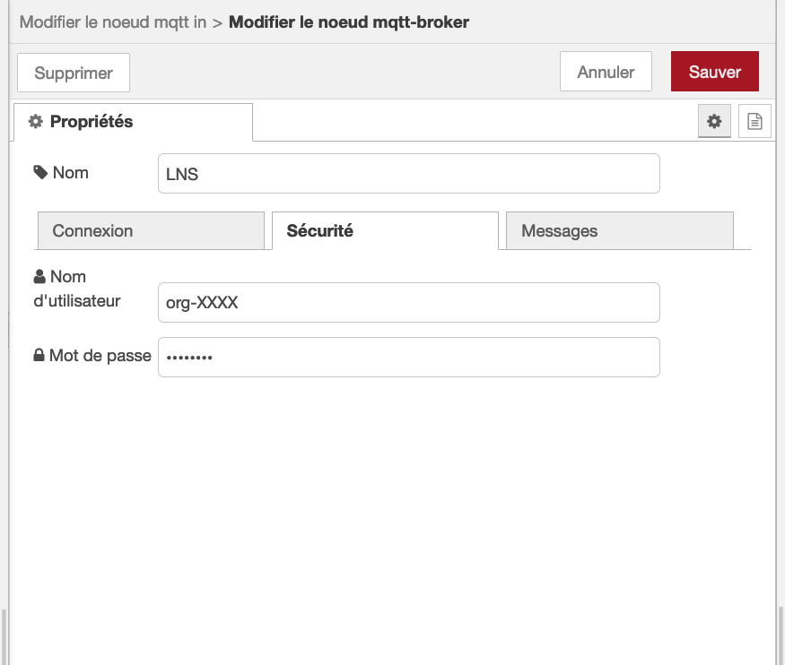
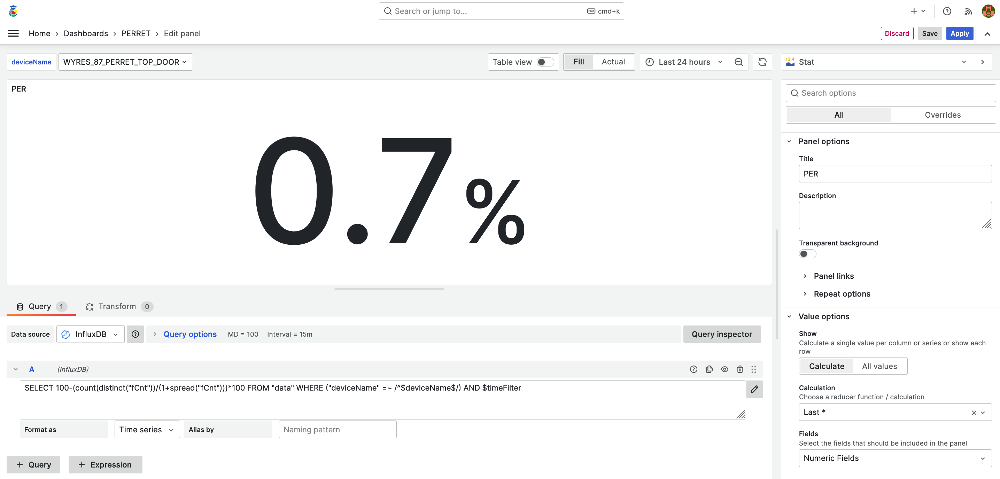
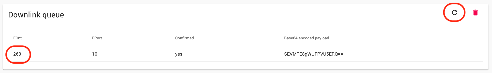
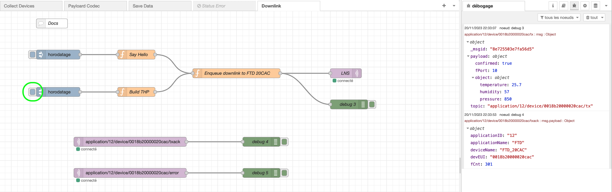

# Nodered - Influxdb - Grafana (on premise) :: Collecte, stockage et affichage des mesures de capteurs LoRaWAN

[Précédent](08.md) | [Sommaire](README.md) |  [Suivant](08b.md)

Dans ce chapitre, vous apprendrez à collecter, stocker et afficher les mesures de capteurs LoRaWAN avec la composition docker Nodered - Influxdb - Grafana


La chaîne de traitement des mesures est constituée des services dockerisés suivants:
* `nodered` pour la récupération des messages en souscrivant au broker MQTT
* `influxdb` pour stocker les mesures dans des séries temporelles
* `grafana` pour afficher dans des tableaux de bord les séries temporelles stockées par le service `influxdb`

## Lancement de la composition

Lancez les commandes suivantes:

```bash
cd ~/github/campusiot/RIOT-wyres/backend
docker-compose up -d
docker-compose ps
docker-compose logs -f
```

## Collecte et stockage

Ouvrez la [console Web](http://localhost:1880) du service NodeRed (`admin` `CHANGE_THIS_UNSECURE_PASSWORD`)

Configurez dans le noeud MQTT le broker MQTT LNS (`lns.campusiot.imag.fr`) en ajoutant l'identifiant et le mot de passe pour se connecter au broker MQTT (l'identifiant et le mot de passe vous seront communiqué en séance).




Le service `nodered` est en charge de la récupération des messages (onglet `Collect Devices`) et du stockage sous la forme de séries temporelles (en anglais time series) dans le service `influxdb` (onglet `Save Data`).

## Visualisation

Le service `grafana` est en charge de la visualisation 

Ouvrez la [console Web](http://localhost:3000) du service `grafana` (`admin` `CHANGE_THIS_UNSECURE_PASSWORD`).

Un certain nombre de tableaux de bord ont été pré-installés.

Vous pouvez éditer/compléter/transformer les tableaux de bord existants à votre guise.


> Exercice: Que se passe avec ce traqueur GPS qui ne bouge pas mais qui est à l'intérieur d'un batiment ?

### Ajout d'un panel

Ajoutez un panel pour afficher le taux de perte des paquets LoRaWAN (PER pour Packet Error Ratio en anglais) pendant l'interval de temps sélectionné.

```sql
SELECT 100-(count(distinct("fCnt"))/(1+spread("fCnt")))*100 FROM "data" WHERE ("deviceName" =~ /^$deviceName$/) AND $timeFilter
```




## Envoi de messages vers les équipements

Retournez dans la [console Web](http://localhost:1880) du service `nodered`.

Ouvrez l'onglet `Downlink` : il montre comment un message descendant peut être envoyé à un équipement LoRaWAN (classe A, B ou C) via l'intégration MQTT de Chirpstack.

Cliquez sur le noeud 'horodatage'.


Vérifiez dans la console de l'équipement que le message est dans la file `Downlink Queue`.



A la réception d'un message montant, le message mis en queue des messages descendants est transmis vers l'équipement.

Dans le cas du [Testeur de réseau de terrain (FTD) d'Adeunis](https://www.adeunis.com/produit/ftd-testeur-de-reseau/), le message est affiché sur son écran LCD comme ci-dessous.


Exercice : Que se passe t'il dans le cas du noeud `Build THP` ?

Modifiez l'encodeur dans le Device Profile de votre équipement (`OTAA_CLASS_A_FTD` dans le cas du testeur de réseau de terrain).

```javascript
// Encode encodes the given object into an array of bytes.
//  - fPort contains the LoRaWAN fPort number
//  - obj is an object, e.g. {"temperature": 22.5}
//  - variables contains the device variables e.g. {"calibration": "3.5"} (both the key / value are of type string)
// The function must return an array of bytes, e.g. [225, 230, 255, 0]
function Encode(fPort, obj, variables) {
  var bytes = [];
  if(fPort === 10) {
    // Format THP obj as text
    var str = obj.temperature + '°C ' + obj.humidity + '% ' + obj.pressure + 'hPa';
    for (var c = 0; c < str.length; c += 1) {
        bytes.push(str.charCodeAt(c));
    }
  }
  return bytes;
}
```

Cliquez sur le deuxième noeud `horodatage` comme ci-dessous et contrôlez que le message a bien été placé dans la file des downlink depuis la console Web de l'équipement.



A la réception du message descendant, le message suivant est affiché sur l'écran du testeur de réseau de terrain.


## Inspection de la base de données InfluxDB

Vous pouvez inspecter la base de données InfluxDB  avec les lignes de commande suivantes:

```bash
docker-compose exec influxdb influx
```

```
> help
> show databases
> use lorawan
> show tag keys
> show field keys
> show series
> show measurements
> select * from data limit(10);
> select * from radio limit(10);
> select * from data where time > now() - 1h
> select * from "data" where "deviceName" =~ /Wyres_.*/
> SELECT * FROM "data" WHERE "deviceName" =~ /Wyres_.*/ AND time > now() - 1h
> SELECT count(*) FROM "data" WHERE "deviceName" =~ /Wyres_.*/ AND time > now() - 6h GROUP BY time(10m) fill(none)
> SELECT mean("temperature") as mean_temperature, mean("temperature") as mean_pressure, mean("light") as mean_light FROM "data" WHERE time > now() - 1d GROUP BY devEUI, time(1h)
```

[Documentation InfluxQL](https://docs.influxdata.com/influxdb/v1/query_language/spec/#queries)

<details>
<summary>Console (influx)</summary>
<pre>
Connected to http://localhost:8086 version 1.7.7
InfluxDB shell version: 1.7.7
> help
Usage:
        connect <host:port>   connects to another node specified by host:port
        auth                  prompts for username and password
        pretty                toggles pretty print for the json format
        chunked               turns on chunked responses from server
        chunk size <size>     sets the size of the chunked responses.  Set to 0 to reset to the default chunked size
        use <db_name>         sets current database
        format <format>       specifies the format of the server responses: json, csv, or column
        precision <format>    specifies the format of the timestamp: rfc3339, h, m, s, ms, u or ns
        consistency <level>   sets write consistency level: any, one, quorum, or all
        history               displays command history
        settings              outputs the current settings for the shell
        clear                 clears settings such as database or retention policy.  run 'clear' for help
        exit/quit/ctrl+d      quits the influx shell

        show databases        show database names
        show series           show series information
        show measurements     show measurement information
        show tag keys         show tag key information
        show field keys       show field key information

        A full list of influxql commands can be found at:
        https://docs.influxdata.com/influxdb/latest/query_language/spec/
> use lorawan
Using database lorawan
> show tag keys
name: data
tagKey
------
applicationID
applicationName
devEUI
deviceName

name: radio
tagKey
------
appid
datarate
deveui
deviceName
frequency
gatewayID
region
subband

name: stat
tagKey
------
gatewayID
ip
> show field keys
name: data
fieldKey             fieldType
--------             ---------
accelerometerTrigger float
alarm                float
altitude             float
battery              float
batteryVoltage       float
button1Trigger       float
downlinkCounter      float
downlinkRssi         float
downlinkSnr          float
dr                   float
fCnt                 float
firmware             float
latitude             float
led_updown           float
light                float
longitude            float
lsnr                 float
motion_move          float
payloadVersion       float
pitch                float
pressure             float
quality              float
redundancy           float
roll                 float
rssi                 float
satellites           float
temperature          float
uplinkCounter        float
willListen           float

name: radio
fieldKey   fieldType
--------   ---------
dr         float
esp        float
lsnr       float
redundancy float
rssi       float
size       float

name: stat
fieldKey            fieldType
--------            ---------
rxPacketsReceived   float
rxPacketsReceivedOK float
txPacketsEmitted    float
txPacketsReceived   float
> show series
key
---
data,applicationID=281,applicationName=WYRES_BASE,devEUI=d1d1e80000000002,deviceName=Wyres_02
data,applicationID=281,applicationName=WYRES_BASE,devEUI=d1d1e80000000002,deviceName=Wyres_ENSPY_02
...
data,applicationID=489,applicationName=ADEUNIS_FTD,devEUI=0018b20000020cac,deviceName=FTD_20CAC
...
radio,appid=281,datarate=0,deveui=d1d1e80000000003,deviceName=Wyres_03,frequency=868.1,gatewayID=58bf25fffee693c4,region=eu868,subband=g1
...
radio,appid=489,datarate=5,deveui=0018b20000020cac,deviceName=FTD_20CAC,frequency=868.5,gatewayID=58bf25fffee693c4,region=eu868,subband=g1
radio,appid=489,datarate=5,deveui=0018b20000020cac,deviceName=FTD_20CAC,frequency=868.5,gatewayID=58bf25fffee7b3a4,region=eu868,subband=g1
stat,gatewayID=0016c001ff10d6dd,ip=102.x.x.114
stat,gatewayID=0016c001ff10d6dd,ip=129.x.x.244
stat,gatewayID=58bf25fffee7b09c,ip=129.x.x.82
stat,gatewayID=58bf25fffee7b09c,ip=129.x.x.89

</pre>
</details>

## Export des séries temporelles depuis la base de données InfluxDB

Une série temporelle peut être exportée dans un fichier avec les lignes de commande suivantes.

Au format CSV
```bash
QUERY='SELECT * FROM "data"'
docker-compose exec influxdb influx -database lorawan -execute "$QUERY" -format csv > ./export.csv
wc -l ./export.csv
head ./export.csv
```
Au format JSON
```bash
QUERY='SELECT * FROM "data"'
docker-compose exec influxdb influx -database lorawan -execute "$QUERY" -format json > ./export.json
jq . ./export.json | more
```
## Import d'une série temporelle dans la base de données InfluxDB

[Lisez la documentation](https://www.influxdata.com/blog/import-csv-data-influxdb-using-influx-cli-python-java-client-libraries/) et [csv-to-influxdb](https://github.com/fabio-miranda/csv-to-influxdb)

## Sauvegarde/Restauration d'une base de données InfluxDB

[Documentation](https://docs.influxdata.com/influxdb/v1/administration/backup_and_restore/#back-up-a-specific-database)

### Sauvegarde

```bash
BACKUP_DIR=/var/lib/influxdb/backup/backup-$(date +%Y%m%d) docker-compose exec influxdb bash -c "mkdir -p $BACKUP_DIR && influxd backup -portable -db lorawan $BACKUP_DIR"
```

### Restauration

```bash
BACKUP_DATE=...
BACKUP_DIR=/var/lib/influxdb/backup/backup-$BACKUP_DATE docker-compose exec influxdb bash -c "influxd restore -portable -db lorawan $BACKUP_DIR"
```

## Quelques remarques

Le mot de passe Grafana se change dans le fichier `grafana.yml`. Le mot de passe Nodered se change dans le fichier `settings.js` après hachage.

Le service `nodered` peut être compléter avec d'[autres types de noeud](https://flows.nodered.org/search?type=node) via le [`Dockerfile` du service `nodered`](../backend/docker/nodered/Dockerfile). le service `grafana` peut être compléter avec d'[autres plugins](https://grafana.com/grafana/plugins/all-plugins/) via la définition `grafana.yml` du service grafana.

NodeRED intègre la possibilité de créer des [tableaux de bord](https://flows.nodered.org/node/node-red-dashboard) qui peuvent contenir des actions et même des applications plus complexes avec [NodeRed UI Builder](https://flows.nodered.org/node/node-red-contrib-uibuilder).

N'hésitez pas à jeter un coup d'oeil aux [exemples de flots Nodered contribués](https://flows.nodered.org/search?type=flow) par la communauté OpenJS.

## Exercices (Pour aller plus loin)

## Sauvegarde des données dans une base de données Postgres

Ajoutez un [service `postgres`](https://hub.docker.com/_/postgres) à la composition `docker-compose.yml`.

Modifiez le flot Node-RED (en ajouter un nouvel onglet) pour sauvegarder les données dans la base de données gérée par le service `postgres`.

## Sauvegarde des données dans une base de données MongoDB

Ajoutez un [service `mongo`](https://hub.docker.com/_/mongo) à la composition `docker-compose.yml`.

Modifiez le flot Node-RED (en ajouter un nouvel onglet) pour sauvegarder les données dans la base de données gérée par le service `mongo`.
