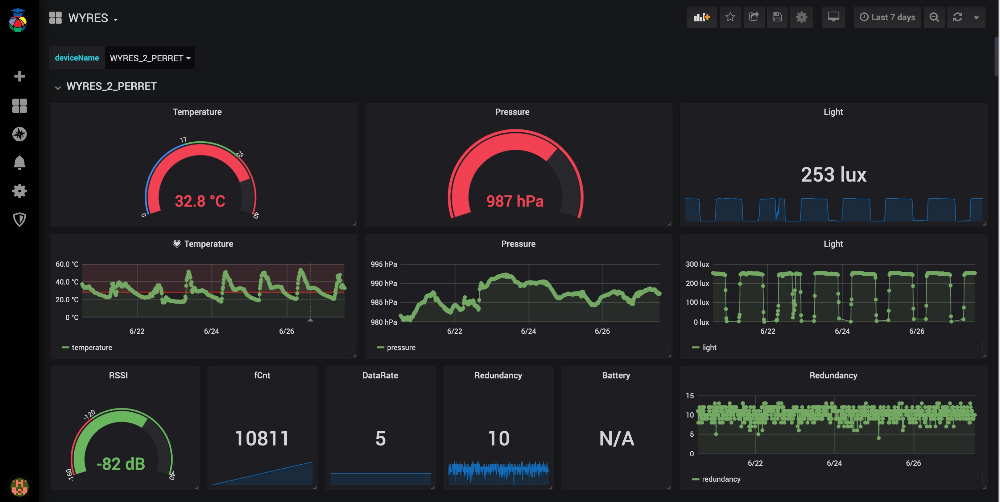

# Nodered - Influxdb - Grafana (on premise) :: Collecte, stockage et affichage des mesures de capteurs LoRaWAN

[Précédent](08.md) | [Sommaire](README.md) |  [Suivant](08b.md)

Dans ce chapitre, vous apprendrez à collecter, stocker et afficher les mesures de capteurs LoRaWAN avec la composition docker Nodered - Influxdb - Grafana


La chaîne de traitement des mesures est constituée des services dockerisés suivants:
* `nodered` pour la récupération des messages en souscrivant au broker MQTT
* `influxdb` pour stocker les mesures dans des séries temporelles
* `grafana` pour afficher dans des tableaux de bord les séries temporelles stockées par le service `influxdb`

Lancez les commandes suivantes:

```bash
cd ~/github/campusiot/RIOT-wyres/backend
docker-compose up -d
docker-compose ps
docker-compose logs -f
```

Ouvrez la [console Web](http://localhost:1880) du service NodeRed (`admin` `MY_SUPER_ADMIN_SECRET`)

Configurez dans le noeud MQTT le broker MQTT LNS (`lns.campusiot.imag.fr`) en ajoutant l'identifiant et le mot de passe pour se connecter au broker MQTT (l'identifiant et le mot de passe vous seront communiqué en séance).


Ouvrez la [console Web](http://localhost:3000) du service `grafana` (`admin` `CHANGE_THIS_UNSECURE_PASSWORD`).

Vous pouvez éditer/compléter/transformer les tableaux de bord existants à votre guise.

> Note: Le mot de passe Grafana se change dans le fichier `grafana.yml`. Le mot de passe Nodered se change dans le fichier `settings.js` après hachage.

> Note: le service `nodered` peut être compléter avec d'[autres types de noeud](https://flows.nodered.org/search?type=node) via le [`Dockerfile` du service `nodered`](../backend/docker/nodered/Dockerfile). le service `grafana` peut être compléter avec d'[autres plugins](https://grafana.com/grafana/plugins/all-plugins/) via la définition `grafana.yml` du service grafana.

> Note: NodeRED intègre la possibilité de créer des [tableaux de bord](https://flows.nodered.org/node/node-red-dashboard) qui peuvent contenir des actions et même des applications plus complexes avec [NodeRed UI Builder](https://flows.nodered.org/node/node-red-contrib-uibuilder).

> Note: n'hésitez pas à jeter un coup d'oeil aux [exemples de flots contribués](https://flows.nodered.org/search?type=flow) par la communauté OpenJS.


