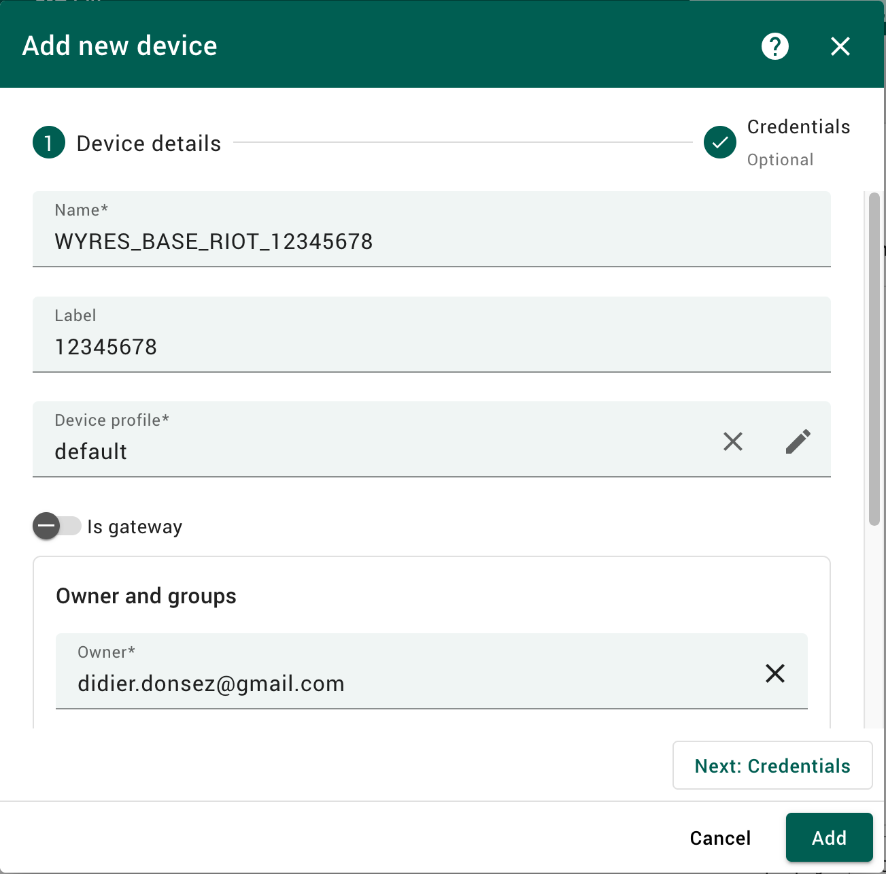
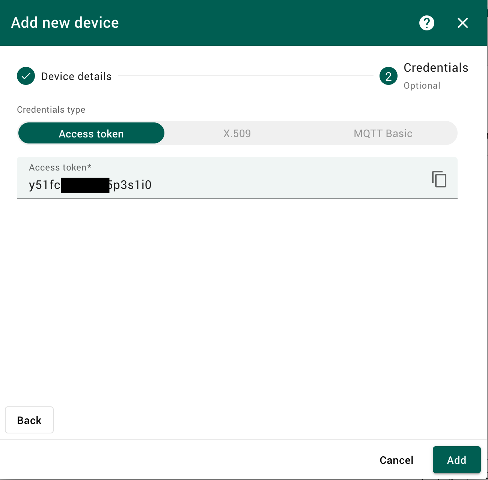
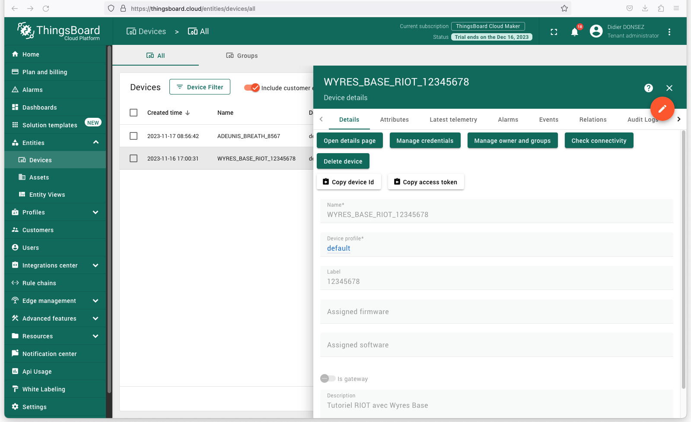
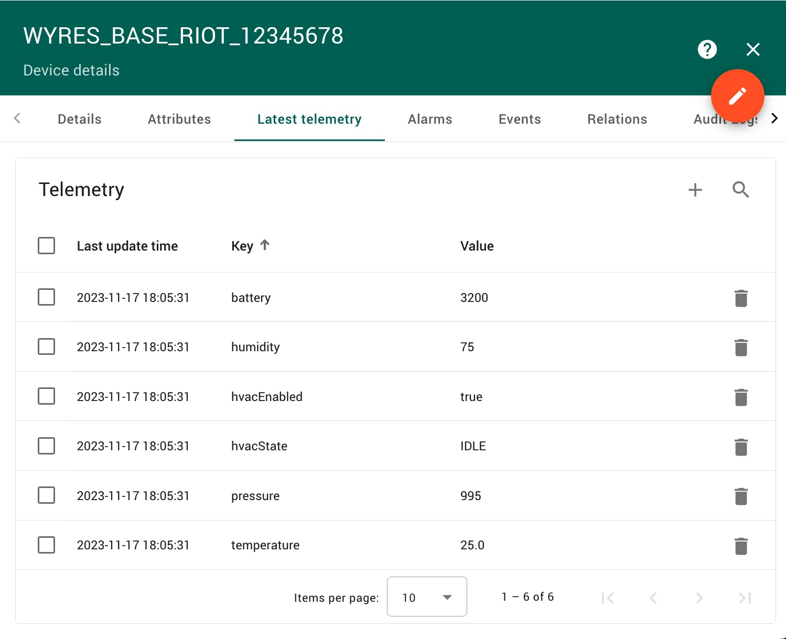
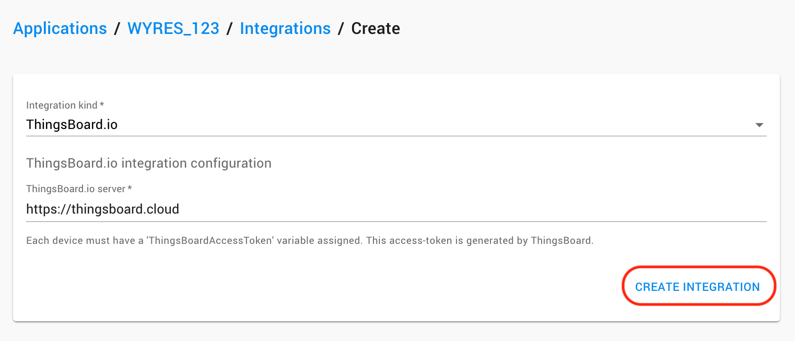
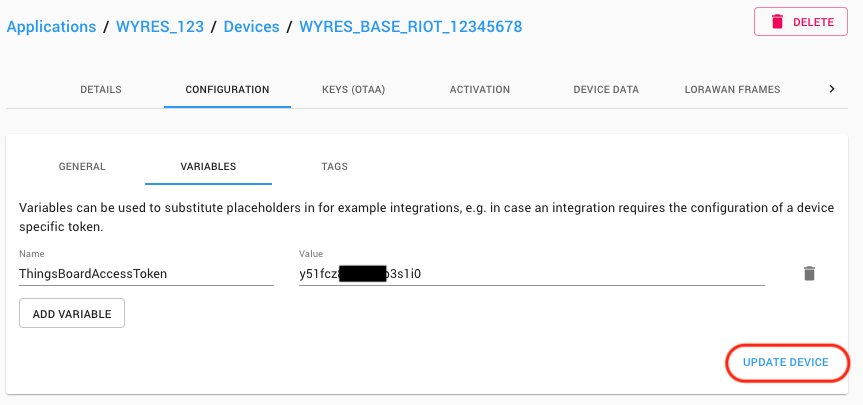
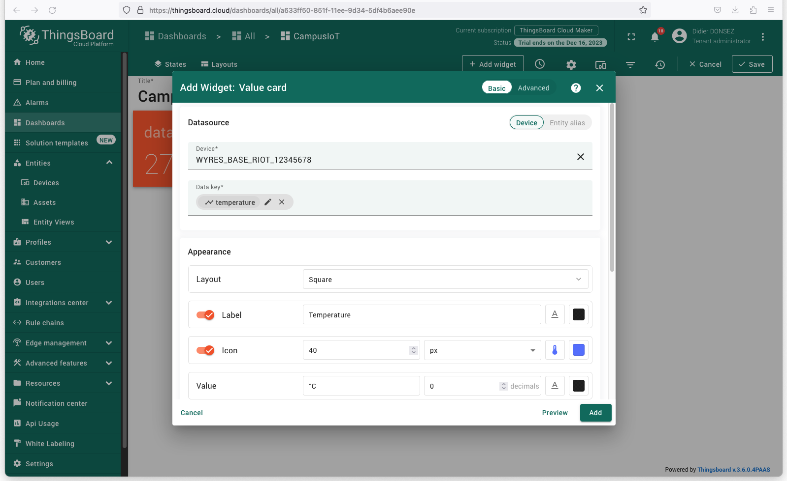
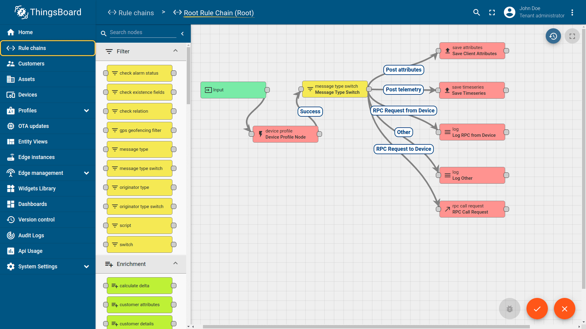

# Thingsboard (cloud) :: Collecte, stockage et affichage des mesures de capteurs LoRaWAN

[Précédent](08a.md) | [Sommaire](README.md) |  [Suivant](08c.md)

Dans ce chapitre, vous apprendrez à collecter, stocker et afficher les mesures de capteurs LoRaWAN avec le service cloud de Thingsboard.


Créez vous un compte sur le service cloud [Thingsboard](https://thingsboard.cloud/signup). ThingsBoard.cloud crée une instance qui vous est dédiée. Ca peut prendre quelques minutes. Cette instance d'évaluation est gratuite pendant un mois.

Connectez-vous à votre [instance ThingsBoard](http://thingsboard.cloud)

Pour ajouter votre équipemnent à Thingsboard, accédez à la section "Entités". Ensuite, allez à la page "Dispositifs".

Cliquez sur l'icône "+" en haut à droite du tableau, puis sélectionnez "Ajouter un nouvel dispositif".

Entrez le nom de l'équipement. Par exemple, "WYRES_BASE_RIOT_12345678" et un label (par exemple, le texte imprimé sur l'étiquette du boitier de l'équipement).



Notez l'`Access Token` du dispositif et terminez la création en cliquant sur "Ajouter" ("Add").





Testez l'envoi d'une [mesure factive (aka télémétrie)](https://thingsboard.io/docs/user-guide/telemetry/) pour tester la configuration :

```bash
OBJECT_JSON='{"temperature":25.0,"pressure":995,"humidity":75,"battery":3200,"hvacEnabled":true,"hvacState": "IDLE"}'
ACCESS_TOKEN=XXXXXXXXXXXX
curl -v -X POST http://thingsboard.cloud/api/v1/$ACCESS_TOKEN/telemetry --header Content-Type:application/json --data "$OBJECT_JSON"
```



Dans la console du LNS, ajoutez une nouvelle intégration `Thingsboard` depuis l'onglet `INTEGRATIONS` votre application.



L'adresse du serveur a spécifié est `https://thingsboard.cloud`.
 
Dans l'onglet `VARIABLES` de l'onglet `CONFIGURATION` de votre équipement, ajoutez une nouvelle variable `ThingsBoardAccessToken` avec la valeur de l'`Access Token` donnée par Thingsboard précédenment.



Désormais que le LNS reçoit un message de l'équipement, il envoit vers Thingsboard une réquête HTTPS contenant les nouvelles mesures contenues dans la charge utile (décodée)ndu message.

Vous pouvez désormais [ajouter un nouveau tableau de bord](https://thingsboard.cloud/dashboards/all) à votre instance Thingsboard en cliquant sur l'icône "+".

Entrez dans le mode Edition pour ajouter un nouveau Widget (que vous choissirez parmi la liste proposée en fonction de vos goûts) et sélectionnez le dispositif (parmi les dispositifs déjà créés) et la mesure (parmi les mesures (aka Data Keys) déjà reçues). N'oubliez pas de sauvegarder le tableau de tableau.



Plus de détail sur l'[intégration Thingsboard de Chirpstack](https://www.chirpstack.io/docs/guides/thingsboard.html).

Vous pouvez approfondir l'utilisation de Thingsboard par vous-même pour créer des [alarmes sur des mesures](https://thingsboard.io/docs/user-guide/alarms/) envoyées par les équipements (par exemple, dépassement d'un seuil de température d'une chambre froide) et des [règles entrainant l'exécution d'actions](https://thingsboard.io/docs/user-guide/rule-engine-2-0/re-getting-started/).

* [Alarmes](https://thingsboard.cloud/alarms)
* [Chaines de règles](https://thingsboard.cloud/ruleChains)



