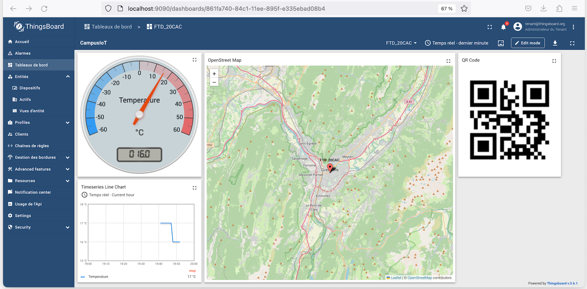

# Thingsboard (on premise) :: Collecte, stockage et affichage des mesures de capteurs LoRaWAN

[Précédent](08b.md) | [Sommaire](README.md) |  [Suivant](08d.md)

Dans ce chapitre, vous apprendrez à collecter, stocker et afficher les mesures de capteurs LoRaWAN dans Thingsboard on premise.

Thingsboard est également disponible sous la forme de [conteneur Docker](https://hub.docker.com/r/thingsboard/tb-postgres).

Cependant, l'intégration Thingsboard dans le LNS n'est pas possible puisque votre machine ne dispose d'une adresse publique. Nodered sera en charge d'effectuer cette intégration vers le service Docker `thingsboard`.

La composition `backend` contient déjà Nodered-InfluxDB-Grafana. Décommentez le service `thingsboard` dans le fichier `docker-compose.yml`.

Redémarrez la composition avec les commandes suivantes:

```bash
cd ~/github/campusiot/RIOT-wyres/backend
docker-compose down
docker-compose up -d
docker-compose ps
docker-compose logs -f
```
Ouvrez [la console web](http://localhost:9090) du service Thingsboard.

Vous pouvez utiliser les 3 comptes par défaut
* Systen Administrator: `sysadmin@thingsboard.org` / `sysadmin`
* Tenant Administrator: `tenant@thingsboard.org` / `tenant`
* Customer User: `customer@thingsboard.org` / `customer`

> Vous pouvez toujours changer les mots de passe pour chaque compte dans la page de profil du compte.

Connectez vous avec le compte Tenant : `tenant@thingsboard.org` / `tenant`

Comme dans le cas de l'instance cloud de Thingsboard, ajoutez le dispositif et recupérez l'`Access Token`.

Renseignez l'`Access Token` dans la variable `ThingsBoardAccessToken` dans l'onglet `VARIABLES` de l'onglet `CONFIGURATION` de votre équipement.

Modifiez le codec dans l'onglet `CODEC` du `Device Profile` de l'équipement pour ajouter les variables (qui contiennent la variable `ThingsBoardAccessToken`) dans l'objet decodé.

Par exemple:

```javascript
// Decode decodes an array of bytes into an object.
//  - fPort contains the LoRaWAN fPort number
//  - bytes is an array of bytes, e.g. [225, 230, 255, 0]
//  - variables contains the device variables e.g. {"calibration": "3.5"} (both the key / value are of type string)
// The function must return an object, e.g. {"temperature": 22.5}
function Decode(fPort, bytes, variables) {
  	var result = "";
	for(var i = 0; i < bytes.length; ++i){
		result+= (String.fromCharCode(bytes[i]));
	}
  	var decoded = { text: result }
  	if(variables.length > 0) {
    	decoded._variables = variables;
  	}
  	return decoded;
}
```

Modifiez le flot Nodered pour que les message de l'équipement reçus vers MQTT soit transformé en requête HTTP vers le service docker `thingsboard`.

La requête est équivalente à la commande `cURL` suivante:

```bash
OBJECT_JSON='{"temperature":25.0,"pressure":995,"humidity":75,"battery":3200,"hvacEnabled":true,"hvacState": "IDLE"}'
ACCESS_TOKEN=XXXXXXXXXXXX
curl -v -X POST http://thingsboard:9090/api/v1/$ACCESS_TOKEN/telemetry --header Content-Type:application/json --data "$OBJECT_JSON"
```

Poursuivez par la création d'un tableau de bord à votre goût, l'ajout d'alarmes et de règles.



