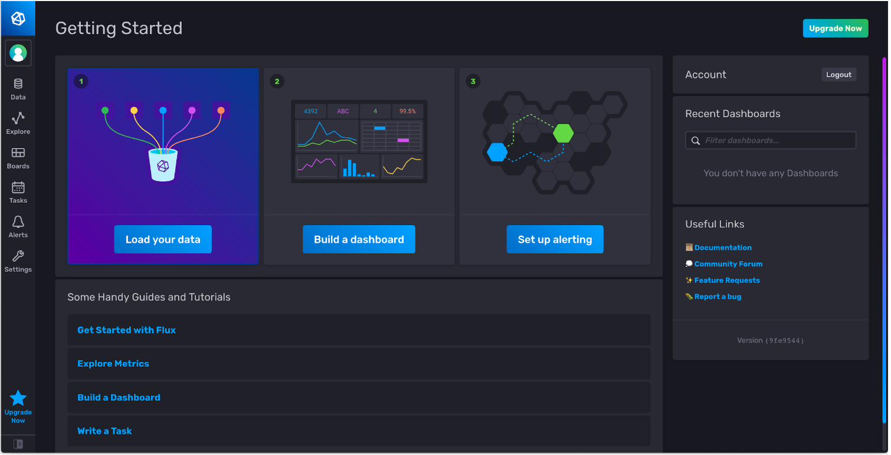
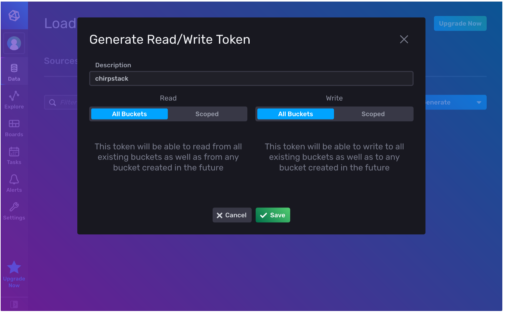

# Influx Data (cloud) :: Collecte, stockage et affichage des mesures de capteurs LoRaWAN

[Précédent](08c.md) | [Sommaire](README.md) |  [Suivant](08e.md)

Dans ce chapitre, vous apprendrez à collecter, stocker et afficher les mesures de capteurs LoRaWAN dans le service cloud InfluxData.

InfluxDB est une base des données temporelle spécialisée dans le stockage de mesures IoT. Elle peut être opérée soi-même sur ses propres serveurs (on-premise). Plusieurs fournisseurs cloud offrent un service de stockage InfluxDB sur leur cloud. InfluxData est l’un d’entre eux.

Chirpstack permet une intégration avec un serveur InfluxDB: https://www.chirpstack.io/application-server/integrations/influxdb/ 

Créez vous un compte gratuit sur le service de stockage en nuage d’InfluxData (une carte de crédit n’est pas nécessaire) https://cloud.influxdata.com/ . Lors de la création du compte, choisissez plutôt un fournisseur en Europe (par exemple, Azure Amsterdam). La retention des données du compte gratuit est limitée à 30 jours. La documentation de InfluxDB cloud est ici https://docs.influxdata.com/influxdb/v2.0/get-started/#start-with-influxdb-cloud-2-0

Créez vous un compte gratuit sur le service de stockage en nuage d’InfluxData (une carte de crédit n’est pas nécessaire) https://cloud.influxdata.com/ . Lors de la création du compte, choisissez plutôt un fournisseur en Europe (par exemple, Azure Amsterdam). La retention des données du compte gratuit est limitée à 30 jours. La documentation de InfluxDB cloud est ici https://docs.influxdata.com/influxdb/v2.0/get-started/#start-with-influxdb-cloud-2-0



Générez un token depuis le menu `Data` > onglet `Tokens`



Ajoutez quelques mesures factices au bucket `lorawan` avec ces commandes shell (il faut configurer les variables `DBHOST` et `TOKEN`)

```bash
# DBHOST dépend du choix du provider Cloud (Azure) et du DataCenter (westeurope-1)
DBHOST=https://westeurope-1.azure.cloud2.influxdata.com
# L’adresse utilisée pour créer le compte InfluxData
DBUSERNAME='prenom.nom@gmail.com'
# Le token généré depuis la console InfluxData
DBTOKEN='ov8MaASWoEXXXXXXXXXXXXXXMHTgmUvKjXXXXXXXXXXXXXXXXXXXXX-kHrD6p4MD-RoWhLc-2AXXX5G4_ajqQ=='

curl -i -XPOST -u "$DBUSERNAME:$DBTOKEN" "$DBHOST/write?db=lorawan" \
--data-binary 'data,deveui=1234567890abdcef,application=WYRES_123 temperature_1=24,humidity_1=50'

sleep 10

curl -i -XPOST -u "$DBUSERNAME:$DBTOKEN" "$DBHOST/write?db=lorawan" \
--data-binary 'data,deveui=1234567890abdcef,application=WYRES_123 temperature_1=20,humidity_1=70.5'

sleep 10

curl -i -XPOST -u "$DBUSERNAME:$DBTOKEN" "$DBHOST/write?db=lorawan" \
--data-binary 'data,deveui=1234567890abdcef,application=WYRES_123 temperature_1=30,pressure_1=990'

sleep 10

curl -i -XPOST -u "$DBUSERNAME:$DBTOKEN" "$DBHOST/write?db=lorawan" \
--data-binary 'data,deveui=1234567890abdcef,application=WYRES_123 temperature_1=37,humidity_1=30.0'
```

Explorez les mesures enregistrées au moyen de l’explorateur de données. Cliquez sur Submit pour visualiser le graphe.


Créez un tableau de bord en ajoutant 2 cellules (cell). La cellule Humidité peut être rapidement obtenue en clone la première cellule créée.


Créez une intégration de votre application WYRES_123 depuis l’onglet Integrations de celle-ci. Utilisez les informations données (Token dans Password) dans la console InfluxData.

`https://westeurope-1.azure.cloud2.influxdata.com/write?db=lorawan`


Un nouveau bucket (lorawan?db=lorawan) est créé dans InfluxData. Attention, il faut prévoir de supprimer des buckets dans la console InfluxData car leur nombre est limité avec le compte gratuit. Vous pouvez changer la rétention du bucket (30 days maximun avec les comptes gratuits). Vous pouvez explorer les données de vos endpoints et construire des tableaux de bord comme vu précédemment.
