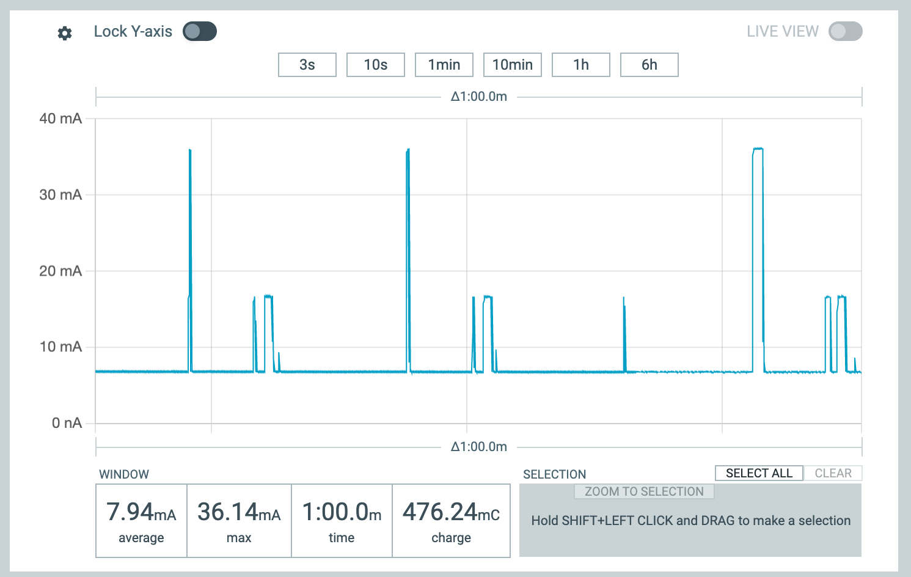

# La programmation ultra basse comsommation avec RIOT et la carte Wyres Base

[Précédent](11.md) | [Sommaire](README.md) |  [Suivant](13.md)

> Configurez la carte cible pour `make`
```bash
export BOARD=wyres-base
export EXTERNAL_BOARD_DIRS=~/github/campusiot/RIOT-wyres/boards
```

Dans ce chapitre, vous apprendrez à écrire votre programme enfin de tirer partie des capacités de sommeil profond (ie deep-sleep) des microcontroleurs pour économiser l'usage des batteries afin de concevoir des équipements sans maintenance pendant plusieurs années.

## Mesure de la consommation électrique

Préalablement, il faut pouvoir instrumenter la consommation électrique d'une carte embarquée.

Les deux platines suivantes ont l'avantage d'être bon marché et facile d'utilisation.

### Nordic PPK II

https://github.com/CampusIoT/tutorial/tree/master/nrf-ppk2



### ST X-NUCLEO-LPM01A Power Shield

https://github.com/CampusIoT/tutorial/tree/master/x-nucleo-lpm01a

## Principes de programmation basse consommation d'énergie

TODO

## Quelques exemples de durées de vie des batteries de produits LoRaWAN

* [Elsys](https://www.elsys.se/en/battery-life-calculator/)
* [MClimate](https://mclimate.eu/pages/lorawan-battery-calculator)

