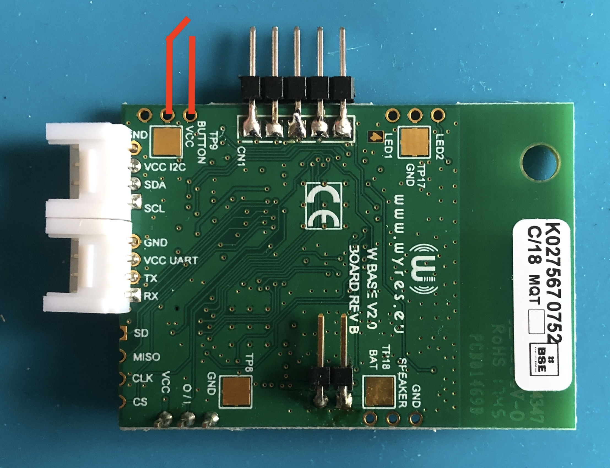

# Gestion d'énergie avec RIOT et la carte Wyres Base

[Précédent](11.md) | [Sommaire](README.md) |  [Suivant](13.md)

> Configurez la carte cible pour `make`
```bash
export BOARD=wyres-base
export EXTERNAL_BOARD_DIRS=~/github/campusiot/RIOT-wyres/boards
```

Dans ce chapitre, vous apprendrez à écrire votre programme enfin de tirer partie des capacités de sommeil profond (ie deep-sleep) du STM32 de la carte Wyres pour économiser l'usage des batteries afin de concevoir des équipements sans maintenance pendant plusieurs années.

## Mesure de la consommation électrique

Préalablement, il faut pouvoir instrumenter la consommation électrique d'une carte embarquée.

Les deux platines suivantes ont l'avantage d'être bon marché et facile d'utilisation.

### Nordic PPK II

https://github.com/CampusIoT/tutorial/tree/master/nrf-ppk2


### ST X-NUCLEO-LPM01A Power Shield

https://github.com/CampusIoT/tutorial/tree/master/x-nucleo-lpm01a

## Principes de programmation basse consommation d'énergie

TODO

## Gestion de l'énergie dans RIOT

Les mécanismes de gestion d'énergie dans RIOT s'appuient sur la capacité des microcontrôleurs de basculer dans des modes de fonctionnement à très basse consommation. Dans RIOT, le principe est de basculer automatiquement le microcontrôleur dans l'un de ces modes lorsque toutes les tâches sont terminées ou bloquées en attente d'un évènement extérieur.

```bash
export BOARD=wyres-base
export EXTERNAL_BOARD_DIRS=~/github/campusiot/RIOT-wyres/boards

cd ~/github/RIOT-OS/RIOT/tests/periph/pm
gmake flash
```

```
> main(): This is RIOT! (Version: 2023.07-devel-325-g2863d)
This application allows you to test the CPU power management.
The available power modes are 0 - 2. Lower-numbered power modes
save more power, but may require an event/interrupt to wake up
the CPU. Reset the CPU if needed.
mode 0 blockers: 1 
mode 1 blockers: 2 
mode 2 blockers: 0 
Lowest allowed mode: 2
using BTN0 as wake-up source
> reboot
main(): This is RIOT! (Version: 2023.07-devel-325-g2863d)
This application allows you to test the CPU power management.
The available power modes are 0 - 2. Lower-numbered power modes
save more power, but may require an event/interrupt to wake up
the CPU. Reset the CPU if needed.
mode 0 blockers: 1 
mode 1 blockers: 2 
mode 2 blockers: 0 
Lowest allowed mode: 2
using BTN0 as wake-up source
> set_rtc 0 5
Setting power mode 0 for 5 seconds.
main(): This is RIOT! (Version: 2023.07-devel-325-g2863d)
This application allows you to test the CPU power management.
The available power modes are 0 - 2. Lower-numbered power modes
save more power, but may require an event/interrupt to wake up
the CPU. Reset the CPU if needed.
mode 0 blockers: 1 
mode 1 blockers: 2 
mode 2 blockers: 0 
Lowest allowed mode: 2
> set_rtc 1 5
Setting power mode 1 for 5 seconds.
> set_rtc 2 5
Setting power mode 2 for 5 seconds.
The alarm rang
```


```
> pm set 0
CPU is entering power mode 0.
Now waiting for a wakeup event...
main(): This is RIOT! (Version: 2023.07-devel-325-g2863d)
This application allows you to test the CPU power management.
The available power modes are 0 - 2. Lower-numbered power modes
save more power, but may require an event/interrupt to wake up
the CPU. Reset the CPU if needed.
mode 0 blockers: 1 
mode 1 blockers: 2 
mode 2 blockers: 0 
Lowest allowed mode: 2
```

Utilisez le bouton 0 (ou un fil entre des broches) pour sortir du `power mode 0`.




```
main(): This is RIOT! (Version: 2023.07-devel-325-g2863d)
This application allows you to test the CPU power management.
The available power modes are 0 - 2. Lower-numbered power modes
save more power, but may require an event/interrupt to wake up
the CPU. Reset the CPU if needed.
mode 0 blockers: 1 
mode 1 blockers: 2 
mode 2 blockers: 0 
Lowest allowed mode: 2
> pm
Usage:
	pm show: display current blockers for each power mode
	pm set <mode>: manually set power mode (lasts until WFI returns)
	pm block <mode>: manually block power mode
	pm unblock <mode>: manually unblock power mode
	pm off: call pm_off()
> pm show
mode 0 blockers: 1 
mode 1 blockers: 2 
mode 2 blockers: 0 
Lowest allowed mode: 2
> pm set 0
CPU is entering power mode 0.
Now waiting for a wakeup event...
```

Utilisez le bouton 0 (ou un fil entre des broches) pour sortir du `power mode 0`.


A contiuer

```bash
make CFLAGS+='-DPM_BLOCKER_INITIAL=0x00000001' flash
```

## Exemple

[Exemple](../tests/low_power_mode/README.md)

## Lignes d'alimentation externes

La ligne `VCC` du connecteur `CN2` (I2C) est controlée via un transistor commandé via la broche `PA12`.
Les 2 `define`s `VCC_I2C_ON` et `VCC_I2C_OFF` de `board.h` commandent cette ligne.


La ligne `VCC` du connecteur `CN3` (UART) est controlée via un transistor commandé via la broche `PA11`.
Les 2 `define`s `VCC_UART_ON` et `VCC_UART_OFF` de `board.h` commandent cette ligne.

  

## References
* https://forum.riot-os.org/t/lorawan-stack-with-low-powermode-not-fully-working-with-stm32-mcu/2601
* https://api.riot-os.org/group__sys__pm__layered.html
* https://learninglab.gitlabpages.inria.fr/mooc-iot/mooc-iot-ressources/Module3/S03/C034AA-M03-S03-part04-cours-FR.html


### RIOT
* https://github.com/RIOT-OS/RIOT/blob/master/cpu/stm32/include/periph/cpu_backup_ram.h
* https://github.com/RIOT-OS/RIOT/blob/master/cpu/stm32/include/periph/cpu_pm.h
* https://github.com/RIOT-OS/RIOT/blob/master/cpu/stm32/periph/pm.c
* https://github.com/RIOT-OS/RIOT/blob/master/cpu/cortexm_common/include/cpu.h#L157

### Quelques exemples de durées de vie des batteries de produits LoRaWAN
* [Elsys](https://www.elsys.se/en/battery-life-calculator/)
* [MClimate](https://mclimate.eu/pages/lorawan-battery-calculator)
